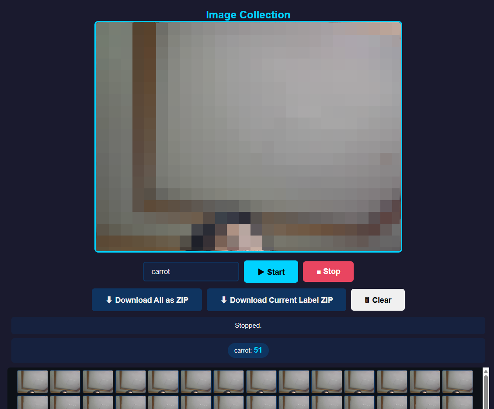

# Raspberry Pi에서 Edge Impulse 이미지 수집

## 개요

라즈베리파이 + 카메라 모듈로 Edge Impulse 이미지 분류/객체 탐지용 이미지를 수집합니다.

### ESP32-CAM(원본) vs Raspberry Pi 비교

| 항목 | ESP32-CAM | Raspberry Pi |
|------|-----------|-------------|
| 언어 | Arduino C++ | Python / Node.js |
| 카메라 | OV2640 2MP | USB 웹캠 / Pi Camera |
| 네트워크 | Wi-Fi 내장 | Wi-Fi / Ethernet |
| 처리 | 단일 스레드 | 멀티스레드, OpenCV |
| 장점 | 저전력, 소형 | 고성능, OpenCV 전처리 가능 |

---

## 방법 1: Python + Flask + OpenCV (추천)

### 설치

```bash
# 패키지 설치
pip install opencv-python flask flask-cors requests

# 또는 requirements.txt
# opencv-python==4.9.0.80
# flask==3.0.0
# flask-cors==4.0.0
# requests==2.31.0
```

### 서버 코드

```python
"""
Collect Images for Edge Impulse - Raspberry Pi Server
ESP32-CAM image_collection.ino의 Python/Flask 버전

실행: python server.py
접속: http://raspberry-pi-ip:5000
"""

import cv2
import os
import json
import base64
import requests
from flask import Flask, request, jsonify, render_template_string
from flask_cors import CORS

# ===== 설정 =====
PORT = 5000
HOST = '0.0.0.0'
CAPTURE_DIR = 'captured_images'
CATEGORIES = ['cat', 'dog', 'person', 'background']

# Edge Impulse 설정 (업로드 시 필요)
EI_API_KEY = 'ei_your_admin_api_key_here'
EI_PROJECT_ID = 12345

# ===== 앱 초기화 =====
app = Flask(__name__)
CORS(app)
os.makedirs(CAPTURE_DIR, exist_ok=True)
for cat in CATEGORIES:
    os.makedirs(f'{CAPTURE_DIR}/{cat}', exist_ok=True)

# 카메라 초기화
camera = cv2.VideoCapture(0)
if not camera.isOpened():
    camera = cv2.VideoCapture(0)  # USB 카메라
if not camera.isOpened():
    raise RuntimeError('Camera not found')

# ===== HTML UI (ESP32-CAM image_collection 호환 UI) =====
HTML_PAGE = '''
<!DOCTYPE html>
<html>
<head>
    <title>Edge Impulse Image Collection</title>
    <meta name="viewport" content="width=device-width, initial-scale=1">
    <style>
        * { box-sizing: border-box; margin: 0; padding: 0; }
        body { font-family: Arial; text-align: center; padding: 20px; background: #1a1a2e; color: #eee; }
        h1 { color: #00d2ff; margin-bottom: 20px; }
        #video { width: 640px; max-width: 100%; border: 3px solid #00d2ff; border-radius: 8px; }
        .controls { margin: 20px 0; display: flex; gap: 10px; flex-wrap: wrap; justify-content: center; }
        button { padding: 12px 24px; border: none; border-radius: 6px; cursor: pointer; font-size: 16px; }
        .label-btn { background: #16213e; color: #eee; border: 2px solid #0f3460; }
        .label-btn.active { background: #e94560; border-color: #e94560; }
        #capture-btn { background: #00d2ff; color: #000; font-weight: bold; }
        #upload-btn { background: #0f3460; color: #eee; }
        .status { margin: 10px; padding: 10px; background: #16213e; border-radius: 6px; }
    </style>
</head>
<body>
    <h1>Edge Impulse Image Collection</h1>
    
    <div class="controls" id="labels"></div>
    <div class="controls">
        <button id="capture-btn" onclick="capture()">📸 Capture</button>
        <button id="upload-btn" onclick="uploadAll()">⬆ Upload to Edge Impulse</button>
    </div>
    <div class="status" id="status">Ready. Select a label and click Capture.</div>
    <div class="status" id="counts">—</div>

    <script>
        const labels = JSON.parse('{{labels}}');

        // 라벨 버튼 생성
        const container = document.getElementById('labels');
        let activeLabel = labels[0];
        labels.forEach(label => {
            const btn = document.createElement('button');
            btn.className = 'label-btn active';
            btn.textContent = label;
            btn.onclick = () => {
                activeLabel = label;
                document.querySelectorAll('.label-btn').forEach(b => b.style.background = '#16213e');
                btn.style.background = '#e94560';
                document.getElementById('status').textContent = 'Selected: ' + label;
            };
            if (label === activeLabel) btn.style.background = '#e94560';
            container.appendChild(btn);
        });

        // 캡처
        function capture() {
            const img = document.getElementById('video');
            const canvas = document.createElement('canvas');
            canvas.width = img.naturalWidth || 240;
            canvas.height = img.naturalHeight || 240;
            canvas.getContext('2d').drawImage(img, 0, 0);
            const dataUrl = canvas.toDataURL('image/jpeg');

            fetch('/capture', {
                method: 'POST',
                headers: { 'Content-Type': 'application/json' },
                body: JSON.stringify({ image: dataUrl, label: activeLabel })
            })
            .then(r => r.json())
            .then(d => {
                document.getElementById('status').textContent = d.message;
                updateCounts();
            });
        }

        // 카운트 업데이트
        function updateCounts() {
            fetch('/counts').then(r => r.json()).then(d => {
                document.getElementById('counts').textContent =
                    Object.entries(d).map(([k,v]) => k + ': ' + v).join(' | ');
            });
        }

        // Edge Impulse 업로드
        function uploadAll() {
            document.getElementById('status').textContent = 'Uploading to Edge Impulse...';
            fetch('/upload', { method: 'POST' })
            .then(r => r.json())
            .then(d => document.getElementById('status').textContent = d.message);
        }

        updateCounts();
    </script>
</body>
</html>
'''

# ===== Flask Routes =====

@app.route('/')
def index():
    return render_template_string(HTML_PAGE, labels=json.dumps(CATEGORIES))

@app.route('/video_feed')
def video_feed():
    """JPEG 스트림 (MJPEG 형식)"""
    def generate():
        while True:
            ret, frame = camera.read()
            if not ret:
                continue
            ret, jpeg = cv2.imencode('.jpg', frame, [cv2.IMWRITE_JPEG_QUALITY, 60])
            if not ret:
                continue
            yield (b'--frame\r\n'
                   b'Content-Type: image/jpeg\r\n\r\n' + jpeg.tobytes() + b'\r\n')
    return app.response_class(generate(), mimetype='multipart/x-mixed-replace; boundary=frame')

@app.route('/capture', methods=['POST'])
def capture():
    data = request.json
    label = data.get('label', 'unknown')
    image_b64 = data.get('image', '').split(',')[1]

    image_bytes = base64.b64decode(image_b64)
    count = len(os.listdir(f'{CAPTURE_DIR}/{label}'))
    filename = f'{CAPTURE_DIR}/{label}/{label}_{count:04d}.jpg'

    with open(filename, 'wb') as f:
        f.write(image_bytes)

    return jsonify({'message': f'Saved: {filename} ({len(image_bytes)} bytes)'})

@app.route('/counts')
def counts():
    result = {}
    for cat in CATEGORIES:
        path = f'{CAPTURE_DIR}/{cat}'
        result[cat] = len(os.listdir(path)) if os.path.exists(path) else 0
    return jsonify(result)

@app.route('/upload', methods=['POST'])
def upload_to_edge_impulse():
    """로컬에 저장된 모든 이미지를 Edge Impulse로 업로드"""
    if not EI_API_KEY or 'your' in EI_API_KEY:
        return jsonify({'message': '⚠ Set EI_API_KEY in script first'})

    url = f'https://ingestion.edgeimpulse.com/api/{EI_PROJECT_ID}/training-data'
    headers = {'x-api-key': EI_API_KEY}
    uploaded = 0

    for cat in CATEGORIES:
        folder = f'{CAPTURE_DIR}/{cat}'
        if not os.path.exists(folder):
            continue
        for fname in os.listdir(folder):
            if not fname.endswith('.jpg'):
                continue
            fpath = os.path.join(folder, fname)
            with open(fpath, 'rb') as f:
                files = {'data': (fname, f, 'image/jpeg')}
                h = {**headers, 'x-label': cat}
                r = requests.post(url, headers=h, files=files)
                if r.status_code == 200:
                    uploaded += 1

    return jsonify({'message': f'Uploaded {uploaded} images to Edge Impulse'})

@app.route('/upload_one', methods=['POST'])
def upload_one():
    """캡처 즉시 Edge Impulse로 업로드"""
    data = request.json
    label = data.get('label', 'unknown')
    image_b64 = data.get('image', '').split(',')[1]
    image_bytes = base64.b64decode(image_b64)

    url = f'https://ingestion.edgeimpulse.com/api/{EI_PROJECT_ID}/training-data'
    headers = {'x-api-key': EI_API_KEY, 'x-label': label}
    files = {'data': ('capture.jpg', image_bytes, 'image/jpeg')}
    r = requests.post(url, headers=headers, files=files)

    return jsonify({'status': r.status_code, 'message': r.text})

# ===== 실행 =====
if __name__ == '__main__':
    print(f'Server: http://{HOST}:{PORT}')
    print(f'Categories: {CATEGORIES}')
    app.run(host=HOST, port=PORT, threaded=True)
```

### 클라이언트 전용 (서버 없이 카메라로만 수집)

```python
"""
간단 버전: 서버 없이 카메라로 캡처해서 로컬 저장 or Edge Impulse 업로드
"""
import cv2
import os
import requests

API_KEY = 'ei_...'
PROJECT_ID = 12345
SAVE_DIR = 'captured_images'
os.makedirs(SAVE_DIR, exist_ok=True)

cam = cv2.VideoCapture(0)
label = 'cat'  # 수집할 라벨

count = 0
while True:
    ret, frame = cam.read()
    cv2.imshow('Collect Images', frame)
    key = cv2.waitKey(1) & 0xFF

    if key == ord(' '):  # Space: 캡처
        fname = f'{SAVE_DIR}/{label}_{count:04d}.jpg'
        cv2.imwrite(fname, frame)
        print(f'Saved: {fname}')

        # Edge Impulse로 직접 업로드
        url = f'https://ingestion.edgeimpulse.com/api/{PROJECT_ID}/training-data'
        headers = {'x-api-key': API_KEY, 'x-label': label}
        files = {'data': (fname, open(fname, 'rb'), 'image/jpeg')}
        r = requests.post(url, headers=headers, files=files)
        print(f'Upload: {r.status_code}')

        count += 1

    elif key == ord('q'):  # Q: 종료
        break

cam.release()
cv2.destroyAllWindows()
```

---

## 방법 2: Node.js (2가지 버전)

USB 웹캠용과 라즈베리파이 카메라용으로 분리되어 있습니다. 실제 프로젝트 위치: `C:\Collect_images_for_edgeImpulse_RP\rpi-edge-impulse-node\`

> ✅ **USB 버전 정상 기동 확인** (2026-07-29, Windows 11 + Node.js v22)

### 프로젝트 구조

```
rpi-edge-impulse-node/
├── package.json          # 공통 의존성 (express + archiver)
├── server-usb.js         # [USB 웹캠] 브라우저 카메라 사용
├── server-pi.js          # [Pi Camera] 서버 직접 카메라 제어
├── captured_images/      # 저장 폴더 (자동 생성)
└── temp/                 # Pi Camera 임시 프레임 (자동 생성)
```

### 공통 설치

```bash
cd C:\Collect_images_for_edgeImpulse_RP\rpi-edge-impulse-node
npm install
npm run usb    # USB 웹캠 서버 실행
npm run pi     # Pi Camera 서버 실행
```

---

### 버전 A: USB 웹캠 (`server-usb.js`)



**동작 방식:** 브라우저의 `getUserMedia()`로 카메라 접근 → 서버는 저장/ZIP만 담당

```bash
node server-usb.js
# → http://localhost:5000
```

**주요 기능:**
| 기능 | 설명 |
|------|------|
| ▶ Start | 300ms 간격으로 자동 연속 촬영 시작 (라벨 지정) |
| ■ Stop | 촬영 중지 |
| 텍스트 입력 | 라벨을 자유롭게 입력 (datalist 추천: cat, dog, person) |
| ⬇ Download All ZIP | 전체 이미지 ZIP 다운로드 |
| ⬇ Download Label ZIP | 현재 입력한 라벨의 이미지만 ZIP 다운로드 |
| 🗑 Clear | 모든 이미지 삭제 |

**코드 구조 설명:**

```javascript
// 1. 서버 설정
const PORT = 5000;
const CAPTURE_DIR = path.join(__dirname, 'captured_images');

// 2. HTML UI를 서버가 직접 제공 (별도 .html 파일 불필요)
const HTML_PAGE = `<!DOCTYPE html>...`;  // template literal로 내장
app.get('/', (req, res) => res.send(HTML_PAGE));

// 3. [POST /api/capture] — 브라우저에서 보낸 base64 이미지를 저장
//    - image: data:image/jpeg;base64,...
//    - label: 사용자가 입력한 라벨 문자열
//    → captured_images/{label}/{label}_{number}.jpg
app.post('/api/capture', (req, res) => {
    const { image, label } = req.body;
    const buf = Buffer.from(image.replace(/^data:image\/jpeg;base64,/, ''), 'base64');
    const dir = path.join(CAPTURE_DIR, label);
    fs.mkdirSync(dir, { recursive: true });
    const n = fs.readdirSync(dir).filter(f => f.endsWith('.jpg')).length;
    fs.writeFileSync(path.join(dir, `${label}_${n}.jpg`), buf);
    res.json({ message: `Saved: ${label}_${n}.jpg` });
});

// 4. [GET /api/download] — archiver로 전체 ZIP 생성 후 스트리밍
app.get('/api/download', (req, res) => {
    res.writeHead(200, {
        'Content-Type': 'application/zip',
        'Content-Disposition': 'attachment; filename="images_' + Date.now() + '.zip"'
    });
    const archive = archiver('zip');
    archive.pipe(res);
    fs.readdirSync(CAPTURE_DIR, { withFileTypes: true })
        .filter(d => d.isDirectory()).forEach(d => {
            fs.readdirSync(path.join(CAPTURE_DIR, d.name))
                .filter(f => f.endsWith('.jpg'))
                .forEach(f => archive.file(path.join(CAPTURE_DIR, d.name, f), { name: d.name + '/' + f }));
        });
    archive.finalize();
});

// 5. [GET /api/download/:label] — 특정 라벨만 ZIP
app.get('/api/download/:label', (req, res) => { /* 특정 폴더만 압축 */ });

// 6. 브라우저 측: getUserMedia()로 카메라 → Canvas → base64 → POST
//    navigator.mediaDevices.getUserMedia({ video: {...} })
//    setInterval(() => fetch('/api/capture', { body: JSON.stringify({ image, label }) }), 300);
```

**카메라 접근 흐름 (브라우저):**
```
① 브라우저가 getUserMedia()로 카메라 스트림 획득
② <video>에 스트림 표시 (실시간 미리보기)
③ Start 버튼 → 300ms 간격으로 Canvas에 프레임 캡처
④ Canvas → JPEG base64 → POST /api/capture
⑤ 서버가 captured_images/{label}/{label}_{n}.jpg 저장
⑥ Stop 버튼 → clearInterval()로 중지
```

---

### 버전 B: Raspberry Pi Camera (`server-pi.js`)

**동작 방식:** 서버가 `libcamera-still` / `raspistill`로 직접 촬영

```bash
# 라즈베리파이에서 실행
node server-pi.js
# → http://raspberry-pi-ip:5000
```

**주요 기능:** USB 버전과 동일한 UI지만, 카메라 제어가 서버에서 이루어짐

```javascript
// 1. Pi Camera 감지
function hasPiCamera() {
    return fs.existsSync('/usr/bin/libcamera-still') ||  // bullseye+
           fs.existsSync('/usr/bin/raspistill');          // legacy
}

// 2. 카메라 촬영 명령어 생성
function getStillCmd(outputPath) {
    if (fs.existsSync('/usr/bin/libcamera-still')) {
        return `libcamera-still -o ${outputPath} --width 640 --height 480 --quality 85 --timeout 500 --nopreview --immediate`;
    }
    return `raspistill -o ${outputPath} --width 640 --height 480 --quality 85 --timeout 500 --nopreview`;
}

// 3. 실제 촬영 (child_process.exec)
function captureStill(callback) {
    const tmpFile = path.join(TEMP_DIR, 'frame_' + Date.now() + '.jpg');
    exec(getStillCmd(tmpFile), { timeout: 3000 }, (err) => {
        if (err) return callback(err);
        if (!fs.existsSync(tmpFile)) return callback(new Error('No output'));
        const buf = fs.readFileSync(tmpFile);
        latestFrame = buf;
        fs.unlink(tmpFile, () => {});
        callback(null, buf);
    });
}

// 4. 연속 촬영 (Start 버튼)
function startContinuousCapture(label) {
    if (isCapturing) return;
    isCapturing = true;
    currentLabel = label;
    const dir = path.join(CAPTURE_DIR, label);
    fs.mkdirSync(dir, { recursive: true });
    captureTimer = setInterval(() => {
        captureStill((err, buf) => {
            if (err) return;
            const n = fs.readdirSync(dir).filter(f => f.endsWith('.jpg')).length;
            fs.writeFileSync(path.join(dir, label + '_' + String(n).padStart(4, '0') + '.jpg'), buf);
        });
    }, 300);
}

// 5. 웹 UI에 최신 프레임 표시 (polling)
app.get('/api/latest_frame', (req, res) => {
    res.writeHead(200, { 'Content-Type': 'image/jpeg' });
    res.end(latestFrame);
});
// 브라우저는 500ms마다 /api/latest_frame?t={timestamp} 로 이미지 갱신
```

**카메라 접근 흐름 (서버):**
```
① 서버가 시작되면 첫 프레임 캡처 (captureStill)
② 웹 UI는 500ms마다 /api/latest_frame으로 최신 JPEG 요청
③ Start → 서버가 300ms마다 라즈베리파이 카메라로 직접 촬영
④ 촬영된 이미지는 서버의 captured_images/ 에 저장
⑤ Stop → clearInterval()로 촬영 중지
```

---

### 코드 설명: 핵심 모듈

| 모듈 | 버전 | 용도 |
|------|------|------|
| `express` | 공통 | HTTP 서버, 라우팅 |
| `archiver` | 공통 | ZIP 압축 스트리밍 (download) |
| `child_process` | Pi 전용 | `raspistill` / `libcamera-still` 실행 |
| `getUserMedia()` | USB 전용 | 브라우저에서 USB 웹캠 접근 (Web API) |

---

## 방법 3: Edge Impulse Linux CLI (가장 간단)

라즈베리파이 OS 64bit 전용으로, CLI 하나로 끝납니다.

```bash
# 1. Node.js 설치 (공식 ARM64 바이너리)
wget https://nodejs.org/dist/v20.11.0/node-v20.11.0-linux-arm64.tar.xz
tar -xf node-v20.11.0-linux-arm64.tar.xz
sudo cp -r node-v20.11.0-linux-arm64/* /usr/local/
node --version  # v20.11.0 확인

# 2. Edge Impulse Linux CLI 설치
npm install -g edge-impulse-linux

# 3. 실행 (카메라 자동 인식, 웹 UI 제공)
edge-impulse-linux

# 최초 실행 시:
# - Edge Impulse 계정 로그인
# - 프로젝트 선택 (또는 새로 생성)
# - 카메라 선택
# - http://라즈베리파이IP:4912 에서 웹 UI 접속
```

---

## 각 방법 비교

| 방법 | 설치 | 카메라 방식 | UI | 출력 |
|------|------|-----------|-----|------|
| **Python Flask** | pip | OpenCV (서버) | 웹 UI + MJPEG | Edge Impulse 업로드 |
| **Node.js USB** | npm | **브라우저** `getUserMedia()` | 웹 UI + 실시간 | **ZIP 다운로드** |
| **Node.js Pi** | npm | `raspistill` (서버) | 웹 UI + polling | **ZIP 다운로드** |
| Edge CLI | npm | 자동 인식 | 웹 UI 내장 | Edge Impulse 업로드 |
| ESP32-CAM | Arduino | OV2640 (내장) | 웹 UI | 로컬 저장 |
