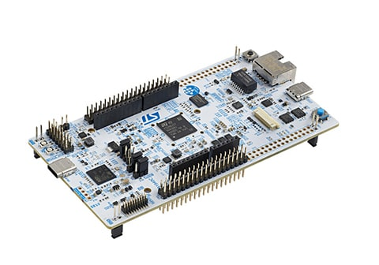
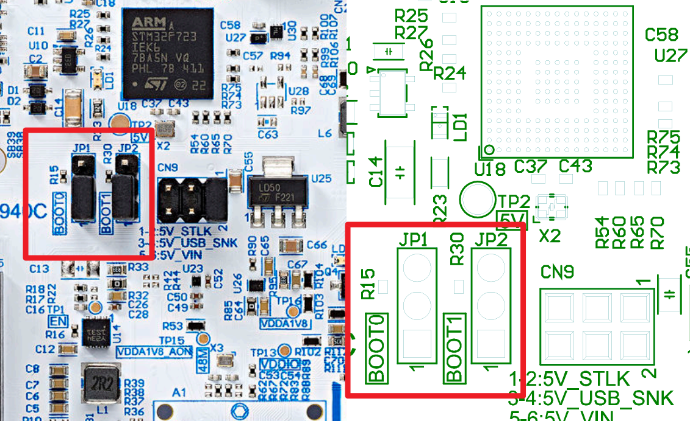

# STM32CubeN6 예제 학습 가이드

**보드**: NUCLEO-N657X0-Q (STM32N657X0HxQ, Cortex-M55 + Neural-ART NPU)

* https://github.com/STMicroelectronics/STM32CubeN6/tree/main/Projects/NUCLEO-N657X0-Q/Examples
* git clone https://github.com/STMicroelectronics/STM32CubeN6.git

**예제 경로**: `STM32CubeN6/Projects/NUCLEO-N657X0-Q/Examples/`

---

## 학습 로드맵

예제를 난이도별로 단계를 나누어 학습하는 것을 권장합니다.

| 단계 | 분류 | 예제 | 학습 내용 |
|------|------|------|-----------|
| 1 | 기초 | GPIO, UART, TIM | 기본 입출력, 통신, 타이머 |
| 2 | 필수 주변장치 | I2C, SPI, DMA, ADC | 센서 통신, 고속 데이터 전송 |
| 3 | 시스템 | RCC, PWR, IWDG, WWDG, CORTEX | 클럭 설정, 전력 관리, 워치독 |
| 4 | STM32N6 특화 | RIF, RAMCFG, SYSCFG/FLEXMEM, BSEC | 보안, 메모리, 칩 설정 |
| 5 | 고성능 | CRC, HASH, RNG, CRYP, PKA | 하드웨어 가속 암호화 |
| 6 | 고급 인터페이스 | I3C, PSSI, SAI, FDCAN, XSPI | 최신 통신 프로토콜 |
| 7 | 저전력 | LPUART, LPTIM, PWR_STOP/STANDBY | 배터리 구동 시스템 |

---

## 1단계: 기초 예제

### GPIO_IOToggle (GPIO 출력)

**경로**: `GPIO/GPIO_IOToggle/STM32CubeIDE/`
**핵심 함수**: `HAL_GPIO_TogglePin()`, `HAL_GPIO_WritePin()`, `HAL_Delay()`
**학습 포인트**:
- GPIO 출력 모드 설정 (Push-Pull)
- LED1(PG8, 파랑), LED2(PG10, 빨강), LED3(PG0, 녹색) — Active LOW
- `HAL_Delay()`를 이용한 시간 지연
- STM32N6 보드의 기본 프로젝트 구조 이해

> **실습 변형**: LED3을 100ms 간격으로 깜빡이도록 변경해보기

### GPIO_EXTI (GPIO 인터럽트)

**경로**: `GPIO/GPIO_EXTI/STM32CubeIDE/`
**핵심 함수**: `HAL_GPIO_EXTI_IRQHandler()`, `HAL_GPIO_EXTI_Callback()`
**학습 포인트**:
- EXTI (External Interrupt) 설정
- Falling edge 트리거 (버튼 누를 때)
- PC.13 (USER button) → 인터럽트 → LED1 토글
- NVIC 인터럽트 우선순위 설정

> **실습 변형**: Rising edge로 변경하고, LED 대신 UART로 메시지 출력

### UART_Printf (UART 출력)

**경로**: `UART/UART_Printf/STM32CubeIDE/`
**핵심 함수**: `HAL_UART_Transmit()`, `printf()` redirection
**학습 포인트**:
- UART 설정 (LPUART1, 115200 baud, 8N1)
- `_write()` 함수 재정의로 printf → UART 연결
- **주의**: Parity 기본값이 ODD, **NONE으로 변경 필수**
- ST-Link VCP(Virtual COM Port) 사용
- 시리얼 모니터(Tera Term, PuTTY 등) 연결 확인

> **실습 변형**: baud rate를 9600으로 변경하고 출력 확인

### UART_Console (양방향 UART)

**경로**: `UART/UART_Console/STM32CubeIDE/`
**핵심 함수**: `HAL_UART_Receive()`, `getchar()`, `printf()`
**학습 포인트**:
- UART 송수신 동시 처리
- 에코(echo) 기능 — 입력한 문자를 다시 출력
- 인터랙티브 콘솔 구현

> **실습 변형**: 간단한 CLI (help, led on, led off) 명령어 처리 구현

### TIM_TimeBase (타이머)

**경로**: `TIM/TIM_TimeBase/STM32CubeIDE/`
**핵심 함수**: `HAL_TIM_Base_Start_IT()`, `HAL_TIM_PeriodElapsedCallback()`
**학습 포인트**:
- TIM2를 1초 타임베이스로 설정
- Prescaler와 Auto-reload 계산 (600MHz 클럭 기준)
- Update 인터럽트로 LED1 토글
- Timer는 `HAL_Delay()`보다 정밀한 시간 제어 가능

> **실습 변형**: Prescaler를 변경하여 0.5초, 2초 인터벌 생성

---

## 2단계: 필수 주변장치

### DMA_RAMToMemory (DMA)

**경로**: `DMA/DMA_RAMToMemory/STM32CubeIDE/`
**핵심 함수**: `HAL_DMA_Start_IT()`, `HAL_DMA_XferCpltCallback()`
**학습 포인트**:
- GPDMA (General Purpose DMA) 기본 사용법
- 메모리 → 메모리 전송
- 인터럽트 기반 전송 완료 처리
- DMA는 CPU 개입 없이 데이터 복사

> **실습 변형**: 2D 데이터 전송으로 변경 (DMA_LinkedList 참조)

### DMA_LinkedList (DMA 연결 리스트)

**경로**: `DMA/DMA_LinkedList/STM32CubeIDE/`
**핵심 함수**: `HAL_DMAEx_LinkedList_BuildNode()`, `HAL_DMAEx_LinkedList_InsertNode_Tail()`
**학습 포인트**:
- **STM32N6 GPDMA 특화 기능**: Linked-list 모드
- 여러 DMA 전송을 체인으로 연결 → CPU 개입 없이 연속 전송
- Scatter-gather: 불연속 메모리 블록 전송

### SPI_FullDuplex_ComDMA (SPI 통신)

**경로**: `SPI/SPI_FullDuplex_ComDMA_Master/STM32CubeIDE/`
**핵심 함수**: `HAL_SPI_TransmitReceive_DMA()`
**학습 포인트**:
- SPI 전이중(Full-Duplex) 통신
- Master/Slave 구조
- DMA를 이용한 고속 데이터 전송
- 2개 보드 필요 (Master + Slave)

### I2C_TwoBoards_ComDMA (I2C 통신)

**경로**: `I2C/I2C_TwoBoards_ComDMA/STM32CubeIDE/`
**핵심 함수**: `HAL_I2C_Master_Transmit_DMA()`, `HAL_I2C_Slave_Receive_DMA()`
**학습 포인트**:
- I2C 프로토콜 (SCL, SDA)
- Master/Slave 어드레싱
- DMA + I2C 조합

### I2C_Sensor_Private_Command_IT (I2C 센서)

**경로**: `I2C/I2C_Sensor_Private_Command_IT/STM32CubeIDE/`
**핵심 함수**: `HAL_I2C_Mem_Write_IT()`, `HAL_I2C_Mem_Read_IT()`
**학습 포인트**:
- 실제 센서(LSM6DSV16X 6축 IMU) 제어
- I2C 메모리 맵 Read/Write
- 인터럽트 기반 통신
- **X-NUCLEO-IKS4A1 확장 보드 필요**

### ADC_SingleConversion_TriggerTimer_DMA (ADC)

**경로**: `ADC/ADC_SingleConversion_TriggerTimer_DMA/STM32CubeIDE/`
**핵심 함수**: `HAL_ADC_Start_DMA()`, `HAL_ADC_ConvCpltCallback()`
**학습 포인트**:
- ADC 단일 채널 변환
- Timer 트리거로 일정 간격 샘플링
- DMA로 결과 자동 전송
- 외부 전압 입력 (0~1.8V, PA.01)

---

## 3단계: 시스템 설정

### RCC_ClockConfig (클럭 설정)

**경로**: `RCC/RCC_ClockConfig/STM32CubeIDE/`
**핵심 함수**: `HAL_RCC_ClockConfig()`, `__HAL_RCC_GET_SYSCLK_SOURCE()`
**학습 포인트**:
- 시스템 클럭 소스 변경 (HSI ↔ HSE)
- `HAL_RCC_ClockConfig()`로 클럽 트리 재설정
- 버튼 누를 때마다 클럭 소스 전환
- LED1 토글 속도 변화로 클럭 변경 확인

### PWR_SLEEP (전력 관리 - SLEEP)

**경로**: `PWR/PWR_SLEEP/STM32CubeIDE/`
**핵심 함수**: `HAL_PWR_EnterSLEEPMode()`
**학습 포인트**:
- SLEEP 모드: CPU 클럭만 정지, 모든 주변장치 동작
- EXTI(버튼) 인터럽트로 Wakeup
- SysTick 인터럽트 비활성화 주의
- 디버그 불가 (JTAG/SWD도 정지)

### IWDG_WindowMode (독립 워치독)

**경로**: `IWDG/IWDG_WindowMode/STM32CubeIDE/`
**핵심 함수**: `HAL_IWDG_Refresh()`, `HAL_IWDG_Init()`
**학습 포인트**:
- IWDG (Independent Watchdog) — LSI 클럭 기반
- Window 모드: 일정 시간 이내에만 리프레시 허용
- 버튼 누르면 의도적 HardFault → IWDG 리셋
- 리셋 원인 확인 (`__HAL_RCC_GET_FLAG()`)

### CORTEX_MPU (메모리 보호)

**경로**: `CORTEX/CORTEX_MPU/STM32CubeIDE/`
**핵심 함수**: `HAL_MPU_ConfigRegion()`, `HAL_MPU_Enable()`
**학습 포인트**:
- MPU (Memory Protection Unit) 영역 설정
- 특정 메모리 영역에 접근 제한
- Cacheable / Non-cacheable 영역 구분
- SAI 예제에서 MPU로 non-cacheable 영역 설정 참조

### CORTEX_CACHE (캐시 제어)

**경로**: `CORTEX/CORTEX_CACHE/STM32CubeIDE/`
**핵심 함수**: `SCB_EnableICache()`, `SCB_EnableDCache()`, `SCB_CleanInvalidateDCache()`
**학습 포인트**:
- **Cortex-M55의 L1 캐시 (I-Cache + D-Cache)**
- Cache coherency: DMA가 cacheable 영역 수정 시 문제 발생
- Cache maintenance operation
- Cache enable/disable에 따른 성능 차이 측정

> **중요**: DMA를 사용하는 예제(SAI, DMA 등)에서는 Cache coherency 처리가 필수

---

## 4단계: STM32N6 특화 기능

### SYSCFG_FLEXMEM_Configurations (메모리 재구성)

**경로**: `SYSCFG/FLEXMEM_Configurations/STM32CubeIDE/`
**핵심 함수**: `HAL_SYSCFG_EnableFlexRAM()`, `HAL_SYSCFG_ConfigTCM()`
**학습 포인트**:
- **STM32N6 특화**: FLEXMEM으로 ITCM/DTCM/FLEXRAM 크기 동적 변경
- 기본: FLEXRAM 400KB + DTCM 128KB + ITCM 64KB
- 콜드 리셋 후: DTCM 256KB + ITCM 128KB + FLEXRAM 160KB
- TCM 변경 시 HardFault 주의

### RIF_Memory (리소스 격리 - 메모리)

**경로**: `RIF/RIF_Memory/STM32CubeIDE/`
**핵심 함수**: `HAL_RIF_RISAF_ConfigRegion()`, `HAL_RIF_RISAF_ConfigSubregion()`
**학습 포인트**:
- **STM32N6 보안 특화**: RIF(Resource Isolation Framework)
- RISAF: 메모리 영역별 접근 권한 제어
- Secure/Non-Secure 영역 분리
- CID(Compartment ID) 기반 접근 제어
- 불법 접근 시 인터럽트 발생

### RIF_Peripheral (리소스 격리 - 주변장치)

**경로**: `RIF/RIF_Peripheral/STM32CubeIDE/`
**핵심 함수**: `HAL_RIF_RIMC_ConfigMasterAttributes()`, `HAL_RIF_RIMC_ConfigSlaveAttributes()`
**학습 포인트**:
- 주변장치(Peripheral) 수준의 접근 제어
- 마스터(CPU/DMA)별 주변장치 접근 권한 설정

### RAMCFG_ECC_Error_Generation (RAM ECC)

**경로**: `RAMCFG/RAMCFG_ECC_Error_Generation/STM32CubeIDE/`
**핵심 함수**: `HAL_RAMCFG_Enable()`, `HAL_RAMCFG_Disable()`
**학습 포인트**:
- **STM32N6 특화**: 내부 SRAM에 대한 ECC (Error Correction Code)
- Single-bit error: 자동 정정 (SEC)
- Double-bit error: 검출만 가능 (DED)
- BKPSRAM에 ECC 비활성 상태로 쓰기 → 활성화 → 에러 유발

### BSEC_ShadowRegisters (보안 레지스터)

**경로**: `BSEC/BSEC_ShadowRegisters/STM32CubeIDE/`
**핵심 함수**: `HAL_BSEC_ReadShadowRegister()`, `HAL_BSEC_WriteShadowRegister()`
**학습 포인트**:
- **STM32N6 보안 특화**: BSEC (Boot and Security) 컨트롤러
- Shadow register: 리셋 후에도 값 유지
- Scratch register: 임시 데이터 저장
- Write-lock: 한 번 쓰면 잠김

### DTS_GetTemperature (온도 센서)

**경로**: `DTS/DTS_GetTemperature/STM32CubeIDE/`
**핵심 함수**: `HAL_DTS_GetTemperature()`
**학습 포인트**:
- **STM32N6 특화**: DTS (Digital Temperature Sensor)
- 칩 내부 다이 온도 측정 (섭씨)
- 디버거 변수 모니터링으로 확인

---

## 5단계: 고성능 암호화 가속

### CRC_ReverseModes (CRC 계산)

**경로**: `CRC/CRC_ReverseModes/STM32CubeIDE/`
**핵심 함수**: `HAL_CRC_Calculate()`, `HAL_CRC_Accumulate()`
**학습 포인트**:
- 하드웨어 CRC 오프로드
- CRC-32/MPEG2 (0x4C11DB7)
- 데이터 반전(bit-reversal) 모드
- 통신 프로토콜 무결성 검증에 활용

### HASH_SHA224SHA256_DMA (해시 연산)

**경로**: `HASH/HASH_SHA224SHA256_DMA/STM32CubeIDE/`
**핵심 함수**: `HAL_HASH_SHA224_Start_DMA()`, `HAL_HASH_SHA256_Start_DMA()`
**학습 포인트**:
- SHA-224/256 해시 가속
- DMA로 데이터 전송 → HASH 엔진 자동 처리
- 미리 계산된 예상값과 비교 검증

### CRYP_AES_GCM (대칭키 암호화)

**경로**: `CRYP/CRYP_AES_GCM/STM32CubeIDE/`
**핵심 함수**: `HAL_CRYP_AESGCM_Encrypt()`, `HAL_CRYP_AESGCM_Decrypt()`
**학습 포인트**:
- AES-GCM (Galois/Counter Mode)
- 256-bit 키 사용
- 인증된 암호화 — 데이터 기밀성 + 무결성 동시 보장
- TAG (Message Authentication Code) 생성

### CRYP_SAES_WrapKey (보안 AES)

**경로**: `CRYP/CRYP_SAES_WrapKey/STM32CubeIDE/`
**핵심 함수**: `HAL_SAES_EncryptWrapKey()`
**학습 포인트**:
- **STM32N6 보안 특화**: SAES (Secure AES)
- Wrap key: 키를 암호화된 형태로 저장
- 평문 키 노출 없이 암호화 수행

### PKA_ECCscalarMultiplication (타원곡선 암호)

**경로**: `PKA/PKA_ECCscalarMultiplication/STM32CubeIDE/`
**핵심 함수**: `HAL_PKA_ECCScalarMultiplication()`
**학습 포인트**:
- **STM32N6 특화**: PKA (Public Key Accelerator)
- ECC P-256 곡선 스칼라 곱셈
- 공개키 생성 (개인키 → 공개키)
- OpenSSL .pem 파일에서 키 로드

---

## 6단계: 고급 인터페이스

### I3C_Controller_Direct_Command_DMA (I3C 통신)

**경로**: `I3C/I3C_Controller_Direct_Command_DMA/STM32CubeIDE/`
**핵심 함수**: `HAL_I3C_ConfigDynAddrAssign()`, `HAL_I3C_GetSetCCC()`
**학습 포인트**:
- **STM32N6 최신 기능**: I3C (Improved I2C)
- I2C 대비 10배 빠름 (12.5 MHz)
- Dynamic Address Assignment (ENTDAA)
- CCC (Common Command Code) GET/SET
- 2개 보드 필요

### PSSI_Master_Single_Com (병렬 인터페이스)

**경로**: `PSSI/PSSI_Master_Single_Com/STM32CubeIDE/`
**핵심 함수**: `HAL_PSSI_Master_Transmit_DMA()`
**학습 포인트**:
- **STM32N6 특화**: PSSI (Parallel Synchronous Slave Interface)
- 8-bit 병렬 데이터 전송
- TIM1 PWM을 클럭 소스로 사용
- 카메라/디스플레이 인터페이스에 활용

### SAI_TDM_I2S_LoopbackDMA (오디오 인터페이스)

**경로**: `SAI/SAI_TDM_I2S_LoopbackDMA/STM32CubeIDE/`
**핵심 함수**: `HAL_SAI_Transmit_DMA()`, `HAL_SAI_Receive_DMA()`
**학습 포인트**:
- **STM32N6 오디오 특화**: SAI (Serial Audio Interface)
- TDM (8슬롯, 96kHz) / I2S (스테레오) 모드
- GPDMA 더블 버퍼링
- **D-Cache coherency 문제 해결 실습**: MPU로 non-cacheable 영역 설정
- Loop-unrolled memcmp32 성능 최적화

### FDCAN_Loopback (CAN 통신)

**경로**: `FDCAN/FDCAN_Loopback/STM32CubeIDE/`
**핵심 함수**: `HAL_FDCAN_Start()`, `HAL_FDCAN_AddMessageToTxFifoQ()`
**학습 포인트**:
- FDCAN (Flexible Data-Rate CAN)
- 표준 ID (11-bit) + 확장 ID (29-bit)
- Nominal 1Mbps / Data 2Mbps
- Rx FIFO 필터링
- External loopback 모드 (내부 테스트)

### XSPI_NOR_AutoPolling_DTR (외부 메모리)

**경로**: `XSPI/XSPI_NOR_AutoPolling_DTR/STM32CubeIDE/`
**핵심 함수**: `HAL_XSPI_AutoPolling()`, `HAL_XSPI_Write()`
**학습 포인트**:
- **STM32N6 필수**: 외부 NOR Flash (STM32N6는 내부 Flash 없음)
- XSPI (Octo-SPI) 인터페이스
- DTR (Double Transfer Rate) 모드
- Auto-polling: 쓰기 완료를 폴링으로 확인
- FSBL이 600MHz 클럭 설정 → Appli 실행

---

## 7단계: 저전력

### LPUART_WakeUpFromStop (저전력 UART)

**경로**: `LPUART/LPUART_WakeUpFromStop/STM32CubeIDE/`
**핵심 함수**: `HAL_LPUART_WakeUp_Init()`, `HAL_PWR_EnterSTOPMode()`
**학습 포인트**:
- LPUART: 저전력 UART (저속, 저전력)
- STOP 모드에서 UART 신호로 Wakeup
- 4가지 Wakeup 이벤트: RXNE, Start bit, 7-bit 주소, 4-bit 주소
- 2개 보드 필요

### LPTIM_PulseCounter (저전력 타이머)

**경로**: `LPTIM/LPTIM_PulseCounter/STM32CubeIDE/`
**핵심 함수**: `HAL_LPTIM_Counter_Start_IT()`, `HAL_LPTIM_AutoReloadMatchCallback()`
**학습 포인트**:
- LPTIM: 저전력 타이머 (LSI 32kHz 클럭)
- 외부 펄스 카운트
- STOP 모드 유지 중 카운트 → Auto-reload 도달 시 Wakeup
- 배터리 구동 센서 노드에 활용

### PWR_STOP_RTC (STOP + RTC 웨이크업)

**경로**: `PWR/PWR_STOP_RTC/STM32CubeIDE/`
**핵심 함수**: `HAL_PWR_EnterSTOPMode()`, `HAL_RTC_SetAlarm_IT()`
**학습 포인트**:
- STOP 모드: CPU 정지, SRAM 유지, 일부 주변장치 동작
- RTC 알람으로 Wakeup
- 정해진 시간마다 깨어나서 센서 읽기 → 다시 Sleep

---

## 주요 문제 해결

| 문제 | 원인 | 해결 |
|------|------|------|
| UART 출력 깨짐 | Parity ODD 기본 설정 | LPUART1 → Parameter Settings → Parity → **NONE** |
| 플래싱 안 됨 | 외부 Flash 문제 | BOOT1 점퍼를 **2-3**으로 연결하여 칩에 직접 쓰기 |
| 디버그 안 됨 | SLEEP/STOP 모드 | 저전력 예제는 디버그 불가, 시리얼 로그로 확인 |
| HardFault | Cache coherency 문제 | DMA 사용 버퍼는 MPU로 non-cacheable 설정 |
| DMA 전송 이상 | D-Cache 데이터 미반영 | `SCB_CleanInvalidateDCache()` 호출 |
| ST-Link 미인식 | 드라이버 누락 | https://www.st.com/en/development-tools/stsw-link009.html |

---

## 보드 점퍼 설정

| 점퍼 | 설정 | 용도 |
|------|------|------|
| BOOT0 | 1-2 (기본) | Flash boot mode |
| BOOT0 | 2-3 | System bootloader (DFU/ISP) |
| BOOT1 | 1-2 (기본) | 외부 Quad-SPI Flash 부팅 |
| BOOT1 | 2-3 | **칩 내부 직접 프로그래밍 (디버그용)** |
| JP3 | OFF (기본) | ST-Link RST 분리 |

---

## 참고 자료

- STM32CubeN6 GitHub: https://github.com/STMicroelectronics/STM32CubeN6
- UM3417: NUCLEO-N657X0-Q 사용자 매뉴얼
- RM0477: STM32N6xx 레퍼런스 매뉴얼
- ST Edge AI Core: NPU 관련 도구
