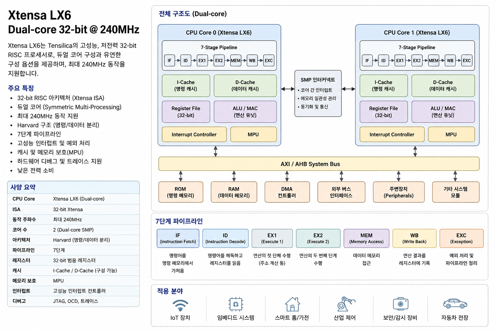
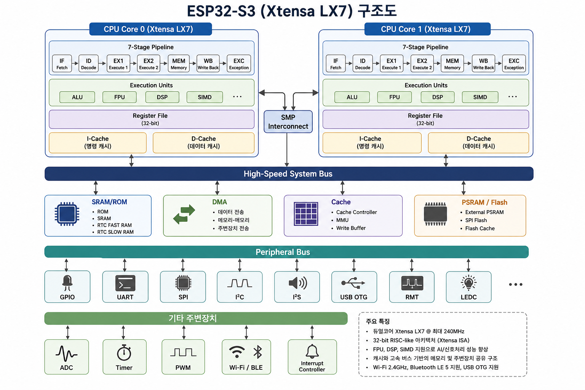

# ESP32-CAM & Edge Impulse & YOLO 완벽 가이드

> 참고 자료: [fishpoint.tistory.com/12753](https://fishpoint.tistory.com/12753), YouTube: AQYSdulh8KY

---

## 목차

1. [ESP32-S 기본 스펙](#1-esp32-s-기본-스펙)
2. [초기 설정 방법](#2-초기-설정-방법)
3. [GPIO 컨트롤을 통한 LED 테스트](#3-gpio-컨트롤을-통한-led-테스트)
4. [Web 서버 구축](#4-web-서버-구축)
5. [YOLO + PC 원격 객체 인식](#5-yolo--pc-원격-객체-인식)
6. [EloquentEsp32Cam으로 Edge Impulse 데이터 수집](#6-eloquentesp32cam으로-edge-impulse-데이터-수집)
7. [Edge Impulse ML 학습 및 배포](#7-edge-impulse-ml-학습-및-배포)
8. [전체 코드](#8-전체-코드)

---

## 1. ESP32 계열 CPU 아키텍처 및 기본 스펙

### 1.1 ESP32 칩 계열별 CPU 아키텍처

ESP32는 한 가지 칩이 아니라 여러 계열이 있으며, CPU 아키텍처도 각각 다릅니다.

| 칩 | CPU 아키텍처 | ISA | 코어 수 | 클럭 | 비고 |
|----|-------------|-----|---------|------|------|
| **ESP32 (원조)** | Xtensa LX6 | Xtensa ISA | **듀얼코어** | 240MHz | 가장 널리 사용됨 |
| **ESP32-S2** | Xtensa LX7 | Xtensa ISA | 싱글코어 | 240MHz | USB-OTG 탑재 |
| **ESP32-S3** | Xtensa LX7 | Xtensa ISA | **듀얼코어** | 240MHz | AI 가속 명령어 추가 |
| **ESP32-C3** | RISC-V | RV32IMC | 싱글코어 | 160MHz | 저가형, BLE 5.0 |
| **ESP32-C6** | RISC-V | RV32IMC | 싱글코어 | 160MHz | Wi-Fi 6 지원 |
| **ESP32-H2** | RISC-V | RV32IMC | 싱글코어 | 96MHz | Thread/Zigbee |

> **ESP-32S** 보드명은 보통 원조 **ESP32 (Xtensa LX6 듀얼코어)** 를 의미합니다.  
> 정확히는 모듈 라벨을 확인하세요: `ESP32-WROOM-32` = LX6, `ESP32-S3-WROOM-1` = LX7.

---

### 1.2 CPU 아키텍처 관계도

```
CPU 아키텍처 (ISA) 분류

ARM Ltd.                     Cadence (Tensilica)            RISC-V International
  └── ARM Cortex-M0/M3/M4        └── Xtensa LX6               └── RV32IMC
  └── ARM Cortex-A53/A72         └── Xtensa LX7               └── RV64GC
  └── ARM Cortex-M33             └── (Configurable DSP,       └── (오픈소스)
                                    SIMD, MAC 추가 가능)
```

- **ARM**: ARM사가 설계한 ISA, 라이선스 필요, Cortex-M 계열이 MCU 시장 지배
- **Xtensa**: Cadence(Tensilica)가 만든 **Configurable Processor** — 칩 제조사가 DSP/SIMD/MAC/캐시/레지스터를 선택 가능
- **RISC-V**: 오픈소스 ISA, Espressif가 신규 칩(C3/C6/H2)에 채택 중

> ⚠ **Xtensa는 ARM이 아닙니다.** ARM, Xtensa, RISC-V는 서로 완전히 다른 독립적인 CPU 아키텍처입니다.

---

### 1.3 듀얼코어 아키텍처 (ESP32 / ESP32-S3)

ESP32 원조와 ESP32-S3는 **듀얼코어**이며, **주변장치(Peripheral)는 두 코어가 공유**합니다.

```
                    ┌─────────────────────┐
                    │    CPU Core 0        │  ← Protocol CPU
                    │  ─ Wi-Fi / BLE      │
                    │  ─ TCP/IP Stack     │
                    │  ─ 시스템 태스크     │
                    └──────────┬──────────┘
                               │
                               │        System Bus (AHB)
                    ┌──────────┴──────────┐
                    │     메모리 버스       │
                    │  ─ Internal SRAM     │
                    │  ─ Flash Cache       │
                    └──────────┬──────────┘
                               │
              ─────────────────┼─────────────────
                               │
       ┌──────┬──────┬──────┬──┴──┬──────┬──────┬──────┐
       │ GPIO │ UART │ SPI  │ I2C  │ I2S  │ PWM  │ ADC  │
       ├──────┼──────┼──────┼──────┼──────┼──────┼──────┤
       │Timer │ RMT  │ CAN  │ DAC  │ SDIO │Touch │ DMA  │
       └──────┴──────┴──────┴──────┴──────┴──────┴──────┘
                              │
                    ┌─────────┴──────────┐
                    │    CPU Core 1        │  ← Application CPU
                    │  ─ 사용자 태스크     │
                    │  ─ 센서 읽기         │
                    │  ─ 모터/GPIO 제어    │
                    │  ─ UI / 디스플레이   │
                    └─────────────────────┘
```





#### 듀얼코어 핵심 특징

| 특징 | 설명 |
|------|------|
| **주변장치 공유** | GPIO, UART, SPI, I2C 등 모든 주변장치는 두 코어가 **시스템 버스를 통해 공유** |
| **Core0 역할** | Wi-Fi, Bluetooth, TCP/IP, FreeRTOS 시스템 태스크 (**통신 전용**) |
| **Core1 역할** | 사용자 애플리케이션, 센서 읽기, GPIO 제어, UI (**사용자 전용**) |
| **충돌 문제** | 두 코어가 같은 GPIO 레지스터에 동시 쓰기 → **마지막으로 쓴 코어의 값이 적용** |
| **동기화 방법** | Mutex, Spinlock, Critical Section, Atomic 연산으로 보호 필요 |
| **독립 동작** | SPI/UART/I2S/DMA는 전송 시작 후 CPU와 **별개로 하드웨어가 독립 동작** |

#### Core 분할 예시

```c
// FreeRTOS에서 Core 지정 예제 (ESP-IDF)
xTaskCreatePinnedToCore(
    wifi_task,      // Core0에 Wi-Fi 태스크 할당
    "wifi", 
    4096, 
    NULL, 
    5, 
    NULL, 
    0               // Core 0
);

xTaskCreatePinnedToCore(
    sensor_task,    // Core1에 센서 태스크 할당
    "sensor", 
    2048, 
    NULL, 
    5, 
    NULL, 
    1               // Core 1
);
```

> 💡 **실전 팁:** FreeRTOS에서 `xTaskCreatePinnedToCore()`로 Core를 분리하면 Wi-Fi 지연 없이 안정적인 GPIO 제어가 가능합니다.

---

### 1.4 Xtensa LX6 vs LX7 비교 (ESP32 vs ESP32-S3)

| 항목 | Xtensa LX6 (ESP32) | Xtensa LX7 (ESP32-S3) |
|------|-------------------|----------------------|
| **코어 수** | 듀얼코어 | 듀얼코어 |
| **클럭** | 240MHz | 240MHz |
| **SRAM** | 512KB | 512KB |
| **Cache** | 8KB/8KB (I/D) | 16KB/16KB (I/D) |
| **DSP 명령어** | 기본 | 확장 (벡터 명령어 추가) |
| **SIMD** | 제한적 | 128비트 SIMD 지원 |
| **MAC 연산** | 기본 | 강화 (AI 추론 가속) |
| **TFLite Micro 성능** | 기준 | **약 2배 향상** |
| **USB** | 없음 | USB-OTG |
| **GPIO** | 최대 34개 | 최대 45개 |

---

### 1.5 ESP32 기본 스펙 (원조, Xtensa LX6)

| 항목 | 사양 |
|------|------|
| **MCU** | Xtensa LX6 dual-core 32-bit @ 240MHz |
| **파이프라인** | 5-stage (Fetch, Decode, Execute, Memory, Writeback) |
| **L1 Cache** | Instruction 8KB / Data 8KB |
| **SRAM** | 512KB (칩 내부) |
| **PSRAM** | 외장 4MB ~ 8MB (모델별 상이) |
| **Flash** | 4MB ~ 16MB (SPI Flash) |
| **Wi-Fi** | 802.11 b/g/n (2.4GHz only) |
| **Bluetooth** | BLE 4.2 + BR/EDR |
| **GPIO** | 최대 34개 |
| **ADC** | 12-bit SAR ADC × 2 (최대 18채널) |
| **DAC** | 8-bit × 2 |
| **인터페이스** | UART × 3, SPI × 3, I2C × 2, I2S × 2, SDIO, CAN, Ethernet MAC, RMT |
| **DMA** | 5채널 (메모리-주변장치 간 데이터 전송) |
| **전압** | 2.3V ~ 3.6V (권장 3.3V) |
| **전류** | 평균 80mA, Wi-Fi TX 시 최대 500mA |
| **절전 모드** | Deep-sleep: 10μA, Modem-sleep: 5mA |

### ESP32-CAM 추가 스펙

| 항목 | 사양 |
|------|------|
| **카메라** | OV2640 (2MP, 최대 UXGA 1600×1200) |
| **PSRAM** | 4MB (AI-Thinker 모델 기준, 필수) |
| **Flash** | 4MB |
| **TF 카드 슬롯** | microSD 지원 (SPI 모드, GPIO 2/4/12/13/14/15) |
| **GPIO 노출** | 10개 (내부 LED: GPIO 4, FLASH: GPIO 2, I2C: GPIO 14/15) |
| **크기** | 27mm × 40.5mm × 4.5mm |

> ⚠ ESP32는 **2.4GHz Wi-Fi만** 지원합니다. 5GHz 네트워크에는 연결되지 않습니다.
> ⚠ ESP32-CAM은 PSRAM이 **필수**이므로 AI-Thinker 모델 (PSRAM 4MB 탑재)을 사용해야 합니다.

---

## 2. 초기 설정 방법

### 2.1 Arduino IDE 설치 및 ESP32 보드 매니저 추가

1. **Arduino IDE 다운로드** (https://www.arduino.cc/en/software)
2. Arduino IDE 실행 → **파일 → 환경설정**
3. "추가적인 보드 매니저 URLs"에 아래 URL 추가:
   ```
   https://raw.githubusercontent.com/espressif/arduino-esp32/gh-pages/package_esp32_index.json
   ```
4. **도구 → 보드 → 보드 매니저** → "esp32" 검색 후 **ESP32 by Espressif Systems** 설치

### 2.2 ESP32-CAM 업로드 설정

ESP32-CAM은 USB 포트가 없으므로 **FTDI USB-to-Serial 변환기**가 필요합니다.

#### 연결 방법 (FTDI → ESP32-CAM)

| FTDI | ESP32-CAM |
|------|-----------|
| 5V | 5V |
| GND | GND |
| TXD | U0R (GPIO 3) |
| RXD | U0T (GPIO 1) |
| GND | IO0 (업로드 시 연결, GPIO 0 → GND) |

#### 업로드 절차

1. **도구 → 보드 → ESP32 Arduino → AI Thinker ESP32-CAM** 선택
2. **도구 → Port**에서 올바른 COM 포트 선택
3. **GPIO 0를 GND에 연결** (플래시 모드 진입)
4. 업로드 버튼 클릭
5. 업로드 완료 후 **GPIO 0 연결 해제** 후 **EN 핀 리셋**

> 💡 **팁:** 업로드가 실패하면 BOOT 버튼을 누른 상태로 업로드 버튼을 클릭해보세요.

---

## 3. GPIO 컨트롤을 통한 LED 테스트

### 3.1 기본 LED Blink

```cpp
// ESP32-CAM 기본 LED Blink
// 내장 LED: GPIO 4 (ESP32-CAM AI-Thinker)

#define LED_BUILTIN 4

void setup() {
  Serial.begin(115200);
  pinMode(LED_BUILTIN, OUTPUT);
  Serial.println("ESP32-CAM LED Blink Test");
}

void loop() {
  digitalWrite(LED_BUILTIN, HIGH);
  Serial.println("LED ON");
  delay(1000);
  digitalWrite(LED_BUILTIN, LOW);
  Serial.println("LED OFF");
  delay(1000);
}
```

### 3.2 외부 LED 제어 (GPIO 2 - FLASH LED)

ESP32-CAM의 GPIO 2는 **Flash LED**에 연결되어 있습니다.

```cpp
#define FLASH_LED 2

void setup() {
  pinMode(FLASH_LED, OUTPUT);
  Serial.begin(115200);
}

void loop() {
  digitalWrite(FLASH_LED, HIGH);  // Flash ON
  delay(500);
  digitalWrite(FLASH_LED, LOW);   // Flash OFF
  delay(500);
}
```

### 3.3 브레드보드 LED 연결도

```
ESP32-CAM GPIO 12 ──┬── 330Ω 저항 ──┬── LED (Anode, 긴 다리)
                     │               │
                    GND ─────────────┴── LED (Cathode, 짧은 다리)
```

### 3.4 시리얼 입력으로 LED 제어

```cpp
#define LED_PIN 4

void setup() {
  Serial.begin(115200);
  pinMode(LED_PIN, OUTPUT);
  Serial.println("명령어 입력: ON / OFF");
}

void loop() {
  if (Serial.available()) {
    String cmd = Serial.readStringUntil('\n');
    cmd.trim();
    if (cmd == "ON") {
      digitalWrite(LED_PIN, HIGH);
      Serial.println("LED ON");
    } else if (cmd == "OFF") {
      digitalWrite(LED_PIN, LOW);
      Serial.println("LED OFF");
    } else {
      Serial.println("Unknown command. Use ON or OFF.");
    }
  }
}
```

---

## 4. Web 서버 구축

### 4.1 ESP32-CAM 캠 스트리밍 웹 서버

가장 기본적인 **ESP32-CAM 웹 서버** 코드입니다. 카메라 영상을 웹브라우저로 실시간 스트리밍합니다.

#### 설정 코드 (CameraWebServer 예제)

Arduino IDE의 **파일 → 예제 → ESP32 → Camera → CameraWebServer** 를 열거나 아래 코드를 사용합니다.

```cpp
#include "esp_camera.h"
#include <WiFi.h>
#include "esp_timer.h"
#include "img_converters.h"
#include "fb_gfx.h"
#include "soc/soc.h"
#include "soc/rtc_cntl_reg.h"
#include "dl_lib.h"
#include "esp_http_server.h"

// Wi-Fi 설정
const char* ssid = "YOUR_WIFI_SSID";
const char* password = "YOUR_WIFI_PASSWORD";

// 카메라 모델 선택 (AI-THINKER)
#define CAMERA_MODEL_AI_THINKER
// #define CAMERA_MODEL_ESP_EYE  // ESP-EYE 사용 시

#if defined(CAMERA_MODEL_AI_THINKER)
#define PWDN_GPIO_NUM     32
#define RESET_GPIO_NUM    -1
#define XCLK_GPIO_NUM      0
#define SIOD_GPIO_NUM     26
#define SIOC_GPIO_NUM     27
#define Y9_GPIO_NUM       35
#define Y8_GPIO_NUM       34
#define Y7_GPIO_NUM       39
#define Y6_GPIO_NUM       36
#define Y5_GPIO_NUM       21
#define Y4_GPIO_NUM       19
#define Y3_GPIO_NUM       18
#define Y2_GPIO_NUM        5
#define VSYNC_GPIO_NUM    25
#define HREF_GPIO_NUM     23
#define PCLK_GPIO_NUM     22
#else
#error "Camera model not selected"
#endif

static const char* _STREAM_CONTENT_TYPE = "multipart/x-mixed-replace;boundary=123456789000000000000987654321";
static const char* _STREAM_BOUNDARY = "\r\n--123456789000000000000987654321\r\n";
static const char* _STREAM_PART = "Content-Type: image/jpeg\r\nContent-Length: %u\r\n\r\n";

httpd_handle_t stream_httpd = NULL;
httpd_handle_t camera_httpd = NULL;

// ... (CameraWebServer 예제의 스트리밍 로직)
```

> 💡 **실제로는** Arduino IDE의 `파일 → 예제 → ESP32 → Camera → CameraWebServer` 예제를 열어서 SSID/PASS만 수정 후 업로드하면 됩니다.

### 4.2 LED 제어 웹 서버 (간단 버전)

```cpp
#define WIFI_SSID "SSID"
#define WIFI_PASS "PASSWD"
#define HOSTNAME "esp32cam"
```

```cpp
    //camera.pinout.wroom_s3();
    camera.pinout.aithinker();
```

```cpp
#include <WiFi.h>
#include <WebServer.h>

const char* ssid = "YOUR_WIFI_SSID";
const char* password = "YOUR_WIFI_PASSWORD";

#define LED_PIN 4

WebServer server(80);
bool ledState = false;

void handleRoot() {
  String html = "<!DOCTYPE html><html><head><meta charset='utf-8'>";
  html += "<meta name='viewport' content='width=device-width, initial-scale=1'>";
  html += "<style>";
  html += "body { text-align:center; font-family:Helvetica; margin-top:50px; }";
  html += ".btn { padding:16px 40px; font-size:24px; border:none; border-radius:8px; cursor:pointer; color:white; }";
  html += ".on { background-color:#4CAF50; } .off { background-color:#f44336; }";
  html += "</style></head><body>";
  html += "<h1>ESP32-CAM LED Control</h1>";
  html += "<p>LED Status: <strong>" + String(ledState ? "ON" : "OFF") + "</strong></p>";
  html += "<a href='/on'><button class='btn on'>LED ON</button></a> ";
  html += "<a href='/off'><button class='btn off'>LED OFF</button></a>";
  html += "</body></html>";
  server.send(200, "text/html", html);
}

void handleOn() {
  ledState = true;
  digitalWrite(LED_PIN, HIGH);
  handleRoot();
}

void handleOff() {
  ledState = false;
  digitalWrite(LED_PIN, LOW);
  handleRoot();
}

void setup() {
  Serial.begin(115200);
  pinMode(LED_PIN, OUTPUT);
  digitalWrite(LED_PIN, LOW);

  WiFi.begin(ssid, password);
  Serial.print("Connecting to Wi-Fi");
  while (WiFi.status() != WL_CONNECTED) {
    delay(500);
    Serial.print(".");
  }
  Serial.println("\nConnected! IP: " + WiFi.localIP().toString());

  server.on("/", handleRoot);
  server.on("/on", handleOn);
  server.on("/off", handleOff);
  server.begin();
}

void loop() {
  server.handleClient();
}
```

**동작 방식:**
1. ESP32-CAM이 Wi-Fi에 연결
2. 시리얼 모니터에 표시된 IP 주소로 브라우저 접속
3. ON/OFF 버튼을 눌러 LED 제어

---

## 5. YOLO + PC 원격 객체 인식

### 5.1 시스템 구성도

```
┌─────────────────┐     HTTP/JPEG     ┌─────────────────────┐
│   ESP32-CAM     │ ◄──────────────►  │   PC (Python)       │
│  (웹 서버)       │    cam-lo.jpg      │   YOLOv3/v8 실행    │
│  192.168.x.x    │                   │   OpenCV 표시        │
└─────────────────┘                   └─────────────────────┘
```

### 5.2 ESP32-CAM: JPEG 이미지 서빙 코드

```cpp
/*
 * ESP32-CAM JPEG HTTP Server
 * PC에서 http://esp32_ip/cam-lo.jpg 로 이미지 요청
 */
#include "esp_camera.h"
#include <WiFi.h>

const char* ssid = "YOUR_WIFI_SSID";
const char* password = "YOUR_WIFI_PASSWORD";

#define CAMERA_MODEL_AI_THINKER

// (핀맵 정의 생략 - CameraWebServer 예제와 동일)

WiFiServer server(80);

void setup() {
  Serial.begin(115200);

  camera_config_t config;
  config.ledc_channel = LEDC_CHANNEL_0;
  config.ledc_timer = LEDC_TIMER_0;
  config.pin_d0 = Y2_GPIO_NUM;
  config.pin_d1 = Y3_GPIO_NUM;
  config.pin_d2 = Y4_GPIO_NUM;
  config.pin_d3 = Y5_GPIO_NUM;
  config.pin_d4 = Y6_GPIO_NUM;
  config.pin_d5 = Y7_GPIO_NUM;
  config.pin_d6 = Y8_GPIO_NUM;
  config.pin_d7 = Y9_GPIO_NUM;
  config.pin_xclk = XCLK_GPIO_NUM;
  config.pin_pclk = PCLK_GPIO_NUM;
  config.pin_vsync = VSYNC_GPIO_NUM;
  config.pin_href = HREF_GPIO_NUM;
  config.pin_sscb_sda = SIOD_GPIO_NUM;
  config.pin_sscb_scl = SIOC_GPIO_NUM;
  config.pin_pwdn = PWDN_GPIO_NUM;
  config.pin_reset = RESET_GPIO_NUM;
  config.xclk_freq_hz = 20000000;
  config.pixel_format = PIXFORMAT_JPEG;
  config.frame_size = FRAMESIZE_VGA;    // 640x480
  config.jpeg_quality = 12;
  config.fb_count = 1;

  esp_err_t err = esp_camera_init(&config);
  if (err != ESP_OK) {
    Serial.printf("Camera init failed: 0x%x", err);
    return;
  }

  WiFi.begin(ssid, password);
  while (WiFi.status() != WL_CONNECTED) {
    delay(500);
    Serial.print(".");
  }
  Serial.println("\nWiFi connected");
  Serial.print("Camera Ready! Use http://");
  Serial.print(WiFi.localIP());
  Serial.println("/cam-lo.jpg");

  server.begin();
}

void loop() {
  WiFiClient client = server.available();
  if (!client) return;

  String req = "";
  while (client.connected()) {
    if (client.available()) {
      char c = client.read();
      req += c;
      if (c == '\n') break;
    }
  }

  if (req.indexOf("GET /cam-lo.jpg") >= 0) {
    camera_fb_t* fb = esp_camera_fb_get();
    if (fb) {
      client.println("HTTP/1.1 200 OK");
      client.println("Content-Type: image/jpeg");
      client.println("Content-Length: " + String(fb->len));
      client.println("Connection: close");
      client.println();
      client.write(fb->buf, fb->len);
      esp_camera_fb_return(fb);
    }
  } else {
    client.println("HTTP/1.1 404 Not Found");
    client.println("Connection: close");
    client.println();
  }
  delay(1);
  client.stop();
}
```

### 5.3 PC: YOLOv3 + OpenCV 객체 인식 (Python)

#### 설치

```bash
pip install opencv-python numpy urllib3
```

#### YOLO 파일 다운로드

다음 파일들을 프로젝트 폴더에 다운로드:

| 파일 | URL |
|------|-----|
| `yolov3.weights` | https://pjreddie.com/media/files/yolov3.weights |
| `yolov3.cfg` | https://github.com/pjreddie/darknet/blob/master/cfg/yolov3.cfg |
| `coco.names` | https://github.com/pjreddie/darknet/blob/master/data/coco.names |

#### 객체 인식 Python 코드

```python
import cv2
import numpy as np
import urllib.request

# ESP32-CAM 이미지 URL (시리얼 모니터에서 확인한 IP로 변경)
URL = "http://192.168.x.x/cam-lo.jpg"

# YOLO 설정 파일 로드
weights_path = "./yolov3.weights"
config_path = "./yolov3.cfg"
names_path = "./coco.names"

# 클래스 이름 로드
with open(names_path, "r") as f:
    classes = [line.strip() for line in f.readlines()]

# YOLO 네트워크 로드
net = cv2.dnn.readNet(weights_path, config_path)
net.setPreferableBackend(cv2.dnn.DNN_BACKEND_OPENCV)
net.setPreferableTarget(cv2.dnn.DNN_TARGET_CPU)

layer_names = net.getLayerNames()
output_layers = [layer_names[i - 1] for i in net.getUnconnectedOutLayers()]

colors = np.random.uniform(0, 255, size=(len(classes), 3))

def detect_objects(frame):
    height, width = frame.shape[:2]

    # Blob 생성
    blob = cv2.dnn.blobFromImage(frame, 1/255.0, (416, 416), swapRB=True, crop=False)
    net.setInput(blob)
    outputs = net.forward(output_layers)

    boxes, confidences, class_ids = [], [], []

    for output in outputs:
        for detection in output:
            scores = detection[5:]
            class_id = np.argmax(scores)
            confidence = scores[class_id]
            if confidence > 0.5:
                center_x = int(detection[0] * width)
                center_y = int(detection[1] * height)
                w = int(detection[2] * width)
                h = int(detection[3] * height)
                x = int(center_x - w / 2)
                y = int(center_y - h / 2)
                boxes.append([x, y, w, h])
                confidences.append(float(confidence))
                class_ids.append(class_id)

    # Non-Maximum Suppression (중복 제거)
    indexes = cv2.dnn.NMSBoxes(boxes, confidences, 0.5, 0.4)

    if len(indexes) > 0:
        for i in indexes.flatten():
            x, y, w, h = boxes[i]
            label = f"{classes[class_ids[i]]}: {confidences[i]:.2f}"
            color = colors[class_ids[i]].tolist()
            cv2.rectangle(frame, (x, y), (x + w, y + h), color, 2)
            cv2.putText(frame, label, (x, y - 10),
                        cv2.FONT_HERSHEY_SIMPLEX, 0.5, color, 2)

    return frame

# 메인 루프
cv2.namedWindow("ESP32-CAM YOLO Detection", cv2.WINDOW_AUTOSIZE)

while True:
    try:
        # ESP32-CAM에서 이미지 가져오기
        resp = urllib.request.urlopen(URL, timeout=5)
        img_data = np.array(bytearray(resp.read()), dtype=np.uint8)
        frame = cv2.imdecode(img_data, cv2.IMREAD_COLOR)

        # 객체 탐지 실행
        frame = detect_objects(frame)

        # 화면 출력
        cv2.imshow("ESP32-CAM YOLO Detection", frame)

        if cv2.waitKey(1) & 0xFF == ord('q'):
            break
    except Exception as e:
        print(f"Error: {e}")
        break

cv2.destroyAllWindows()
```

### 5.4 YOLOv8 (최신 버전) 사용하기

```bash
pip install ultralytics
```

```python
import cv2
import numpy as np
import urllib.request
from ultralytics import YOLO

URL = "http://192.168.x.x/cam-lo.jpg"

# YOLOv8 모델 로드 (nano 버전 - 가벼움)
model = YOLO("yolov8n.pt")

while True:
    try:
        resp = urllib.request.urlopen(URL, timeout=5)
        img_data = np.array(bytearray(resp.read()), dtype=np.uint8)
        frame = cv2.imdecode(img_data, cv2.IMREAD_COLOR)

        # YOLOv8 추론
        results = model(frame, verbose=False)[0]

        # 결과 시각화
        annotated = results.plot()

        cv2.imshow("ESP32-CAM YOLOv8", annotated)

        if cv2.waitKey(1) & 0xFF == ord('q'):
            break
    except Exception as e:
        print(f"Error: {e}")
        break

cv2.destroyAllWindows()
```

---

## 6. EloquentEsp32Cam으로 Edge Impulse 데이터 수집

### 6.1 EloquentEsp32Cam 라이브러리 설치

1. Arduino IDE 실행
2. **스케치 → 라이브러리 포함하기 → 라이브러리 관리** (Ctrl + Shift + I)
3. 검색창에 `EloquentEsp32Cam` 입력
4. **EloquentEsp32Cam by Simone Salerno** 설치

### 6.2 데이터 수집 예제 열기

```
파일 → 예제 → EloquentEsp32Cam → Collect_Images_for_EdgeImpulse
```

### 6.3 Wi-Fi 설정 및 카메라 모델 변경

* Collect_Images_for_EdgeImpulse.ino

```cpp
#define WIFI_SSID "SSID"
#define WIFI_PASS "PASSWD"
#define HOSTNAME "esp32cam"
```

```cpp
void setup() {
    delay(3000);
    Serial.begin(115200);
    Serial.println("___IMAGE COLLECTION SERVER___");

    // camera settings
    // replace with your own model!
    //camera.pinout.wroom_s3();
    camera.pinout.aithinker();
    camera.brownout.disable();
```

* 전체 코드

```cpp
/**
 * Collect images for Edge Impulse image
 * classification / object detection
 *
 * BE SURE TO SET "TOOLS > CORE DEBUG LEVEL = INFO"
 * to turn on debug messages
 */

// if you define WIFI_SSID and WIFI_PASS before importing the library, 
// you can call connect() instead of connect(ssid, pass)
//
// If you set HOSTNAME and your router supports mDNS, you can access
// the camera at http://{HOSTNAME}.local

#define WIFI_SSID "SSID"
#define WIFI_PASS "PASSWD"
#define HOSTNAME "esp32cam"


#include <eloquent_esp32cam.h>
#include <eloquent_esp32cam/extra/esp32/wifi/sta.h>
#include <eloquent_esp32cam/viz/image_collection.h>

using eloq::camera;
using eloq::wifi;
using eloq::viz::collectionServer;


void setup() {
    delay(3000);
    Serial.begin(115200);
    Serial.println("___IMAGE COLLECTION SERVER___");

    // camera settings
    // replace with your own model!
    //camera.pinout.wroom_s3();
    camera.pinout.aithinker();
    camera.brownout.disable();
    // Edge Impulse models work on square images
    // face resolution is 240x240
    camera.resolution.face();
    camera.quality.high();

    // init camera
    while (!camera.begin().isOk())
        Serial.println(camera.exception.toString());

    // connect to WiFi
    while (!wifi.connect().isOk())
      Serial.println(wifi.exception.toString());

    // init face detection http server
    while (!collectionServer.begin().isOk())
        Serial.println(collectionServer.exception.toString());

    Serial.println("Camera OK");
    Serial.println("WiFi OK");
    Serial.println("Image Collection Server OK");
    Serial.println(collectionServer.address());
}


void loop() {
    // server runs in a separate thread, no need to do anything here
}
```

### 6.4 업로드 및 데이터 캡처

1. 코드 업로드 후 시리얼 모니터(115200 baud) 확인
2. 출력된 IP 주소를 브라우저에 입력
3. 웹 인터페이스 접속
4. 객체를 카메라 앞에 배치
5. **"Collect Start"** 버튼 클릭 → 이미지 캡처 시작
6. 충분한 이미지 수집 후 **"Download"** 버튼 클릭
7. 압축 파일(.zip) 다운로드

> ⚠ **데이터 수집 체크리스트**
> - 각 객체당 **최소 50장 이상** 이미지 수집
> - 배경은 **단색(흰색 권장)** 사용
> - 다양한 각도와 조명 조건에서 촬영
> - 객체가 프레임 중앙에 오도록 배치
> - 해상도는 **256x256** 픽셀이 적당

---

## 7. Edge Impulse ML 학습 및 배포

### 7.1 Edge Impulse 계정 생성 및 프로젝트 생성

1. [Edge Impulse](https://edgeimpulse.com/) 접속
2. **Sign Up** → 계정 생성 및 로그인
3. 대시보드에서 **"Create new project"** 클릭
4. 프로젝트 이름 입력 (예: `vegetable-identifier`)
5. **"Create new project"** 클릭

### 7.2 데이터 업로드

1. 왼쪽 메뉴 **"Data acquisition"** 클릭
2. **"Upload data"** 섹션에서:
   - **"Choose files"**: ESP32-CAM에서 다운로드한 zip 파일 선택
   - **Label**: 객체 이름 입력 (예: `tomato`, `potato`, `onion`)
   - **"Upload"** 클릭
3. 각 객체별로 반복
4. 데이터가 Training/Test 세트로 자동 분할됨

### 7.3 라벨링 (객체 탐지의 경우)

1. 상단 **"Labeling queue"** 클릭
2. 각 이미지에서 객체에 **Bounding Box** 그리기
3. 라벨 이름 할당

> 💡 **팁:** 정사각형에 가깝게 Bounding Box를 그리고, "Track objects across frames" 옵션을 활성화하면 연속 프레임에서 자동 추적됩니다.

### 7.4 Impulse 디자인

1. 왼쪽 메뉴 **"Impulse design"** 클릭
2. **Image settings**:
   - Image width: `96`
   - Image height: `96`
   - Resize mode: `Fit shortest`
3. **Processing block**: `Image` 추가
4. **Learning block**: `Object Detection (Images)` 또는 `Classification` 추가
5. **"Save Impulse"** 클릭

### 7.5 Feature 생성

1. 왼쪽 메뉴 **"Image"** 클릭
2. Color depth: `Grayscale` (시스템 부하 감소, 선택사항)
3. **"Save parameters"** 클릭
4. **"Generate features"** 클릭
5. Feature explorer에서 각 클래스별 분리 확인 (잘 섞여 있으면 데이터 보강 필요)

### 7.6 모델 학습

1. 왼쪽 메뉴 **"Classifier"** 또는 **"Object Detection"** 클릭
2. 학습 설정:
   - **Number of training cycles**: `30~50` (epochs)
   - **Learning rate**: `0.001`
   - **Validation split**: `20%`
3. **"Start training"** 클릭
4. 학습 완료 후 **F1 Score** 확인

### 7.7 모델 배포 (Arduino 라이브러리)

1. 왼쪽 메뉴 **"Deployment"** 클릭
2. **"Arduino Library"** 선택
3. Target: **"Espressif ESP-EYE (ESP32 240MHz)"** 선택
4. **"Build"** 클릭
5. ZIP 파일 다운로드 (예: `ei-vegetable-identifier-arduino-1.0.1.zip`)

### 7.8 Arduino IDE에 라이브러리 설치

1. 압축 파일 해제
2. `Vegetable_Identifier_inferencing` 폴더 (프로젝트명 + `_inferencing`)를 복사
3. `문서/Arduino/libraries/` 폴더에 붙여넣기
4. Arduino IDE 재시작

### 7.9 예제 코드 실행

```
파일 → 예제 → Vegetable_Identifier_inferencing → esp32 → esp32_camera
```

#### 코드 수정 사항

```cpp
// 카메라 모델 변경 (필수)
// #define CAMERA_MODEL_ESP_EYE  // 주석 처리
#define CAMERA_MODEL_AI_THINKER  // AI-Thinker 모델 사용 시 활성화
```

### 7.10 실행 결과 확인

1. 코드 업로드 후 시리얼 모니터(115200 baud) 열기
2. ESP32-CAM이 실시간으로 객체 탐지 결과 출력
3. 예시 출력:
   ```
   Predictions (DSP: 15 ms., Classification: 25 ms., Anomaly: 0 ms.):
       tomato (0.92) [ x: 45, y: 30, width: 60, height: 55 ]
   ```

### 7.11 OLED 선택 연결 (선택사항)

ESP32-CAM에 OLED 디스플레이를 연결하여 결과를 직접 표시할 수 있습니다.

| OLED | ESP32-CAM |
|------|-----------|
| SDA | GPIO 15 |
| SCL | GPIO 14 |
| VCC | 3.3V |
| GND | GND |

---

## 8. 전체 코드

### 최종 ESP32-CAM 객체 탐지 코드 (OLED 포함)

전체 코드는 아래 GitHub에서 확인할 수 있습니다:

- **Circuit Digest GitHub**: https://github.com/Circuit-Digest/Object-Detection-Using-ESP32-CAM-Edge-Impulse-along-with-the-I2C-OLED-Display

#### 디렉토리 구조

```
프로젝트 폴더/
├── esp32_cam_web_server/     # ESP32-CAM 웹 서버 코드
│   ├── esp32_cam_web_server.ino
│   └── camera_pins.h
├── yolo_pc_client/           # PC YOLO 클라이언트
│   ├── detect.py
│   ├── yolov3.weights
│   ├── yolov3.cfg
│   └── coco.names
└── edge_impulse_data/        # Edge Impulse 데이터 수집
    ├── tomato/
    ├── potato/
    └── onion/
```

---

## 참고 자료

### 📖 ESP32-CAM 기본 설정 및 웹 서버

| 사이트 | 내용 | 추천도 | URL |
|--------|------|--------|-----|
| **ESP32s.com** (2026 업데이트) | ESP32-CAM 비디오 스트리밍 웹 서버 완벽 가이드 - 배선, 업로드, 문제해결까지 상세 | ⭐⭐⭐⭐⭐ | https://www.esp32s.com/blog/complete-guide-to-esp32-cam-video-streaming-web-server-with-arduino-ide/ |
| **Random Nerd Tutorials** | ESP32 웹 서버 종합 가이드 - GPIO 제어부터 인증, AP 모드까지 | ⭐⭐⭐⭐⭐ | https://randomnerdtutorials.com/esp32-web-server-beginners-guide/ |
| **Random Nerd Tutorials** | ESP32-CAM 비디오 스트리밍 + Face Recognition | ⭐⭐⭐⭐ | https://randomnerdtutorials.com/esp32-cam-video-streaming-face-recognition-arduino-ide/ |
| **ESP32s.com** (2026) | ESP32 웹 서버 Arduino IDE 상세 코드 설명 (타이밍, 연결 해제 처리 포함) | ⭐⭐⭐⭐ | https://www.esp32s.com/blog/build-an-esp32-web-server-with-arduino-ide-2026-updated-guide/ |
| **Microcontrollers Lab** | ESP32 웹 서버로 LED 제어 - HTML/CSS 동적 생성 및 HTTP 요청 처리 상세 설명 | ⭐⭐⭐⭐ | https://microcontrollerslab.com/esp32-web-server-arduino-led/ |
| **Random Nerd Tutorials** | ESP32 Web Server - Arduino IDE (초기 버전, 기본 개념) | ⭐⭐⭐ | https://randomnerdtutorials.com/esp32-web-server-arduino-ide/ |
| **GitHub (heinbm)** | 고급 ESP32-CAM 웹서버 - OTA 업데이트, 설정 저장, 설정 가능한 해상도 | ⭐⭐⭐⭐ | https://github.com/heinbm/esp32-cam-webserver |

### 🎯 YOLO + ESP32-CAM 객체 인식 (PC)

| 사이트 | 내용 | 추천도 | URL |
|--------|------|--------|-----|
| **Maker Guides** (2025) | ESP32-CAM + YOLOv3 상세 튜토리얼 - 폴더 구조, 가상환경, 코드 단계별 설명 | ⭐⭐⭐⭐⭐ | https://www.makerguides.com/object-detection-with-esp32-cam-and-yolo/ |
| **Electronic Clinic** | ESP32-CAM + Python OpenCV YOLOv3 - 실제 성능 비교 (RPi4, i3, i7+GPU) | ⭐⭐⭐⭐⭐ | https://www.electroniclinic.com/esp32-cam-with-python-opencv-yolo-v3-for-object-detection-and-identification/ |
| **YouTube - Felipe Tambasco** | ESP32-CAM + YOLOv11 (최신) - 배선부터 Python 코드까지 영상으로 상세 설명 | ⭐⭐⭐⭐⭐ | https://www.youtube.com/watch?v=Tqa9gwoIy5I |
| **ECE 196** | ESP32-CAM + Roboflow YOLO - Roboflow에서 모델 학습부터 배포까지 | ⭐⭐⭐⭐ | https://ece-196.github.io/docs/tutorials/cv_esp32-cam_tutorial/ |
| **GitHub (longpth)** | ESP32-CAM WebSocket + PC YOLOv3/TFLite 원격 객체 탐지 | ⭐⭐⭐⭐ | https://github.com/longpth/ESP32-CAM-ObjectDetection |
| **GitHub (Scicrop)** | esp32-cam-yolo - Windows 인스톨러 제공, 초보자 친화적 | ⭐⭐⭐⭐ | https://github.com/Scicrop/esp32-cam-yolo |
| **GitHub (lennarddaw)** | ESP32-CAM + YOLOv8 모듈식 구조, 설치 간편 | ⭐⭐⭐⭐ | https://github.com/lennarddaw/scope |
| **GitHub (PR0FES0R21)** | YOLOv8 사람 감지 + 자동 녹화 + FastAPI REST API | ⭐⭐⭐⭐ | https://github.com/PR0FES0R21/ESP32-Human-Detection-Yollo-v8 |
| **GitHub (CodeNinja-Omkar)** | ESP32-CAM 무인차 + YOLOv8n + Flask 대시보드 (AP 모드) | ⭐⭐⭐⭐ | https://github.com/CodeNinja-Omkar/Survillieance_car_mini_project_26_TY_B_-18-20-23-25-29- |
| **Osrtos** | ESP32-CAM YOLOv3 오픈소스 임베디드 프로젝트 개요 | ⭐⭐⭐ | https://osrtos.com/projects/esp32-cam-yolo-object-and-animal-detection/ |

### 🤖 EloquentEsp32Cam + Edge Impulse

| 사이트 | 내용 | 추천도 | URL |
|--------|------|--------|-----|
| **Eloquent Arduino 공식 문서** | EloquentEsp32Cam + Edge Impulse FOMO 객체 탐지 - 설치부터 실행까지 | ⭐⭐⭐⭐⭐ | https://eloquentarduino.com/posts/esp32-cam-object-detection |
| **Circuit Digest (원문)** | ESP32-CAM + Edge Impulse 객체 탐지 원문 튜토리얼 | ⭐⭐⭐⭐⭐ | https://circuitdigest.com/microcontroller-projects/object-recognition-using-esp32-cam-and-edge-impulse |
| **Maker Guides** (2025) | Edge Impulse로 객체 탐지 모델 학습 및 ESP32-CAM 배포 - ESP32 Core 2.0.4 주의사항 포함 | ⭐⭐⭐⭐⭐ | https://www.makerguides.com/train-an-object-detection-model-with-edge-impulse-for-esp32-cam/ |
| **GitHub (EloquentEsp32cam)** | 라이브러리 소스 코드 및 예제 | ⭐⭐⭐⭐ | https://github.com/eloquentarduino/EloquentEsp32cam |
| **GitHub (Mali03)** | ESP32-CAM + Edge Impulse 객체 탐지 - 데이터 수집부터 배포까지 전체 코드 | ⭐⭐⭐⭐ | https://github.com/Mali03/ESP32-CAM-ObjectDetection |
| **Kite Metric** | ESP32 AI 객체 탐지 with Edge Impulse - 웹 서버 데이터 수집부터 배포까지 | ⭐⭐⭐⭐ | https://kitemetric.com/blogs/esp32-ai-object-detection-with-edge-impulse |
| **GitHub (apauaie)** | ESP32-CAM Edge Impulse + Arduino Nano 연동 (시리얼 통신) | ⭐⭐⭐ | https://github.com/apauaie/ai_esp32_cam_ei |
| **GitHub (OmerGnscr)** | ESP32-CAM + YOLOv8 듀얼 모델 + 커스텀 데이터셋 + 로깅 | ⭐⭐⭐⭐ | https://github.com/OmerGnscr/ESP32Cam-Object-Detection-Project |
| **GitHub (richard-luc)** | ESP32-CAM + YOLOv8 다중 카메라 감시 시스템 + Qt 클라이언트 | ⭐⭐⭐⭐ | https://github.com/richard-luc/ESP32-Camera-AI-Detection |

### 📚 공식 문서 및 추가 자료

| 사이트 | 내용 | URL |
|--------|------|-----|
| **Edge Impulse 공식 문서** | 데이터 수집, 모델 학습, 배포 전 과정 공식 가이드 | https://docs.edgeimpulse.com/docs |
| **Ultralytics YOLOv8** | 최신 YOLO 모델 문서 및 파이썬 API | https://docs.ultralytics.com |
| **Espressif ESP32-CAM** | 공식 ESP32-CAM 하드웨어 문서 | https://docs.espressif.com/projects/esp-dev-kits/en/latest/esp32/esp32-cam/ |
| **Arduino ESP32 코어** | GitHub 저장소 - 카메라 예제 포함 | https://github.com/espressif/arduino-esp32 |
| **Edge Impulse Studio** | 웹 기반 ML 모델 학습 플랫폼 | https://studio.edgeimpulse.com |
| **Roboflow** | 데이터 라벨링 및 YOLO 모델 학습 (대안) | https://roboflow.com |

---

> 본 문서는 [fishpoint.tistory.com/12753](https://fishpoint.tistory.com/12753) 및 YouTube 영상 [AQYSdulh8KY](https://youtu.be/AQYSdulh8KY)를 포함한 여러 참고 자료를 종합하여 작성되었습니다.
