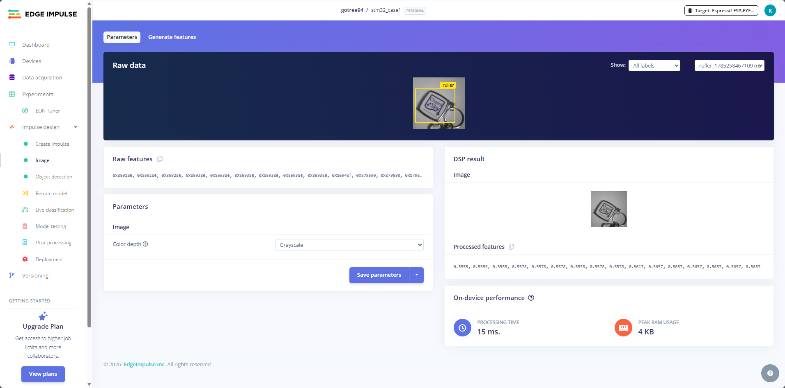
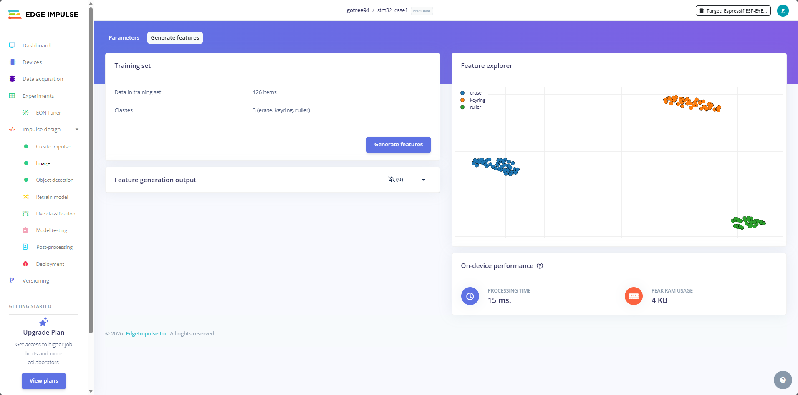

# ESP32-CAM Edge Impulse 추론 코드 수정

## Arduino IDE

* Add this library through the Arduino IDE via:
  - Sketch > Include Library > Add .ZIP Library...

* Examples can then be found under:
  - File > Examples > stm32_case1_inferencing


* 스케치 → 라이브러리 포함하기 → ZIP 라이브러리 추가
* 다운로드한 ZIP 선택

---

```
/* Edge Impulse Arduino examples
 * Copyright (c) 2022 EdgeImpulse Inc.
 *
 * Permission is hereby granted, free of charge, to any person obtaining a copy
 * of this software and associated documentation files (the "Software"), to deal
 * in the Software without restriction, including without limitation the rights
 * to use, copy, modify, merge, publish, distribute, sublicense, and/or sell
 * copies of the Software, and to permit persons to whom the Software is
 * furnished to do so, subject to the following conditions:
 *
 * The above copyright notice and this permission notice shall be included in
 * all copies or substantial portions of the Software.
 *
 * THE SOFTWARE IS PROVIDED "AS IS", WITHOUT WARRANTY OF ANY KIND, EXPRESS OR
 * IMPLIED, INCLUDING BUT NOT LIMITED TO THE WARRANTIES OF MERCHANTABILITY,
 * FITNESS FOR A PARTICULAR PURPOSE AND NONINFRINGEMENT. IN NO EVENT SHALL THE
 * AUTHORS OR COPYRIGHT HOLDERS BE LIABLE FOR ANY CLAIM, DAMAGES OR OTHER
 * LIABILITY, WHETHER IN AN ACTION OF CONTRACT, TORT OR OTHERWISE, ARISING FROM,
 * OUT OF OR IN CONNECTION WITH THE SOFTWARE OR THE USE OR OTHER DEALINGS IN THE
 * SOFTWARE.
 */

// These sketches are tested with 2.0.4 ESP32 Arduino Core
// https://github.com/espressif/arduino-esp32/releases/tag/2.0.4

/* Includes ---------------------------------------------------------------- */
#include <stm32_case1_inferencing.h>
#include "edge-impulse-sdk/dsp/image/image.hpp"

#include "esp_camera.h"

// Select camera model - find more camera models in camera_pins.h file here
// https://github.com/espressif/arduino-esp32/blob/master/libraries/ESP32/examples/Camera/CameraWebServer/camera_pins.h

//#define CAMERA_MODEL_ESP_EYE // Has PSRAM
#define CAMERA_MODEL_AI_THINKER // Has PSRAM

#if defined(CAMERA_MODEL_ESP_EYE)
#define PWDN_GPIO_NUM    -1
#define RESET_GPIO_NUM   -1
#define XCLK_GPIO_NUM    4
#define SIOD_GPIO_NUM    18
#define SIOC_GPIO_NUM    23

#define Y9_GPIO_NUM      36
#define Y8_GPIO_NUM      37
#define Y7_GPIO_NUM      38
#define Y6_GPIO_NUM      39
#define Y5_GPIO_NUM      35
#define Y4_GPIO_NUM      14
#define Y3_GPIO_NUM      13
#define Y2_GPIO_NUM      34
#define VSYNC_GPIO_NUM   5
#define HREF_GPIO_NUM    27
#define PCLK_GPIO_NUM    25

#elif defined(CAMERA_MODEL_AI_THINKER)
#define PWDN_GPIO_NUM     32
#define RESET_GPIO_NUM    -1
#define XCLK_GPIO_NUM      0
#define SIOD_GPIO_NUM     26
#define SIOC_GPIO_NUM     27

#define Y9_GPIO_NUM       35
#define Y8_GPIO_NUM       34
#define Y7_GPIO_NUM       39
#define Y6_GPIO_NUM       36
#define Y5_GPIO_NUM       21
#define Y4_GPIO_NUM       19
#define Y3_GPIO_NUM       18
#define Y2_GPIO_NUM        5
#define VSYNC_GPIO_NUM    25
#define HREF_GPIO_NUM     23
#define PCLK_GPIO_NUM     22

#else
#error "Camera model not selected"
#endif

/* Constant defines -------------------------------------------------------- */
#define EI_CAMERA_RAW_FRAME_BUFFER_COLS           320
#define EI_CAMERA_RAW_FRAME_BUFFER_ROWS           240
#define EI_CAMERA_FRAME_BYTE_SIZE                 3

/* Private variables ------------------------------------------------------- */
static bool debug_nn = false; // Set this to true to see e.g. features generated from the raw signal
static bool is_initialised = false;
uint8_t *snapshot_buf; //points to the output of the capture

static camera_config_t camera_config = {
    .pin_pwdn = PWDN_GPIO_NUM,
    .pin_reset = RESET_GPIO_NUM,
    .pin_xclk = XCLK_GPIO_NUM,
    .pin_sscb_sda = SIOD_GPIO_NUM,
    .pin_sscb_scl = SIOC_GPIO_NUM,

    .pin_d7 = Y9_GPIO_NUM,
    .pin_d6 = Y8_GPIO_NUM,
    .pin_d5 = Y7_GPIO_NUM,
    .pin_d4 = Y6_GPIO_NUM,
    .pin_d3 = Y5_GPIO_NUM,
    .pin_d2 = Y4_GPIO_NUM,
    .pin_d1 = Y3_GPIO_NUM,
    .pin_d0 = Y2_GPIO_NUM,
    .pin_vsync = VSYNC_GPIO_NUM,
    .pin_href = HREF_GPIO_NUM,
    .pin_pclk = PCLK_GPIO_NUM,

    //XCLK 20MHz or 10MHz for OV2640 double FPS (Experimental)
    .xclk_freq_hz = 20000000,
    .ledc_timer = LEDC_TIMER_0,
    .ledc_channel = LEDC_CHANNEL_0,

    .pixel_format = PIXFORMAT_JPEG, //YUV422,GRAYSCALE,RGB565,JPEG
    .frame_size = FRAMESIZE_QVGA,    //QQVGA-UXGA Do not use sizes above QVGA when not JPEG

    .jpeg_quality = 12, //0-63 lower number means higher quality
    .fb_count = 1,       //if more than one, i2s runs in continuous mode. Use only with JPEG
    .fb_location = CAMERA_FB_IN_PSRAM,
    .grab_mode = CAMERA_GRAB_WHEN_EMPTY,
};

/* Function definitions ------------------------------------------------------- */
bool ei_camera_init(void);
void ei_camera_deinit(void);
bool ei_camera_capture(uint32_t img_width, uint32_t img_height, uint8_t *out_buf) ;

/**
* @brief      Arduino setup function
*/
void setup()
{
    // put your setup code here, to run once:
    Serial.begin(115200);
    //comment out the below line to start inference immediately after upload
    while (!Serial);
    Serial.println("Edge Impulse Inferencing Demo");
    if (ei_camera_init() == false) {
        ei_printf("Failed to initialize Camera!\r\n");
    }
    else {
        ei_printf("Camera initialized\r\n");
    }

    ei_printf("\nStarting continious inference in 2 seconds...\n");
    ei_sleep(2000);
}

/**
* @brief      Get data and run inferencing
*
* @param[in]  debug  Get debug info if true
*/
void loop()
{

    // instead of wait_ms, we'll wait on the signal, this allows threads to cancel us...
    if (ei_sleep(5) != EI_IMPULSE_OK) {
        return;
    }

    snapshot_buf = (uint8_t*)malloc(EI_CAMERA_RAW_FRAME_BUFFER_COLS * EI_CAMERA_RAW_FRAME_BUFFER_ROWS * EI_CAMERA_FRAME_BYTE_SIZE);

    // check if allocation was successful
    if(snapshot_buf == nullptr) {
        ei_printf("ERR: Failed to allocate snapshot buffer!\n");
        return;
    }

    ei::signal_t signal;
    signal.total_length = EI_CLASSIFIER_INPUT_WIDTH * EI_CLASSIFIER_INPUT_HEIGHT;
    signal.get_data = &ei_camera_get_data;

    if (ei_camera_capture((size_t)EI_CLASSIFIER_INPUT_WIDTH, (size_t)EI_CLASSIFIER_INPUT_HEIGHT, snapshot_buf) == false) {
        ei_printf("Failed to capture image\r\n");
        free(snapshot_buf);
        return;
    }

    // Run the classifier
    ei_impulse_result_t result = { 0 };

    EI_IMPULSE_ERROR err = run_classifier(&signal, &result, debug_nn);
    if (err != EI_IMPULSE_OK) {
        ei_printf("ERR: Failed to run classifier (%d)\n", err);
        return;
    }

    // print the predictions
    ei_printf("Predictions (DSP: %d ms., Classification: %d ms., Anomaly: %d ms.): \n",
                result.timing.dsp, result.timing.classification, result.timing.anomaly);

    // Always print classification scores
    ei_printf("Classification:\r\n");
    for (uint16_t i = 0; i < EI_CLASSIFIER_LABEL_COUNT; i++) {
        ei_printf("  %s: %.5f\r\n",
            ei_classifier_inferencing_categories[i],
            result.classification[i].value);
    }

#if EI_CLASSIFIER_OBJECT_DETECTION == 1
    ei_printf("Object detection bounding boxes:\r\n");
    if (result.bounding_boxes_count == 0) {
        ei_printf("  (no detections)\r\n");
    }
    for (uint32_t i = 0; i < result.bounding_boxes_count; i++) {
        ei_impulse_result_bounding_box_t bb = result.bounding_boxes[i];
        if (bb.value == 0) {
            continue;
        }
        ei_printf("  %s (%f) [ x: %u, y: %u, width: %u, height: %u ]\r\n",
                bb.label,
                bb.value,
                bb.x,
                bb.y,
                bb.width,
                bb.height);
    }
#endif

    // Print anomaly result (if it exists)
#if EI_CLASSIFIER_HAS_ANOMALY
    ei_printf("Anomaly prediction: %.3f\r\n", result.anomaly);
#endif

#if EI_CLASSIFIER_HAS_VISUAL_ANOMALY
    ei_printf("Visual anomalies:\r\n");
    for (uint32_t i = 0; i < result.visual_ad_count; i++) {
        ei_impulse_result_bounding_box_t bb = result.visual_ad_grid_cells[i];
        if (bb.value == 0) {
            continue;
        }
        ei_printf("  %s (%f) [ x: %u, y: %u, width: %u, height: %u ]\r\n",
                bb.label,
                bb.value,
                bb.x,
                bb.y,
                bb.width,
                bb.height);
    }
#endif


    free(snapshot_buf);

}

/**
 * @brief   Setup image sensor & start streaming
 *
 * @retval  false if initialisation failed
 */
bool ei_camera_init(void) {

    if (is_initialised) return true;

#if defined(CAMERA_MODEL_ESP_EYE)
  pinMode(13, INPUT_PULLUP);
  pinMode(14, INPUT_PULLUP);
#endif

    //initialize the camera
    esp_err_t err = esp_camera_init(&camera_config);
    if (err != ESP_OK) {
      Serial.printf("Camera init failed with error 0x%x\n", err);
      return false;
    }

    sensor_t * s = esp_camera_sensor_get();
    // initial sensors are flipped vertically and colors are a bit saturated
    if (s->id.PID == OV3660_PID) {
      s->set_vflip(s, 1); // flip it back
      s->set_brightness(s, 1); // up the brightness just a bit
      s->set_saturation(s, 0); // lower the saturation
    }

#if defined(CAMERA_MODEL_M5STACK_WIDE)
    s->set_vflip(s, 1);
    s->set_hmirror(s, 1);
#elif defined(CAMERA_MODEL_ESP_EYE)
    s->set_vflip(s, 1);
    s->set_hmirror(s, 1);
    s->set_awb_gain(s, 1);
#endif

    is_initialised = true;
    return true;
}

/**
 * @brief      Stop streaming of sensor data
 */
void ei_camera_deinit(void) {

    //deinitialize the camera
    esp_err_t err = esp_camera_deinit();

    if (err != ESP_OK)
    {
        ei_printf("Camera deinit failed\n");
        return;
    }

    is_initialised = false;
    return;
}


/**
 * @brief      Capture, rescale and crop image
 *
 * @param[in]  img_width     width of output image
 * @param[in]  img_height    height of output image
 * @param[in]  out_buf       pointer to store output image, NULL may be used
 *                           if ei_camera_frame_buffer is to be used for capture and resize/cropping.
 *
 * @retval     false if not initialised, image captured, rescaled or cropped failed
 *
 */
bool ei_camera_capture(uint32_t img_width, uint32_t img_height, uint8_t *out_buf) {
    bool do_resize = false;

    if (!is_initialised) {
        ei_printf("ERR: Camera is not initialized\r\n");
        return false;
    }

    camera_fb_t *fb = esp_camera_fb_get();

    if (!fb) {
        ei_printf("Camera capture failed\n");
        return false;
    }

   bool converted = fmt2rgb888(fb->buf, fb->len, PIXFORMAT_JPEG, snapshot_buf);

   esp_camera_fb_return(fb);

   if(!converted){
       ei_printf("Conversion failed\n");
       return false;
   }

    if ((img_width != EI_CAMERA_RAW_FRAME_BUFFER_COLS)
        || (img_height != EI_CAMERA_RAW_FRAME_BUFFER_ROWS)) {
        do_resize = true;
    }

    if (do_resize) {
        ei::image::processing::crop_and_interpolate_rgb888(
        out_buf,
        EI_CAMERA_RAW_FRAME_BUFFER_COLS,
        EI_CAMERA_RAW_FRAME_BUFFER_ROWS,
        out_buf,
        img_width,
        img_height);
    }


    return true;
}

static int ei_camera_get_data(size_t offset, size_t length, float *out_ptr)
{
    // we already have a RGB888 buffer, so recalculate offset into pixel index
    size_t pixel_ix = offset * 3;
    size_t pixels_left = length;
    size_t out_ptr_ix = 0;

    while (pixels_left != 0) {
        // Swap BGR to RGB here
        // due to https://github.com/espressif/esp32-camera/issues/379
        out_ptr[out_ptr_ix] = (snapshot_buf[pixel_ix + 2] << 16) + (snapshot_buf[pixel_ix + 1] << 8) + snapshot_buf[pixel_ix];

        // go to the next pixel
        out_ptr_ix++;
        pixel_ix+=3;
        pixels_left--;
    }
    // and done!
    return 0;
}

#if !defined(EI_CLASSIFIER_SENSOR) || EI_CLASSIFIER_SENSOR != EI_CLASSIFIER_SENSOR_CAMERA
#error "Invalid model for current sensor"
#endif

```


---

## 문제

Edge Impulse 분류(Classification) 모델(`stm32_case1`)을 ESP32-CAM에서 실행했을 때, 객체 탐지(Object Detection) 전용 출력만 표시되어 분류 결과가 나타나지 않음.

**원인:** `#include <stm32_case1_inferencing.h>`에서 `EI_CLASSIFIER_OBJECT_DETECTION`이 `1`로 정의되어 있음. 원본 Edge Impulse 예제 코드는 이 매크로에 따라 객체 탐지 출력(`bounding_boxes`) **또는** 분류 출력(`classification`)만 선택적으로 표시함. 분류 모델인데 객체 탐지 분기만 실행되어 아무 결과도 출력되지 않음.

## 수정 내용

`loop()` 함수 내 출력 로직을 다음과 같이 변경:

| 항목 | 변경 전 | 변경 후 |
|------|---------|---------|
| 분류 결과 | `#else` 분기에만 있음 (OD=1이면 미출력) | **항상 출력** (`#if` 밖) |
| OD 박스 없음 | 아무 메시지 없음 | `"(no detections)"` 출력 |

## 수정된 코드

```cpp
// 항상 분류 결과 출력
ei_printf("Classification:\r\n");
for (uint16_t i = 0; i < EI_CLASSIFIER_LABEL_COUNT; i++) {
    ei_printf("  %s: %.5f\r\n",
        ei_classifier_inferencing_categories[i],
        result.classification[i].value);
}

// 객체 탐지 결과 (해당 모델만)
#if EI_CLASSIFIER_OBJECT_DETECTION == 1
    ei_printf("Object detection bounding boxes:\r\n");
    if (result.bounding_boxes_count == 0) {
        ei_printf("  (no detections)\r\n");
    }
    for (uint32_t i = 0; i < result.bounding_boxes_count; i++) {
        ...
    }
#endif
```

## 출력 예시

수정 후 시리얼 모니터 출력:

```
Predictions (DSP: 7 ms., Classification: 680 ms., Anomaly: 0 ms.): 
Classification:
  cat: 0.92340
  dog: 0.05120
  person: 0.02540
Object detection bounding boxes:
  (no detections)
```

## 대상 파일

- **경로:** `C:\Users\Administrator\Documents\Arduino\esp32_camera\esp32_camera.ino`
- **변경 라인:** 189-216 (출력 섹션 전체 교체)

## 참고

- `ei_classifier_inferencing_categories` 배열은 모델 헤더(`stm32_case1_inferencing.h`)에 자동 생성됨
- Edge Impulse의 원본 예제는 OD/분류 겸용으로 설계되었으나, 실제로는 **둘 중 하나만** 유효함
- `run_classifier()`는 항상 `result.classification[]`을 채우므로 분류 결과는 항상 읽을 수 있음







```
Sketch uses 452797 bytes (14%) of program storage space. Maximum is 3145728 bytes.
Global variables use 41916 bytes (12%) of dynamic memory, leaving 285764 bytes for local variables. Maximum is 327680 bytes.
esptool v5.3.1
Serial port COM10:
Connecting.....
Connected to ESP32 on COM10:
Chip type:          ESP32-D0WD (revision v1.0)
Features:           Wi-Fi, BT, Dual Core + LP Core, 240MHz, Vref calibration in eFuse, Coding Scheme None
Warning: Detected crystal freq 41.13 MHz is quite different to normalized freq 40 MHz. Unsupported crystal in use?
Crystal frequency:  40MHz
MAC:                24:a1:60:c5:83:e0

Uploading stub flasher...
Running stub flasher...
Stub flasher running.
Changing baud rate to 460800...
Changed.

Configuring flash size...

Writing 'C:\Users\Administrator\AppData\Local\arduino\sketches\3DAC79ECC357292BF699295497376A97/esp32_camera.ino.bootloader.bin' at 0x00001000...
Flash will be erased from 0x00001000 to 0x00007fff...
Compressed 24992 bytes to 16001...

Writing at 0x00001000 [                              ]   0.0% 0/16001 bytes... 

Writing at 0x000071a0 [==============================] 100.0% 16001/16001 bytes... 
Wrote 24992 bytes (16001 compressed) at 0x00001000 in 0.8 seconds (262.0 kbit/s).
Verifying written data...
Hash of data verified.

Writing 'C:\Users\Administrator\AppData\Local\arduino\sketches\3DAC79ECC357292BF699295497376A97/esp32_camera.ino.partitions.bin' at 0x00008000...
Flash will be erased from 0x00008000 to 0x00008fff...
Compressed 3072 bytes to 137...

Writing at 0x00008000 [                              ]   0.0% 0/137 bytes... 

Writing at 0x00008c00 [==============================] 100.0% 137/137 bytes... 
Wrote 3072 bytes (137 compressed) at 0x00008000 in 0.2 seconds (99.0 kbit/s).
Verifying written data...
Hash of data verified.

Writing 'C:\Users\Administrator\AppData\Local\Arduino15\packages\esp32\hardware\esp32\3.3.11/tools/partitions/boot_app0.bin' at 0x0000e000...
Flash will be erased from 0x0000e000 to 0x0000ffff...
Compressed 8192 bytes to 47...

Writing at 0x0000e000 [                              ]   0.0% 0/47 bytes... 

Writing at 0x00010000 [==============================] 100.0% 47/47 bytes... 
Wrote 8192 bytes (47 compressed) at 0x0000e000 in 0.2 seconds (263.2 kbit/s).
Verifying written data...
Hash of data verified.

Writing 'C:\Users\Administrator\AppData\Local\arduino\sketches\3DAC79ECC357292BF699295497376A97/esp32_camera.ino.bin' at 0x00010000...
Flash will be erased from 0x00010000 to 0x0007efff...
Compressed 452944 bytes to 274865...

Writing at 0x00010000 [                              ]   0.0% 0/274865 bytes... 

Writing at 0x0001d5aa [>                             ]   6.0% 16384/274865 bytes... 

Writing at 0x00021eb8 [==>                           ]  11.9% 32768/274865 bytes... 

Writing at 0x00027b85 [====>                         ]  17.9% 49152/274865 bytes... 

Writing at 0x00030b81 [======>                       ]  23.8% 65536/274865 bytes... 

Writing at 0x00036229 [=======>                      ]  29.8% 81920/274865 bytes... 

Writing at 0x0003b909 [=========>                    ]  35.8% 98304/274865 bytes... 

Writing at 0x00041040 [===========>                  ]  41.7% 114688/274865 bytes... 

Writing at 0x000463fc [=============>                ]  47.7% 131072/274865 bytes... 

Writing at 0x0004b80c [===============>              ]  53.6% 147456/274865 bytes... 

Writing at 0x00052b4d [================>             ]  59.6% 163840/274865 bytes... 

Writing at 0x0005853b [==================>           ]  65.6% 180224/274865 bytes... 

Writing at 0x0005eb0e [====================>         ]  71.5% 196608/274865 bytes... 

Writing at 0x00066c4c [======================>       ]  77.5% 212992/274865 bytes... 

Writing at 0x0006ec8c [========================>     ]  83.5% 229376/274865 bytes... 

Writing at 0x000745d3 [=========================>    ]  89.4% 245760/274865 bytes... 

Writing at 0x00079f8d [===========================>  ]  95.4% 262144/274865 bytes... 

Writing at 0x0007e950 [==============================] 100.0% 274865/274865 bytes... 
Wrote 452944 bytes (274865 compressed) at 0x00010000 in 8.9 seconds (409.3 kbit/s).
Verifying written data...
Hash of data verified.

Hard resetting via RTS pin...
```


```
Predictions (DSP: 7 ms., Classification: 681 ms., Anomaly: 0 ms.): 
Classification:

  erase: 0.00000

  keyring: 0.00000

  ruller: 0.00000

Object detection bounding boxes:

  erase (0.574219) [ x: 40, y: 40, width: 8, height: 8 ]


...


Predictions (DSP: 7 ms., Classification: 680 ms., Anomaly: 0 ms.): 
Classification:

  erase: 0.00000

  keyring: 0.00000

  ruller: 0.00000

Object detection bounding boxes:

  keyring (0.511719) [ x: 32, y: 40, width: 8, height: 8 ]

...


```


