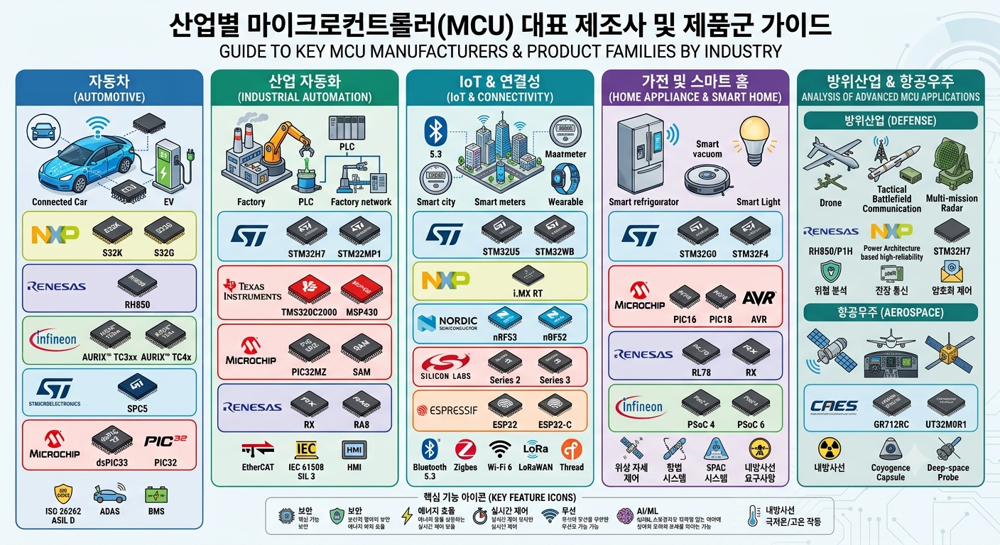

# 산업별 마이크로컨트롤러(MCU) 제조사 및 핵심 제품군 가이드

## 1. 개요 (Overview)
본 문서는 자동차, 산업 자동화, IoT, 가전, 방위산업 및 항공우주 등 주요 산업 분야별로 널리 사용되는 마이크로컨트롤러(MCU) 제조사와 대표 제품군을 분석하고, 각 제품의 채택 이유와 강점을 정리한 기술 가이드입니다. 

또한, 초저가 및 높은 무선 성능으로 주목받는 **Espressif (ESP32)**의 산업적 한계점과 이를 극복하는 **하이엔드/산업용 전문 MCU 제품군**의 차별화 요소, 그리고 커리어 및 취업 관점에서 **학생들에게 가장 가치가 높은(고연봉/고부가가치) MCU 기술 및 제품군**에 대해 상세히 다룹니다.

---

## 2. 산업 분야별 핵심 MCU 제조사 및 대표 제품군





### 2.1. 방위산업 및 항공우주 (Defense & Aerospace)
가혹한 온도 변화, 극심한 진동, 우주 공간의 **방사선(Radiation)** 환경에서도 치명적인 오류 없이 동작해야 하는 **내환경성 및 극상의 신뢰성**이 최우선 사양입니다.

* **CAES (Frontgrade) — UT32M0R1 / UT32M0R500**
  * **채택 이유**: 우주 방사선 대항(TID/SEL Immunized) 특성을 기본 내장한 Space-grade Arm Cortex-M0+ 기반 MCU.
  * **주요 장점**: 위성 전력 제어, 모터 드라이버, 원격 측정(Telemetry) 관리에 최적화되어 있으며, 오류 검출 및 수정(EDAC) 기능을 통해 데이터 손상을 하드웨어 차원에서 방지.
* **Gaisler — GR712RC**
  * **채택 이유**: 유럽우주국(ESA) 표준 결함 허용(Fault-Tolerant) 듀얼코어 LEON3-FT SPARC V8 프로세서.
  * **주요 장점**: 우주선 전용 데이터 통신 표준인 SpaceWire 및 MIL-STD-1553B 인터페이스를 내장해 위성 자세 제어 및 탐사선 컴퓨터에 필수 적용.
* **NXP / Renesas (Power Architecture & RH850/P1H)**
  * **채택 이유**: 국방 무기 체계, 레이다, 전술 통신 장비 등의 고신뢰성 제어용.
  * **주요 장점**: 장기간 공급 보장(15~20년 이상 Longevity) 및 가혹 동작 온도 범위(-55°C ~ +125°C) 준수.

### 2.2. 자동차 (Automotive)
운전자의 생명과 직결되므로 **기능 안전성(Functional Safety)**과 실시간 차량 네트워크 처리 능력이 핵심 요구사항입니다.

* **Infineon — AURIX™ TC3xx / TC4x**
  * **채택 이유**: 차량 기능 안전 최고 등급인 **ISO 26262 ASIL-D** 완벽 지원 멀티코어 MCU.
  * **주요 장점**: 가상화(Virtualization) 지원 및 전용 하드웨어 보안 모듈(HSM) 탑재. 전기차 배터리 관리 시스템(BMS), 차체 제어, ADAS 센서 융합의 표준.
* **NXP — S32K / S32G**
  * **채택 이유**: 차세대 중앙 집중형(Zonal/Domain) 차량 아키텍처 지원.
  * **주요 장점**: CAN-FD, LIN, Automotive Ethernet 가속기를 내장하여 데이터 병목을 최소화하고 무선 업데이트(OTA) 보안 강화.
* **Renesas — RH850**
  * **채택 이유**: 글로벌 완성차(OEM) 시장에서의 높은 시장 점유율과 입증된 안정성.
  * **주요 장점**: 저전력 온칩 플래시 및 우수한 내열 특성을 바탕으로 파워트레인 및 에어백 제어기(ECU)에 광범위 적용.

### 2.3. 산업 자동화 및 로보틱스 (Industrial Automation)
24시간 연속 가동 환경에서의 **고속 실시간 모터 제어**와 Industrial Ethernet 통신 신뢰성이 필수적입니다.

* **Texas Instruments — C2000™ (TMS320C2000)**
  * **채택 이유**: 디지털 전원 제어 및 고성능 모터 제어(FOC) 분야의 독보적인 MCU.
  * **주요 장점**: 초저지연 PWM 및 초고속 ADC 결합으로 로봇 팔, 인버터, 산업용 드라이브 반응 속도 극대화.
* **STMicroelectronics — STM32H7 / STM32MP1**
  * **채택 이유**: 고성능 Arm Cortex-M7 프로세싱 성능과 생태계 제공.
  * **주요 장점**: EtherCAT, PROFINET 등 산업용 필드버스 직접 처리 및 스마트 공장 HMI, 비전 검사 장비 최적화.

### 2.4. IoT & 무선 연결성 (IoT & Connectivity)
배터리로 동작하는 단말이 많아 **초저전력(Ultra-low power)** 설계와 온칩 무선 통신 모듈(Bluetooth, Wi-Fi, LoRa)의 결합이 핵심입니다.

* **Nordic Semiconductor — nRF52 / nRF53 시리즈**
  * **채택 이유**: 초저전력 BLE(Bluetooth Low Energy) 및 Mesh, Thread 기술 시장 리더.
  * **주요 장점**: 극도로 낮은 전력 소비량으로 웨어러블 및 스마트 홈 센서의 배터리 수명 극대화.
* **Espressif — ESP32 시리즈**
  * **채택 이유**: Wi-Fi + Bluetooth 통합 초저가/고성능 MCU.
  * **주요 장점**: 높은 가성비, 연산 능력 및 거대한 오픈소스 커뮤니티 생태계 보유.

### 2.5. 가전 및 스마트 홈 (Home Appliance)
비용 효율성, 모터 소음 제어 및 정밀 입출력 제어가 요구됩니다.

* **Microchip — PIC / AVR (PIC16, PIC18 등)**
  * **채택 이유**: 수십 년간 검증된 노이즈 내성, 신뢰성 및 가성비.
  * **주요 장점**: 가전제품의 버튼/센서 제어 및 전력 모니터링용 표준 MCU.
* **STMicroelectronics — STM32G0 / STM32F4**
  * **채택 이유**: 스마트 가전의 터치 패널 제어 및 BLDC 모터 정밀 제어.
  * **주요 장점**: 모터 제어 라이브러리 지원 및 높은 가성비.

---

## 3. Espressif(ESP32)의 한계점과 산업 현장의 고충

ESP32는 컨슈머 시장에서 뛰어난 성과를 거두었으나, 정통 산업계(Industrial/Automotive/Aerospace) 채택 시 다음과 같은 한계가 존재합니다.

1. **아날로그(ADC) 및 노이즈 내성 한계**
   * ADC의 비선형성(Non-linearity)이 심해 정밀 센서 데이터 수집 시 별도의 외장 ADC가 필요함.
   * 고전압 스위칭, 인버터 노이즈가 강한 공장 환경에서 EMI/EMC 내성이 다소 취약함.
2. **실시간 제어(Real-Time Determinism)의 지터(Jitter) 발생**
   * 무선(Wi-Fi/BT) 백그라운드 스택 실행으로 인해 마이크로초($\mu s$) 단위의 정밀 모터/타이밍 제어 시 인터럽트 지연 발생.
3. **기능 안전(Functional Safety) 규격 부재**
   * ISO 26262(자동차), IEC 61508(산업) 등의 기능 안전 인증 및 하드웨어 코어 락스텝, RAM ECC 등 셀프 진단 구조 결여.
4. **장기 공급 보장(Longevity) 및 지정학적 리스크**
   * 산업 장비에 필수적인 10~15년 장기 공급 보장 프로그램 부재 및 중국 본사 기반에 따른 방산/안보 인프라 적용의 신중함.

---

## 4. 단점을 극복한 하이엔드/산업용 전용 MCU 비교

Espressif의 약점을 하드웨어 차원에서 완벽히 극복한 대표 산업용 MCU 제품군은 다음과 같습니다.

### 4.1. 주요 대표 제품군 분석
* **Infineon AURIX™ (TC3xx / TC4x)**: 듀얼 코어 락스텝(Lockstep) 및 ECC 적용으로 하드웨어 오류 발생 즉시(0.0001초 내) 감지/복구. ISO 26262 ASIL-D 완벽 충족.
* **Texas Instruments C2000™**: 12~16bit 고정밀/초고속 ADC 및 C28x DSP 코어를 내장하여 무선 스택 간섭 없이 마이크로초 단위 Zero-Latency 모터 제어 실현.
* **STMicroelectronics STM32H7**: 10~15년 장기 공급 공식 약속(Longevity Commitment). 듀얼 코어 물리 분리(Domain Isolation)를 통해 실시간 제어부와 네트워크 제어부를 완전 독립 운용.
* **Microchip SAM E70 / PIC32MZ**: 강한 ESD/EFT 내노이즈 가드링 설계로 대형 아크 용접기 및 인버터 인근에서도 칩 리셋 방지.

### 4.2. 핵심 요약 비교표

| 비교 항목 | Espressif (ESP32) | 산업용 표준 MCU (Infineon / TI / ST) |
| :--- | :--- | :--- |
| **최우선 가치** | 저가격, Wi-Fi/BT 무선 통신, 개발 편의성 | **신뢰성, 안전성, 타이밍 정밀도, 노이즈 내성** |
| **기능 안전 인증** | 없음 (미지원) | **ISO 26262 ASIL-D / IEC 61508 SIL-3** |
| **실시간 제어** | 무선 스택에 의한 지터(Jitter) 발생 가능 | **하드웨어 가속기 기반 Zero-Latency** |
| **장기 공급 보장** | 일반 컨슈머 주기 (약 3~5년) | **10~15년 공식 장기 공급 보장** |
| **아날로그(ADC)** | 단순 레벨 측정용 (비선형 오차 존재) | **12~16bit 고정밀 오차 교정 ADC** |

---

## 5. 학생 관점: 가치가 가장 높은(고연봉/고부가가치) 분야 및 MCU 학습 로드맵

학생들이 취업 및 커리어 관점에서 **"몸값을 가장 높이고 장기적으로 대체 불가능한 인재"**가 되기 위해 익혀야 할 핵심 MCU/프로세서 기술 및 제품군 분석입니다.

### 5.1. 추천 3대 고부가가치 분야 및 대표 제품군

1. **전기차 / 자율주행 (Automotive & ADAS) — [수요 및 연봉 1위]**
   * **대표 제품군**: Infineon AURIX™ (TC3xx / TC4x), NXP S32K / S32G
   * **선정 이유**: SDV 전환 및 전장화에 따른 기능 안전 엔지니어의 몸값 폭등. 국내외 완성차 1차 벤더 필수 스펙.
   * **핵심 학습 역량**: ISO 26262 ASIL-D 기능 안전 표준, AUTOSAR(오토사) 소프트웨어 아키텍처, CAN-FD / Automotive Ethernet.

2. **방위산업 & 로보틱스 / 초고속 제어 (Defense & Robotics) — [대체 불가능한 영역]**
   * **대표 제품군**: Texas Instruments C2000™ (TMS320F2838x / F2800x), STMicroelectronics STM32H7 (Arm Cortex-M7)
   * **선정 이유**: 고성능 모터 드라이버, 방산 유도 제어, 로봇 팔 제어의 독보적 표준.
   * **핵심 학습 역량**: FOC(벡터 제어) 모터 제어 알고리즘, DSP 연산 가속기 활용, 마이크로초($\mu s$) 단위 RTOS 정밀 타이밍 제어.

3. **엣지 AI & FPGA 융합 제어 (Edge AI & Hardware Acceleration) — [미래 유망 분야]**
   * **대표 제품군**: AMD Xilinx Kria (KV260 / KR260) 또는 Zynq-7000 시리즈, STMicroelectronics STM32N6 (NPU 탑재 MCU)
   * **선정 이유**: 순수 MCU 연산 한계 극복을 위한 "Arm + FPGA/NPU" 융합 SoC 채택 급증.
   * **핵심 학습 역량**: Verilog/SystemVerilog RTL 설계 + C/C++ 엠베디드 SW 결합, 딥러닝 모델 경량화(Quantization) 및 엣지 AI 이식.

### 5.2. 역량 단계별 학습 로드맵 (Roadmap)

```
[Level 1: 입문]   ESP32 / Arduino (센서 데이터 입출력, C/C++ 기초)
        ↓
[Level 2: 취업]   STM32F4 / STM32G0 (Bare-metal 및 FreeRTOS, 레지스터 직접 제어)
        ↓
[Level 3: 고연봉] TI C2000 (모터 FOC 제어) / STM32H7 (EtherCAT 필드버스 통신) 
        ↓
[Level 4: 마스터] AMD Xilinx Zynq/Kria (Arm + FPGA) OR Infineon AURIX (AUTOSAR / CAN-FD)
```

### 5.3. 학생 포트폴리오 차별화 전략
* **기본 역량**: STM32F1/F4 또는 ESP32 기반의 범용 프로젝트 경험은 **기본 패시브 스킬**로 간주됩니다.
* **핵심 차별화 포인트**: 특수 목적형 MCU/SoC를 이용한 하이엔드 프로젝트 경험이 포함될 때 포트폴리오의 가치가 극대화됩니다.
  * 예시 1: *TI C2000 기반 고속 BLDC 모터 FOC 제어기 설계 및 검증*
  * 예시 2: *AMD Xilinx Zynq/Kria FPGA를 활용한 실시간 영상 처리 하드웨어 가속기 구현*
  * 예시 3: *STM32H7 및 EtherCAT 기반 로봇 다축 제어 시스템 구축*

