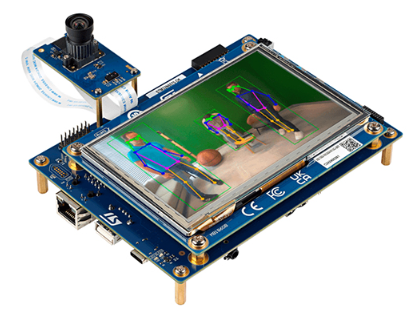
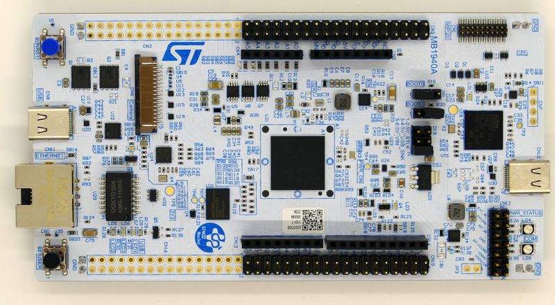
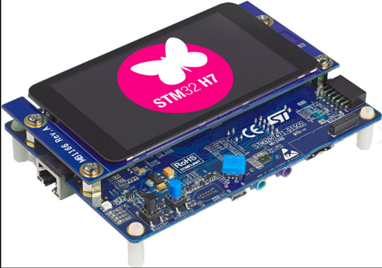
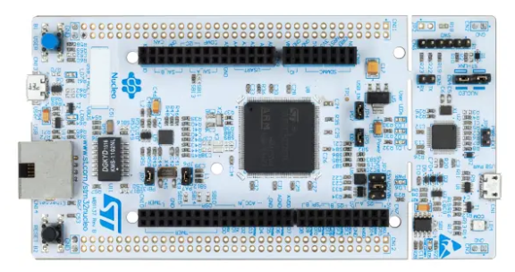
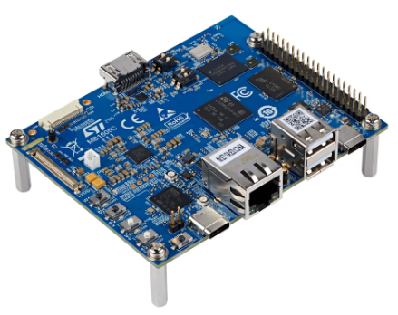
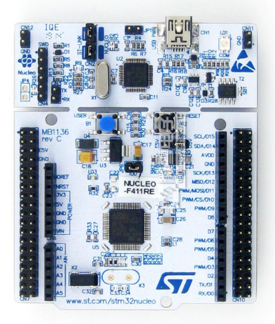
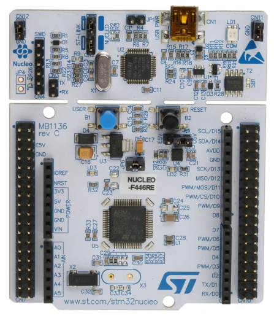
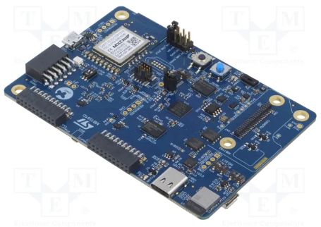
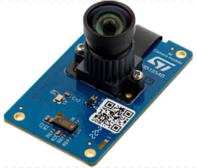
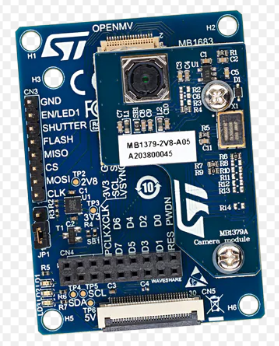

# STMicroelectronics(ST)의 평가 보드 라인업

---

 

> [ST마이크로일렉트로닉스](https://ko.wikipedia.org/wiki/ST%EB%A7%88%EC%9D%B4%ED%81%AC%EB%A1%9C%EC%9D%BC%EB%A0%89%ED%8A%B8%EB%A1%9C%EB%8B%89%EC%8A%A4)의 공식 하드웨어 생태계는 개발 목적, 양산 준비 단계, 특정 애플리케이션 특화 여부에 따라 크게 4가지 핵심 카테고리로 나뉩니다.

 

# 1. STM32 Eval (Evaluation) Boards 
## : "끝판왕, 올인원 보드"
   * 성격: 해당 MCU가 지원하는 <ins>모든 핀과 모든 하드웨어 기능(인터페이스)</ins>을 한 기판에 전부 구현한 최상위 평가 보드입니다.
   * 특징: 크기가 매우 크고, 외부 확장 버스(EBI), 오디오 코덱, 모터 제어 커넥터,  다중 이더넷/USB 등 칩의 한계까지 테스트할 수 있도록 설계되었습니다.
   * 칩 제조사들이 기술 지원이나 레퍼런스 검증용으로 주로 씁니다.
   * 단점: 기능이 다 들어간 만큼 가격이 매우 비쌉니다 (보통 수십만 원대).

  

# 2. Discovery Kits (디스커버리 키트) 
## : "특정 목적용 완제품 프로토타이핑"
   * 성격: 말씀하신 대로 <ins>"칩의 주요 핵심 기능을 다 써볼 수 있는"</ins> 보드인데, 특히 특정 테마 (디스플레이, AI, IoT, 오디오 등)에 맞춰 주변 장치가 완제품 형태로 빌트인 되어 있습니다.
   * 특징: 예를 들어 '디스플레이 디스커버리'면 LCD 패널이 붙어 있고,  'IoT 디스커버리'면 Wi-Fi/Bluetooth 모듈과 온보드 센서들이 기본 장착되어 있습니다.
   * 별도의 실딩 보드를 주렁주렁 달지 않고도 곧바로 그럴듯한 프로토타입 결과물을 만들 수 있습니다.

  

# 3. NUCLEO (뉴클레오) 
## : "가장 대중적인 아두이노 형태의 확장형 보드"
   * 성격: <ins>아두이노 우노(Uno) 또는 메가(Mega)와 호환</ins>되는 핀 배열(Arduino Shield 호환)을 가진 표준 개발 보드입니다.
   * 특징: 기본 칩과 클록, ST-LINK(디버거)만 있는 매우 깔끔하고 미니멀한 구조입니다.
   * 필요한 기능은 아두이노 실드나 ST 고유의 X-NUCLEO 확장 보드를 위에 쌓아 올려가며 개발합니다.
   * 가격이 매우 저렴하여(몇 만 원대) 전 세계 엔지니어와 학생들의 표준 교재로 쓰입니다.
   * 종류: 핀 수에 따라 Nucleo-32, Nucleo-64, Nucleo-144 등으로 나뉩니다.

  

# 4. STM32 무선/센서 전용 노드 (STWIN, SensorTile 등) 
## : "초소형 실전형 IoT 노드"
   * 성격: 최근 에지 AI 및 고도화된 IoT 시장을 겨냥해 나오는 산업용/웨어러블 규격의 초소형 독립 노드 보드입니다.
   * 특징: 뉴클레오나 디스커버리처럼 책상 위에 두고 쓰는 형태가 아니라,  손가락 마디만 한 크기에 초저전력 MCU + 정밀 MEMS 센서 + 무선 모듈 + 배터리 회로를 밀집시켜 둔 형태입니다.
   * 앞서 보셨던 스마트 센서 머신러닝이나 모터 진동 예측 보전(Predictive Maintenance) 등의  AI 알고리즘을 현장에 바로 부착해 테스트할 때 사용합니다.
   * (예: STWIN.box, SensorTile Box)

 

---

 

## 📊 한눈에 보는 ST 보드 라인업 비교

| 보드 라인업 | 주변 장치 내장 수준 | 확장성 (아두이노 등) | 주 용도 | 가격대 | 
|:---------------:|:---------------:|:---------------:|:---------------:|:---------------:|
| EVAL | 🌟🌟🌟 (전 기능 풀옵션) | 전용 확장 커넥터 중심 | 칩의 한계 기능 검증, 풀 스펙 테스트 | 매우 높음 | 
| Discovery | 🌟🌟 (테마별 완제품 빌트인) | 보드에 따라 일부 지원 | 디스플레이/오디오/IoT 프로토타입 | 중간 | 
| NUCLEO | 🌟 (최소한의 소자만 탑재) | 🌟🌟🌟 (아두이노/Morpho 핀) | 범용 임베디드 개발, 아이디어 검증 | 낮음 (가성비 최고) | 
| IoT Node | 🌟🌟 (센서/무선 컴팩트 밀집) | 전용 소형 커넥터 | 현장 부착형 실증 테스트, 에지 AI | 중간 | 

 

---

 

# STM32 AI 교육·프로토타이핑 보드 라인업

> STM32 + X-CUBE-AI(STM32Cube AI Studio) 및 ST Edge AI Developer Cloud 기반 AI/ML 교육 및 프로토타이핑에 적합한 보드들을 용도별로 분류했습니다.

 

## 1. 🧠 Advanced AI & Vision Prototyping (고급 AI/비전 프로토타이핑)
**대상**: 고성능 NPU 기반 컴퓨터 비전, 객체 탐지, 포즈 추정
| 보드 | 주요 스펙 | AI 가속 |
|:-----|:----------|:---------|
| **STM32N6570-DK** + B-CAMS-IMX | Cortex-M55 @ 800 MHz, 5" LCD, MIPI CSI-2, Ethernet | Neural-ART NPU 600 GOPS |
| **STM32N6570-DK** (단독) | 동일 보드, 카메라 미포함 | Neural-ART NPU 600 GOPS |

| [쿠팡](https://www.coupang.com/vp/products/9580333393?itemId=28597307720&vendorItemId=95541033690&src=1032034&spec=10305199&addtag=400&ctag=9580333393&lptag=I28597307720&itime=20260627114345&pageType=PRODUCT&pageValue=9580333393&wPcid=17385890433435590372435&wRef=prod.danawa.com&wTime=20260627114345&redirect=landing&mcid=35995fc51a57424788e270e9922f0200) | [Stmicro](https://estore.st.com/en/catalogsearch/result/?q=STM32N6570-DK) | [Mouser](https://www.mouser.kr/ProductDetail/STMicroelectronics/STM32N6570-DK?qs=%252BXxaIXUDbq0LuvUu20SpPg%3D%3D) |
|:-----:|:-------:|:-------:|
|  ₩291,700 | $219.37(₩336,737.34) | ₩333,442 |

| [Gmarket](https://item.gmarket.co.kr/Item?spm=gmktpc.searchlist.topclickeditem.d0_0.501265c7Er7prH&goodscode=4571268507&utparam-url=%7B%22x_object_id%22%3A%224571268507%22%2C%22x_object_type%22%3A%22item%22%2C%22query%22%3A%22%EC%82%B0%EC%97%85%EA%B8%B0%EA%B8%B0%22%2C%22pvid%22%3A%22e829666efd614a519485d9ba8dfde54f%22%2C%22pvid_sys%22%3A%22gmarket%20server%22%2C%22search_session_id%22%3A%220c877fbb-8d7a-4995-b367-813d85822778%22%2C%22origin_price%22%3A%22191400%22%2C%22promotion_price%22%3A%22176330%22%2C%22coupon_price%22%3A%22%22%2C%22ab_buckets%22%3A%22%22%2C%22trafficType%22%3A%22organic%22%7D) | [Stmicro](https://estore.st.com/en/catalogsearch/result/?q=B-CAMS-IMX) | [Mouser](https://www.mouser.kr/ProductDetail/STMicroelectronics/B-CAMS-IMX?qs=IKkN%2F947nfAj%2F3qr0ylv5g%3D%3D) |
|:-----:|:-------:|:-------:|
|  ₩177,580 | $86.21(₩132,334.07) | ₩131,039 |

 

## 2. 💰 Affordable AI Accelerated Prototyping (가성비 NPU 프로토타이핑)
**대상**: NPU 가속을 경험할 수 있는 가장 저렴한 엔트리 보드
| 보드 | 주요 스펙 | AI 가속 |
|:-----|:----------|:---------|
| **NUCLEO-N657X0-Q** | Cortex-M55 @ 800 MHz, Arduino/Morpho, 카메라 FPC | Neural-ART NPU 600 GOPS |

| [쿠팡](https://www.coupang.com/vp/products/9621603333?itemId=28731937613&vendorItemId=95671854017&src=1032034&spec=10305199&addtag=400&ctag=9621603333&lptag=I28731937613&itime=20260627120120&pageType=PRODUCT&pageValue=9621603333&wPcid=17385890433435590372435&wRef=prod.danawa.com&wTime=20260627120120&redirect=landing&mcid=383b2c41808c45ba99d9009ded6f3e0e) | [Stmicro](https://estore.st.com/en/catalogsearch/result/?q=NUCLEO-N657X0-Q) | [Mouser](https://www.mouser.kr/ProductDetail/STMicroelectronics/NUCLEO-N657X0-Q?qs=%252BXxaIXUDbq1Ro77qvzSZDA%3D%3D) |
|:-----:|:-------:|:-------:|
|  ₩163,610 | $73.04(₩112,117.86) | ₩113,286 |

 

## 3. ⚡ High-Performance CPU-based AI (고성능 CPU 기반 AI)
**대상**: NPU 없이 CPU만으로 추론, 대용량 모델 벤치마킹
| 보드 | 주요 스펙 | AI 방식 |
|:-----|:----------|:---------|
| **STM32H747I-DISCO** | CM7 400 MHz + CM4 200 MHz, 4" LCD, Ethernet, 카메라 커넥터 | X-CUBE-AI (CPU 추론) |
| **NUCLEO-H743ZI2** | CM7 @ 480 MHz, 2 MB Flash, 1 MB RAM, Arduino/Morpho | X-CUBE-AI (CPU 추론) |

| [Auction](https://itempage3.auction.co.kr/DetailView.aspx?itemno=E677686466) | [Stmicro](https://estore.st.com/en/catalogsearch/result/?q=STM32H747I-DISCO) | [Mouser](https://www.mouser.kr/ProductDetail/STMicroelectronics/STM32H747I-DISCO?qs=PzGy0jfpSMt94jB7NPxlfQ%3D%3D) |
|:-----:|:-------:|:-------:|
|  ₩192,250 | $161.03(₩247,184.27) Out of Stock |  ₩244,766 (stock 0) |

| [옥션](https://itempage3.auction.co.kr/DetailView.aspx?itemno=F460872187) | Stmicro | Mouser |
|:-----:|:-------:|:-------:|
|  ₩71,800 | 단종 | 구형 |

  

 

## 4. 🐧 Linux Edge AI with NPU (리눅스 기반 에지 AI)
**대상**: Linux + AI, OpenSTLinux + X-LINUX-AI, 산업용 에지
| 보드 | 주요 스펙 | AI 가속 |
|:-----|:----------|:---------|
| **STM32MP257F-DK** | Dual A35 @ 1.5 GHz + M33 @ 400 MHz, LPDDR4 4 GB, eMMC, HDMI, Wi-Fi/BLE | NPU 1.35 TOPS + GPU |

| [쿠팡](https://www.coupang.com/vp/products/9245942715?itemId=27344495630&vendorItemId=94310744298&src=1032034&spec=10305199&addtag=400&ctag=9245942715&lptag=I27344495630&itime=20260627130304&pageType=PRODUCT&pageValue=9245942715&wPcid=17385890433435590372435&wRef=prod.danawa.com&wTime=20260627130304&redirect=landing&mcid=5dc7aff08d16496fbfd6e0e314295fa1) | [Stmicro](https://estore.st.com/en/stm32mp257f-dk-cpn.html) | [Mouser](https://www.mouser.kr/ProductDetail/STMicroelectronics/STM32MP257F-DK?qs=NeOn4crkEuv9X8W3Ch%2FMaQ%3D%3D) |
|:-----:|:-------:|:-------:|
|  ₩293,300 | $100.64(₩154,484.41) | ₩156,089 |

 

## 5. 🐤 Entry-Level TinyML / CPU AI Education (입문용 TinyML/CPU AI)
**대상**: AI 첫걸음, 소형 모델, 키워드 검출, 이상 탐지
| 보드 | 주요 스펙 | 비고 |
|:-----|:----------|:-----|
| **NUCLEO-F411RE** (STM32F411) | CM4 @ 100 MHz, 512 KB Flash, 128 KB RAM | $14, 가장 저렴한 AI 교육용 |
| **NUCLEO-F446RE** (STM32F446) | CM4 @ 180 MHz, 512 KB Flash, 128 KB RAM | FPU+DSP, F4 라인 중 가성비 |
| **B-U585I-IOT02A** | CM33 @ 160 MHz, Wi-Fi/BLE, 온보드 센서 | IoT + AI + 저전력 |

| [11번](https://www.11st.co.kr/products/8929184927?utm_term=&utm_campaign=%B4%D9%B3%AA%BF%CDpc_%B0%A1%B0%DD%BA%F1%B1%B3%B1%E2%BA%BB&utm_source=%B4%D9%B3%AA%BF%CD_PC_PCS&utm_medium=%B0%A1%B0%DD%BA%F1%B1%B3) | [Stmicro](https://estore.st.com/en/catalogsearch/result/?q=NUCLEO-F411RE) | [Mouser](https://www.mouser.kr/ProductDetail/STMicroelectronics/NUCLEO-F411RE?qs=Zt3UNFD9mQjdEJg18RwZ2g%3D%3D) |
|:-----:|:-------:|:-------:|
|  ₩18,920 | $18.44(₩28,305.77) | ₩28,059 |

| [Gmarket](https://itempage3.auction.co.kr/DetailView.aspx?itemno=F574888400) | [Stmicro](https://estore.st.com/en/catalogsearch/result/?q=NUCLEO-F446RE) | [Mouser](https://www.mouser.kr/ProductDetail/STMicroelectronics/NUCLEO-F446RE?qs=PRtH0mD6DWYnuBoPSlbRCA%3D%3D) |
|:-----:|:-------:|:-------:|
|  ₩29,700 | $18.42(₩28,275.07) | ₩28,606 |

| [Auction](https://itempage3.auction.co.kr/DetailView.aspx?itemno=E698165934) | [Stmicro](https://estore.st.com/en/b-u585i-iot02a-cpn.html) | [Mouser](https://www.mouser.kr/ProductDetail/STMicroelectronics/B-U585I-IOT02A?qs=Jslch3jnSjk0oS%252BiVUwGOA%3D%3D) |
|:-----:|:-------:|:-------:|
|  ₩149,230 | $87.63(₩132,334.07) | ₩133,198 |

  

 

## 6. 📷 Camera Modules for Vision AI (비전 AI 카메라 모듈)
**대상**: STM32 보드에 연결하는 비전 모듈
| 모듈 | 센서 | 인터페이스 | 호환 보드 |
|:-----|:-----|:-----------|:----------|
| **B-CAMS-IMX** | Sony IMX335 5 Mpix + IMU + ToF | MIPI CSI-2 (2-lane) | STM32N6570-DK, STM32MP257F-DK |
| **B-CAMS-OMV** | OV5640 5 Mpix | 8-bit DCMI (병렬) | STM32H747I-DISCO 등 DCMI 보드 |

| [Gmarket](https://item.gmarket.co.kr/Item?spm=gmktpc.searchlist.topclickeditem.d0_0.501265c7Er7prH&goodscode=4571268507&utparam-url=%7B%22x_object_id%22%3A%224571268507%22%2C%22x_object_type%22%3A%22item%22%2C%22query%22%3A%22%EC%82%B0%EC%97%85%EA%B8%B0%EA%B8%B0%22%2C%22pvid%22%3A%22e829666efd614a519485d9ba8dfde54f%22%2C%22pvid_sys%22%3A%22gmarket%20server%22%2C%22search_session_id%22%3A%220c877fbb-8d7a-4995-b367-813d85822778%22%2C%22origin_price%22%3A%22191400%22%2C%22promotion_price%22%3A%22176330%22%2C%22coupon_price%22%3A%22%22%2C%22ab_buckets%22%3A%22%22%2C%22trafficType%22%3A%22organic%22%7D) | [Stmicro](https://estore.st.com/en/catalogsearch/result/?q=B-CAMS-IMX) | [Mouser](https://www.mouser.kr/ProductDetail/STMicroelectronics/B-CAMS-IMX?qs=IKkN%2F947nfAj%2F3qr0ylv5g%3D%3D) |
|:-----:|:-------:|:-------:|
|  ₩177,580 | $86.21(₩132,334.07) | ₩131,039 |

| [Gmarket](https://link.gmarket.co.kr/gate/pcs?item-no=4571286434&sub-id=1001&service-code=10000000&lcd=100000076) | [Stmicro](https://estore.st.com/en/catalogsearch/result/?q=B-CAMS-OMV) | [Mouser](https://www.mouser.kr/ProductDetail/STMicroelectronics/B-CAMS-OMV?qs=IS%252B4QmGtzzrx0gGY7GXbMA%3D%3D) |
|:-----:|:-------:|:-------:|
|  ₩83,100 | $44.65(₩68,538.64) | ₩67,868 |

 

---

## 📊 AI 교육 보드 비교 한눈에

| 보드 | MCU/MPU | AI 가속기 | Flash/RAM | 가격대 | 추천 용도 |
|:-----|:---------|:----------|:----------|:------|:----------|
| NUCLEO-F411RE | CM4 @ 100 MHz | 없음 (CPU) | 512 KB / 128 KB | ~$14 | TinyML 입문, KWS |
| NUCLEO-H743ZI2 | CM7 @ 480 MHz | 없음 (CPU) | 2 MB / 1 MB | ~$45 | 중간 규모 모델,  교육 메인 |
| STM32H747I-DISCO | CM7+CM4 @ 400 MHz | 없음 (CPU) | 2 MB / 1 MB | ~$159 | 컴퓨터 비전 교육 |
| NUCLEO-N657X0-Q | CM55 @ 800 MHz | NPU 600 GOPS | 외부 XSPI Flash  / 4.2 MB SRAM | ~$50-70 | NPU 입문,  가성비 끝판왕 |
| STM32N6570-DK | CM55 @ 800 MHz | NPU 600 GOPS + GPU | 외부 XSPI Flash  / 4.2 MB SRAM | ~$183 | AI/비전 프로토타입 최종 |
| STM32MP257F-DK | A35×2 @ 1.5 GHz | NPU 1.35 TOPS | LPDDR4 4 GB | ~$100 | Linux + AI, 산업용 |
| B-U585I-IOT02A | CM33 @ 160 MHz | 없음 (CPU) | 2 MB / 786 KB | ~$90 | IoT AI, 센서 융합 |

> 💡 **추천 학습 로드맵**
> 1. **NUCLEO-F411RE** 또는 **NUCLEO-H743ZI2**로 X-CUBE-AI (CPU 추론) 기초 학습
> 2. **NUCLEO-N657X0-Q**로 NPU 가속 경험
> 3. **STM32N6570-DK** + **B-CAMS-IMX**로 고급 비전 AI 프로젝트
> 4. **STM32MP257F-DK**로 Linux 환경 AI 배포

 

---

 

## 🏆 장기 교육용 키트 추천 순위

> **선정 기준**: 장기간 하나의 보드로 커버 가능한 교육 범위의 폭, NPU 미래 대비, 생태계 확장성, 가격 대비 효용

 

---

### 🥇 1위: NUCLEO-N657X0-Q (~₩11만)

**"NPU 가성비 끝판왕, 기초부터 고급까지 가장 균형 잡힌 교육용 보드"**

| 가능한 교육 범위 | 비고 |
|:---|---|
| ✅ 기본 MCU (GPIO, UART, I2C, SPI) | Arduino/Morpho 핀 |
| ✅ CPU 기반 X-CUBE-AI 추론 | Cortex-M55 Helium |
| ✅ **NPU 가속 추론 (Neural-ART 600 GOPS)** | N6 시리즈 핵심 |
| ✅ FreeRTOS + AI 통합 | 교육 커리큘럼 전체 |
| ✅ 카메라 비전 AI (B-CAMS-IMX 추가 시) | FPC 커넥터 있음 |
| ✅ 각종 센서 실드 확장 | Arduino 호환 |
| ✅ 향후 STM32N6570-DK로 업그레이드 | 동일 NPU 아키텍처, 자연스러운 이행 |

**추천 이유**: N6570-DK와 **동일한 NPU**를 탑재하면서 가격은 **1/3 수준**. 교육 현장에서 가장 실용적이고, NPU 기초부터 실전까지 모두 커버하며, 부족한 부분(LCD, GPU)은 추후 DK로 업그레이드하는 학습 로드맵이 가장 효율적.

 

---

### 🥈 2위: STM32N6570-DK + B-CAMS-IMX (~₩33만)

**"AI 교육의 완성체, 예산이 충분하다면 단 하나의 최종 선택"**

| 가능한 교육 범위 | 비고 |
|:---|---|
| ✅ 위 NUCLEO-N657X0-Q의 **모든 기능** | 동일 MCU + NPU |
| ✅ **GPU (NeoChrom 2.5D)** | GUI, TouchGFX 교육 |
| ✅ **5인치 LCD 터치 디스플레이** | 온보드 디스플레이 |
| ✅ **MIPI CSI-2 카메라 (B-CAMS-IMX)** | 비전 AI 올인원 |
| ✅ **하드웨어 ISP + H.264 인코더** | 고급 이미지 처리 |
| ✅ **Ethernet (RGMII)** | 네트워크/AI 통합 |
| ✅ 단일 보드로 **모든 실습 가능** | 추가 실드 불필요 |

**추천 이유**: 하나의 보드로 MCU, NPU, GPU, CV, 네트워크를 **전부** 다룰 수 있는 유일한 선택지. FreeRTOS + AI + Vision + Graphics까지 아우르는 **가장 넓은 교육 범위**. 다만 가격이 부담된다면 NUCLEO-N657X0-Q로 시작해 필요할 때 업그레이드하는 전략도 좋음.

 

---

### 🥉 3위: STM32MP257F-DK (~₩15-29만)

**"MCU를 넘어 Linux + AI까지, 차별화된 교육 범위"**

| 가능한 교육 범위 | 비고 |
|:---|---|
| ✅ **Linux (OpenSTLinux) 환경** | MCU와 다른 패러다임 |
| ✅ **가장 강력한 NPU (1.35 TOPS)** | GPU+NPU 통합 아키텍처 |
| ✅ **HDMI 출력, USB 3.0, Wi-Fi/BLE** | PC 주변기기 수준 |
| ✅ **LPDDR4 4 GB, eMMC** | 대용량 메모리 |
| ❌ MCU 저수준 제어 (GPIO 타이밍 등) | Linux 추상화 계층 |
| ❌ FreeRTOS 실시간 AI 추론 | Linux 기반 |

**추천 이유**: 1위/2위가 MCU + NPU 중심이라면, 이 보드는 **Linux + NPU**라는 완전히 다른 영역을 커버. STM32 교육 과정의 범위를 **MCU를 넘어 MPU(Linux)로 확장**하고 싶다면 필수. 산업용 에지 AI, 리눅스 드라이버, OpenCV 등도 다룰 수 있어 교육 포트폴리오를 크게 넓힘.

 

---

### 📊 요약 비교

| 순위 | 보드 | 가격대 | 핵심 가치 |
|:----:|:-----|:------|:----------|
| 🥇 | **NUCLEO-N657X0-Q** | ~₩11만 | **가성비 + NPU + 확장성의 최적 균형** |
| 🥈 | **STM32N6570-DK + B-CAMS-IMX** | ~₩33만 | **올인원 최종 솔루션** |
| 🥉 | **STM32MP257F-DK** | ~₩15-29만 | **Linux + AI로 영역 확장** |

> 💡 **조언**: 교육 과정의 주력 보드로 **NUCLEO-N657X0-Q**를 채택하고, 시연/심화 과정에서 교사용으로 **STM32N6570-DK** 한 대를 추가 운영하는 조합이 예산 대비 효율이 가장 높습니다.

