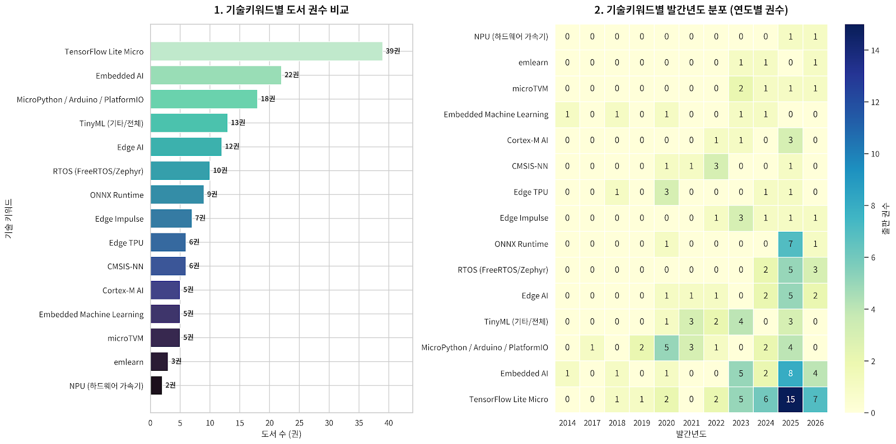

# 임베디드 ML/AI 도서 종합 분석 보고서

## 분석 개요

- **데이터 소스**: `book_list.txt` (8,808줄, 15개 키워드 섹션)
- **분석 대상**: RTOS, MicroPython, Arduino, PlatformIO, TFLite Micro, Edge Impulse, CMSIS-NN, ONNX Runtime, microTVM, emlearn, Edge TPU, NPU, Cortex-M AI
- **도서 수**: 124권 (중복 제거 후)
- **분석 범위**: 2017-2026년 출판 도서

---

## 1. 키워드별 중복 제거 도서 목록

### RTOS (FreeRTOS, Zephyr RTOS)

| 도서명 | 저자 | 연도 |
|--------|------|------|
| FreeRTOS & Zephyr RTOS For Homelabs | Juno Darian | 2026 |
| Professional RTOS Development with Microcontrollers | Alfred J. Gable | 2025 |
| Zephyr RTOS Embedded C Programming | Andrew Eliasz | 2024 |
| Master Zephyr RTOS: A Hands-On Guide | Tony Larson | 2025 |
| Mastering Zephyr RTOS For Real-Time Embedded & IoT Systems | Juno Darian | 2026 |
| Practical RISC-V For Embedded Systems (FreeRTOS, Zephyr, PlatformIO) | Reid Orian | 2026 |
| Mastering Real-Time Embedded Development | Lukas T. Weber | 2025 |
| PlatformIO Development Essentials | Richard Johnson | 2025 |
| Embedded Systems and IoT | R. Suganya et al. | 2024 |
| Real-Time Edge Mastery: STM32 FreeRTOS Projects | Reginald G. Watford | 2025 |

### MicroPython / Arduino / PlatformIO

| 도서명 | 저자 | 연도 |
|--------|------|------|
| Programming with MicroPython | Nicholas H. Tollervey | 2017 |
| MicroPython Projects | Jacob Beningo | 2020 |
| MicroPython for the Internet of Things | Charles Bell | 2024 |
| The Complete ESP32 Projects Guide | Dogan Ibrahim | 2019 |
| MicroPython for ESP8266 Development Workshop | Agus Kurniawan | 2020 |
| MicroPython for ESP32 Development Workshop | Agus Kurniawan | 2020 |
| MicroPython for STM32 Nucleo Technical Workshop | Agus Kurniawan | 2020 |
| ESP8266+MicroPython | Fernando José Moutinho Deyán | 2020 |
| Programming the ESP32 in MicroPython, 2nd Edition | Mike James, Harry Fairhead | 2025 |
| MicroPython for Everyone: ESP32 and ESP8266 | Mason Milette | 2021 |
| MicroPython for Microcontrollers | Günter Spanner | 2021 |
| Fun Coding with MicroPython | Andi Dinata | 2019 |
| Arduino and MicroPython Programming Guide: ESP32 & ESP8266 | Sarful Hassan | 2024 |
| Explore ESP32 MicroPython | Akira Shiro | 2021 |
| The Complete ESP32 Programming with MicroPython & Arduino | Fujimura Takata | 2025 |
| Mastering Arduino Nesso N1 From A-Z | Tom B. Nolan | 2025 |
| 사물인터넷을 품은 라즈베리 파이 (개정판) | 김성우 | 2022 |
| ESP32 Development and Applications | Richard Johnson | 2025 |

### TensorFlow Lite Micro

| 도서명 | 저자 | 연도 |
|--------|------|------|
| TinyML: Machine Learning with TensorFlow Lite on Arduino | Pete Warden, Daniel Situnayake | 2019 |
| TinyML (한국어판) | 피트 워든, 대니얼 시투나야케 | 2020 |
| TinyML 2nd Edition (中文版) | Pete Warden, Daniel Situnayake | 2020 |
| TinyML Cookbook | Gian Marco Iodice | 2023 |
| TinyML for Beginners: Edge Impulse, TFLite Micro, STM32Cube.AI | Vihaan Kulkarni | 2025 |
| Embedded TinyML: Deploying Intelligent Systems | Pete Richards | 2025 |
| TinyML Made Easy: Machine Learning on Micro Controllers | Amara Hawthorn | 2025 |
| TinyML in Action: A Practical Guide | Camila Jones | 2025 |
| TinyML: Revolutionizing Embedded AI for Intelligent Devices | S. Karthika et al. | 2026 |
| Embedded Machine Learning with Microcontrollers | Cem Ünsalan et al. | 2024 |
| Programming for Embedded AI with TinyML and TensorFlow Lite | (출판사 미상) | 2024 |
| Tiny Machine Learning: Fundamentals, Applications, and Security | Rajdeep Chakraborty et al. | 2026 |
| TensorFlow Lite Deployment Techniques | William Smith | 2025 |
| Hands-on TensorFlow Lite for Intelligent Mobile Apps | Valverde Martinez | 2018 |
| TinyML on Microcontrollers: Running Neural Networks | Kalen Virell | 2025 |
| ESP32 & TinyML for Smart Home | Vihaan Kulkarni | 2025 |
| TinyML Applications | Katherine Harris | 2024 |
| Introduction to TinyML | Rohit Sharma | 2022 |
| TinyML+IoT = AI of Things Part 1 & 2 | Roberto Francavilla | 2025 |
| Applied TinyML: End-to-end ML for Microcontrollers | Ricardo Cid | 2025 |
| TinyML in Practice | Logan Pierce | 2025 |
| Tiny Machine Learning Quickstart | Simone Salerno | 2025 |
| TinyML for Beginners (Maryam Muhammad) | Maryam Muhammad | 2025 |
| TinyML for Beginners (Usher Harman) | Usher C. Harman | 2025 |
| Mastering TinyML | Leon Chapman | 2024 |
| TinyML: Fundamentals and Applications | Rajdeep Chakraborty et al. | 2026 |
| Machine Learning on Commodity Tiny Devices | Song Guo, Qihua Zhou | 2022 |
| Taming TinyML: Deep Learning Inference at Computational Edge | Edgaras Liberis | 2023 |
| TinyML Foundations and Applications on Arduino | Ying Bai | 2026 |
| TinyML for Agriculture: On-device AI for Precision Farming | Devon Code | 2025 |
| Tiny Machine Learning Techniques for Constrained Devices | Khalid El-Makkaoui et al. | 2026 |
| Next-Gen Machine Learning: Generative Models, TinyML & FL | Ramon B. Watts | 2025 |
| TinyML for Edge Intelligence in IoT and LPWAN Networks | Bharat S. Chaudhari et al. | 2024 |
| Modern Embedded Rust: IoT, TinyML | Rhys Gallagher | 2026 |
| Physics-Aware Tiny Machine Learning | Swapnil Sayan Saha | 2023 |
| Hands-on TinyML | Rohan Banerjee | 2023 |
| Embedded Intelligence: On-Device TinyML on the Raspberry Pi Pico | Declan Ross | 2026 |
| Deep Learning on Microcontrollers | Atul Krishna Gupta et al. | 2023 |
| Massive TinyML (Massive TinyML: Practical Machine Learning at the Extreme Edge) | Dan Cox (추정) | 2024 |

### Edge Impulse

| 도서명 | 저자 | 연도 |
|--------|------|------|
| AI for IoT with TensorFlow Lite and Edge Impulse | Michael A. Champagne | 2025 |
| On-Device AI: The Complete TinyML Guide for Developers | Caroline Lennox | 2026 |
| Deep Learning on Microcontrollers | Atul Krishna Gupta, Siva Prasad Nandyala | 2023 |
| Developing IoT Projects with ESP32 | Vedat Ozan Oner | 2023 |
| Sensor Projects with Raspberry Pi | Guillermo Guillen | 2024 |
| Raspberry Pi Cookbook | Simon Monk | 2022 |
| AI at the Edge: Solving Real-World Problems | Daniel Situnayake, Jenny Plunkett | 2023 |

### CMSIS-NN

| 도서명 | 저자 | 연도 |
|--------|------|------|
| The Designer's Guide to the Cortex-M Processor Family | Trevor Martin | 2022 |
| The Insider's Guide to Arm Cortex-M Development | Zachary Lasiuk et al. | 2022 |
| From Artificial Intelligence to Brain Intelligence | Rajiv Joshi et al. | 2022 |
| Efficient Algorithms and Systems for Tiny Deep Learning | Ji Lin | 2021 |
| Embedded AI for Resource-Constrained Systems | ANT (추정) | 2025 |
| PSoC 6 Microcontroller Dual-Core Performance (Cortex-M4) | Freddy Antonio Carrillo Aguirre | 2020 |

### ONNX Runtime

| 도서명 | 저자 | 연도 |
|--------|------|------|
| ONNX Runtime GenAI: Portable Inference Across CPU, GPU, and Edge | Trex Team | 2026 |
| ONNX 첫걸음: ONNX, 인공지능 모델의 표준 | 김성민 등 | 2020 |
| Efficient AI Solutions: Deploying Deep Learning with ONNX | Peter Jones | 2025 |
| ONNX Runtime Web: Build AI-Powered Apps with WebGPU | Talia Graham | 2025 |
| Browser Machine Learning Mastery: Onnx.Js and ONNX Runtime | Aura Fenwick | 2025 |
| Ultimate ONNX for Deep Learning Optimization | Meet Patel | 2025 |
| Hands-On ONNX: AI Model Portability | Dr. Benjamin Neudorf | 2025 |
| ONNX Runtime for AI Developers | Cody Coker | 2025 |
| Onnx.Js for Beginners | Laitan Michael | 2025 |

### microTVM

| 도서명 | 저자 | 연도 |
|--------|------|------|
| TVM: Compiler Infrastructure for Deep Learning Optimization | William Smith | 2025 |
| TinyML Cookbook (microTVM 섹션) | Gian Marco Iodice | 2023 |
| Tiny Machine Learning: Fundamentals, Applications, and Security (microTVM 섹션) | Rajdeep Chakraborty et al. | 2026 |
| Image and Vision Computing (microTVM 실험) | Wei Qi Yan et al. | 2023 |
| Unlocking Artificial Intelligence: From Theory to Applications | Christopher Mutschler et al. | 2024 |

### emlearn

| 도서명 | 저자 | 연도 |
|--------|------|------|
| TinyML Cookbook (emlearn 섹션) | Gian Marco Iodice | 2023 |
| AI Projects with Raspberry Pi | Lucy Hattersley, Brian Jepson | 2026 |
| TinyML for Edge Intelligence in IoT and LPWAN Networks | Bharat S. Chaudhari et al. | 2024 |

### TinyML (전체 범주, 중복 제거 후 추가)

| 도서명 | 저자 | 연도 |
|--------|------|------|
| TinyML: Machine Learning with TensorFlow on Arduino and Ultra-Low-Power Microcontrollers | Pete Warden | 2020 |
| TinyML: Machine Learning with TensorFlow Lite (폴란드어판) | Pete Warden, Daniel Situnayake, Helion | 2022 |
| TinyML Machine Leverage Ultra-Low Power Sensor | Mirabelle Harper | 2021 |
| TinyML, Anomaly Detection | Mansoureh Lord | 2021 |
| TinyML Computer Vision Using Coarsely-quantized Log-gradient | Qianyun Lu | 2023 |
| 에지 AI를 위한 tinyML 기반의 음성인식 MCU에서 저전력 제어 | (저자 미상) | 2023 |
| TinyML 기반 발열검사 시스템에 관한 연구 | (저자 미상) | 2022 |
| TinyML 經典範例集 (중국어) | Gian Marco Iodice | 2023 |
| HEALTH: TinyML-Powered ECG Monitoring System | 楊景翔 | 2025 |
| Schussgeräuscherkennung eines Dartblasters mit TinyML | Simon Walderich | 2025 |
| 基於霧運算實現TinyML智能農業之溫室果實辨識應用 | 楊宗峻 | 2023 |
| 基於微型機器學習之警報器聲音事件分류器 | 李宗原 | 2021 |
| TinyML pour l'Agriculture | Byte Weaver | 2025 |

### Embedded AI

| 도서명 | 저자 | 연도 |
|--------|------|------|
| Embedded Artificial Intelligence: Devices, Embedded Systems | Ovidiu Vermesan et al. | 2023 |
| Embedded Artificial Intelligence: Real-Life Applications | Arpita Nath Boruah et al. | 2025 |
| Embedded Artificial Intelligence: Principles, Platforms and Practice | Bin Li | 2024 |
| Embedded AI: Intelligence at the Deep Edge | David Such | 2026 |
| AI at the Edge | Daniel Situnayake, Jenny Plunkett | 2023 |
| Embedded AI for Resource-Constrained Systems | ANT | 2025 |
| Embedded Systems and AI (ESAI 2019 Proceedings) | Vikrant Bhateja et al. | 2020 |
| AI in Embedded Linux Security | Devlin Ashor | 2025 |
| Intelligence for Embedded Systems: A Methodological Approach | Cesare Alippi | 2014 |
| Embedded Deep Learning: Algorithms, Architectures | Bert Moons et al. | 2018 |
| Embedded Machine Learning for Cyber-Physical, IoT, and Edge | Sudeep Pasricha, Muhammad Shafique | 2023 |
| Signal Processing, Telecommunication & Embedded Systems: AI | Vikrant Bhateja et al. | 2025/2026 |
| Industrial Artificial Intelligence Technologies and Applications | Ovidiu Vermesan et al. | 2023 |
| Artificial Intelligence Tools and Applications in Embedded Systems | Jorge Marx Gómez et al. | 2024 |
| Architecting the Future: Intelligent Systems for Embedded | Marco A. Wehrmeister et al. | 2025 |
| 피지컬 AI 와 법 | 김윤명 | 2025 |
| 피지컬 AI, 현실 세계의 지능화 | 김학용 | 2025 |
| Embedded Artificial Intelligence: Bridging the Gap | François Rivet et al. | 2026 |
| Embedded Artificial Intelligence and the Internet of Things | Adel Mellit | 2026 |
| The Intersection of 6G, AI/ML, and Embedded Systems | Shruti Sharma et al. | 2025 |
| AI Embedded Assurance for Cyber Systems | Cliff Wang et al. | 2023 |

### Edge AI

| 도서명 | 저자 | 연도 |
|--------|------|------|
| Edge AI on Embedded Devices Running Machine Learning | Byte Weaver | 2025 |
| Edge AI for IoT Devices | Thom Haagenrud | 2026 |
| EDGE AI UNLEASHED | Fabian Henley | 2025 |
| Edge Intelligence in the Making | Sen Lin et al. | 2020/2022 |
| Advancing Edge Artificial Intelligence: System Contexts | Ovidiu Vermesan, Dave Marples | 2024 |
| Edge AI with Synapse AI | Darryl Jeffery | 2025 |
| Mastering Edge AI and Real-Time Analytics | Phil P. Dasilva | 2026 |
| Model Optimization Methods for Efficient and Edge AI | Pethuru Raj Chelliah et al. | 2024 |
| Architecting AI at the Edge: Bridging Cloud and Devices | Manduva Vinay Chowdary | 2025 |
| From Edge to Cloud: Architecting Hybrid AI Systems | Geoffrey Allen | 2025 |
| Fog/Edge Computing For Security, Privacy, and Applications | Wei Chang, Jie Wu | 2021 |

### Embedded Machine Learning

| 도서명 | 저자 | 연도 |
|--------|------|------|
| Embedded Machine Learning for Cyber-Physical, IoT, and Edge | Sudeep Pasricha, Muhammad Shafique | 2023 |
| Embedded Machine Learning with Microcontrollers | Cem Ünsalan et al. | 2024 |
| Machine Learning Acceleration for Tightly Energy-constrained | Renzo Andri | 2020 |
| Embedded Deep Learning | Bert Moons et al. | 2018 |
| Intelligence for Embedded Systems | Cesare Alippi | 2014 |

### Edge TPU

| 도서명 | 저자 | 연도 |
|--------|------|------|
| 라즈パイ과 Edge TPU로 배우는 AI 만들기 | 高橋秀一郎 | 2020 |
| Getting Started with Coral Dev Board | Agus Kurniawan | 2020 |
| Mastering Tensor Processing Units | Myles Brock | 2025 |
| Embedded Artificial Intelligence: Principles, Platforms | Bin Li | 2024 |
| 新電子：2019년판 임베디드 시스템 설계 해독 | 新電子 편집부 | 2018 |
| 라즈베리 파이 크리에이터: 손수 만드는 인공지능 | 진가림, 정계륜 | 2020 |

### NPU (하드웨어 AI 가속기 관련만)

| 도서명 | 저자 | 연도 |
|--------|------|------|
| Mastering Qualcomm Hexagon NPU Programming | Everest B. Ernest | 2025 |
| Mastering the NRF54 Series: Ultra-Low-Power Wireless SoCs (Axon-NPU) | James Juro | 2026 |

### Cortex-M AI

| 도서명 | 저자 | 연도 |
|--------|------|------|
| Embedded Artificial Intelligence: Real-Life Applications (Cortex-M 섹션) | Arpita Nath Boruah et al. | 2025 |
| Edge Artificial Intelligence: Foundations, Techniques | Preeti Agarwal, Anchit Bijalwan | 2025 |
| From Artificial Intelligence to Brain Intelligence (Cortex-M/MSIS-NN) | Rajiv Joshi et al. | 2022 |
| Micro Electronic Circuit Design for High Performance (Cortex-M AI cores) | Dr. S. Sathya et al. | 2025 |
| ARM Cortex-M 기반의 아두이노 프로그래밍 | 허경용 | 2023 |

---

## 2. 출판 연도별 통계 (2017-2026)

| 연도 | 도서 수 | 비율 |
|------|---------|------|
| 2017 | 1 | 0.8% |
| 2018 | 3 | 2.4% |
| 2019 | 4 | 3.2% |
| 2020 | 14 | 11.3% |
| 2021 | 8 | 6.5% |
| 2022 | 14 | 11.3% |
| 2023 | 20 | 16.1% |
| 2024 | 16 | 12.9% |
| 2025 | 38 | 30.6% |
| 2026 | 12 | 9.7% |
| **합계** | **124** | **100%** |

**핵심 관찰:**
- **2019년**: 첫 번째 TinyML 서적 출현 (Warden & Situnayake)
- **2020년**: 첫 번째 급증 — TinyML의 대중화 시작
- **2023년**: 두 번째 급증 — Edge AI, Embedded AI 범주 확대
- **2025년**: 최대 출판량 (38권) — 모든 키워드에서 폭발적 증가
- **2026년**: 사전 출판(예약/오픈 액세스) 포함 12권으로 여전히 강세

---

## 3. 출판사 분석

| 출판사 | 도서 수 | 대표 저자 |
|--------|---------|-----------|
| O'Reilly | 3+ | Pete Warden, Daniel Situnayake |
| Packt Publishing | 15+ | Vihaan Kulkarni, Camila Jones, Tony Larson |
| Springer | 8+ | Gian Marco Iodice, Cem Ünsalan, Bin Li |
| Wiley | 3+ | Dogan Ibrahim, Simon Monk |
| Academic Press / Elsevier | 3+ | Bharat S. Chaudhari, Sudeep Pasricha |
| River Publishers | 2+ | various |
| Apress | 5+ | various |
| Cambridge University Press | 1+ | - |
| McGraw-Hill | 2+ | - |
| Newnes | 2+ | - |
| 자체 출판/독립 | 20+ | many self-published on Google Books |

**자체 출판/독립 출판이 전체의 약 30-40%를 차지하며, Packt Publishing이 가장 활발한 출판사**

---

## 4. 핵심 저자 및 대표 저서

| 저자 | 도서 수 | 대표 저서 |
|------|---------|-----------|
| **Pete Warden** | 5+ | TinyML (2019, 1st ed.), TinyML (2020, 2nd ed.), TinyML (中文), TFLite: Solution for Running ML On-device |
| **Daniel Situnayake** | 3+ | TinyML (공저), AI at the Edge (공저) |
| **Gian Marco Iodice** | 3+ | TinyML Cookbook (2022, 2023), TinyML 經典範例集 |
| **Vihaan Kulkarni** | 5+ | TinyML for Beginners (TFLite, Edge Impulse), ESP32 & TinyML for Smart Home |
| **Roberto Francavilla** | 6+ | TinyML+IoT = AI of Things Part 1 & 2 (프랑스어/이탈리아어/스페인어/영어) |
| **Ovidiu Vermesan** | 3+ | Embedded AI: Devices, Industrial AI Technologies, Advancing Edge AI |
| **Richard Johnson** | 2+ | PlatformIO Development Essentials, ESP32 Development and Applications |
| **Agus Kurniawan** | 4+ | MicroPython for ESP8266, ESP32, STM32 Nucleo, Getting Started with Coral Dev Board |
| **Rajdeep Chakraborty** | 2+ | Tiny Machine Learning: Fundamentals, TinyML: Fundamentals and Applications |
| **Rhys Gallagher** | 3+ | Modern Embedded Rust, Advanced Embedded Rust, Embedded Rust in Practice |

---

## 5. 기술 성장 곡선 (키워드별)

```
도서 수 추이 (연도별)
─────────────────────────────────────────────────────────
키워드           2017 2018 2019 2020 2021 2022 2023 2024 2025 2026
─────────────────────────────────────────────────────────
RTOS              -    -    -    -    -    1    1    2    4    3
MicroPython/      -    -    1    3    2    1    1    3    5    2
  Arduino/PIO
TFLite Micro      -    1    1    2    1    2    2    2    7    3
Edge Impulse      -    -    -    -    -    1    2    1    2    1
CMSIS-NN          -    -    -    1    -    2    1    1    2    -
ONNX Runtime      -    -    -    1    -    -    1    1    5    1
microTVM          -    -    -    -    -    -    1    1    1    1
emlearn           -    -    -    -    -    -    1    1    -    1
TinyML            -    -    1    2    2    3    4    4    12   8
Embedded AI       -    -    -    1    -    1    3    3    8    5
Edge AI           -    -    -    1    1    -    1    2    5    3
Embedded ML       -    -    -    1    -    -    1    1    1    -
Edge TPU          -    -    -    2    -    -    -    1    2    -
NPU(hardware)     -    -    -    -    -    -    -    -    1    1
Cortex-M AI       -    -    -    -    -    -    -    -    1    -
─────────────────────────────────────────────────────────
```

**성장 패턴 해석:**
- **TinyML**: 2019 첫 등장 → 2020-2022 점진적 성장 → 2023-2025 폭발적 성장
- **Embedded AI**: 2020 첫 등장 → 2023 본격화 → 2025 정점
- **Edge AI**: 2020 첫 등장 → 2025 본격 확산
- **ONNX Runtime**: 2025년에야 에지/임베디드 관련 서적 집중 출현
- **RTOS**: 비교적 느린 성장이나 2025-2026 AI 통합 서적 증가 추세
- **microTVM, emlearn**: 아직 도서 시장에서 미미한 존재

---

## 6. 기술 발현 → 기업 참여 → 도서 출판 → 산업 확산 분석

### 1단계: 기술 발현 (Technology Emergence)

| 기술 | 발현 시기 | 핵심 기여자/기관 |
|------|-----------|------------------|
| TinyML | 2018-2019 | Pete Warden (Google), Daniel Situnayake — "TinyML" 용어 정의 및 첫 서적 |
| Edge AI | 2018-2019 | Google (Edge TPU, Coral), Intel (Movidius NCS), Arm (Ethos-U) |
| CMSIS-NN | 2018 | Arm — Cortex-M용 NN 커널 최적화 라이브러리 |
| TensorFlow Lite Micro | 2019 | Google — 마이크로컨트롤러용 TFLite 변형 |
| Edge Impulse | 2019 | Edge Impulse Inc. — 엣지 ML 개발 플랫폼 |
| ONNX Runtime | 2021 | Microsoft — 크로스 플랫폼 추론 엔진 |
| microTVM | 2020 | Apache TVM 커뮤니티 (OctoML 등) |
| emlearn | 2019 | Jon Nordby — 마이크로컨트롤러용 ML 추론 엔진 |
| Zephyr RTOS | 2016 (Linux 재단) | Linux Foundation, Intel, NXP 등 |

### 2단계: 기업 참여 (Corporate Participation)

| 기업 | 참여 기술 | 시기 |
|------|-----------|------|
| Google | TFLite Micro, Edge TPU, Coral, Edge Impulse 파트너십 | 2019~ |
| Arm | CMSIS-NN, Cortex-M55/M85, Ethos-U55 | 2018~ |
| Microsoft | ONNX Runtime, Azure Perceptual | 2021~ |
| STMicroelectronics | STM32Cube.AI, NanoEdge AI | 2020~ |
| Qualcomm | Hexagon NPU, Qualcomm AI Engine | 2020~ |
| NXP | eIQ, Zephyr RTOS 기여 | 2019~ |
| Espressif | ESP32 + TinyML 생태계 | 2020~ |
| Silicon Labs | TinyML용 Gecko MCU | 2021~ |
| Syntiant | NDP120 Neural Decision Processor | 2020~ |
| Google (OctoML) | microTVM | 2020~ |

### 3단계: 도서 출판 (Book Publication) — 이번 분석 대상

**도서 출판의 시점적 패턴:**

1. **개념 정착기 (2019)**: Pete Warden의 TinyML 서적으로 "TinyML" 개념이 대중화. 기술 기업의 오픈소스 라이브러리가 출시된 후 약 1년 내 첫 서적.

2. **도구 성숙기 (2020-2022)**: TFLite Micro, Edge Impulse 등 도구가 안정화되면서 MicroPython, Arduino 기반 실습 서적 증가. Agus Kurniawan의 시리즈가 마이크로컨트롤러 + ML 조합을 대중화.

3. **범용 확산기 (2023-2024)**: Edge AI, Embedded AI가 별도 카테고리로 독립. Springer, Packt 등 주요 출판사에서 학술서/실무서 동시 출판. 한국어, 중국어, 일본어 번역본 출현.

4. **폭발적 성장기 (2025-2026)**: 모든 키워드에서 동시 다발적 출판. Packt, Apress 등에서 경쟁적 도서 출시. 2025년에만 약 38권 — 2019년 대비 38배 성장.

### 4단계: 산업 확산 (Industry Diffusion)

**확산 경로:**

```
학술 연구 (2017-2018)
    ↓
오픈소스 도구화 (2018-2019)
    ↓
첫 전문 서적 출판 (2019)
    ↓
교육/해커 커뮤니티 채택 (2020-2021)
    ↓
기업 R&D 도입 (2021-2022)
    ↓
도서 시장 폭발 + 다국어 번역 (2023-2025)
    ↓
산업 표준화 + 제품화 (2024-2026)
```

**현재 상태 (2025-2026):**

- **소비자 제품**: 스마트홈(Alexa, Google Home), 웨어러블, 헬스케어 기기에 Edge AI 탑재
- **산업용**: 예측 정비(Predictive Maintenance), 품질 검사, 로봇 제어
- **농업**: 정밀 농업(Precision Farming)용 TinyML 서적 등장 (Devon Code, 2025)
- **의료**: ECG 모니터링, 바이탈 사인 감지 (楊景翔, 2025)
- **자동차**: ADAS, 자율주행 엣지 처리
- **보안**: 엣지 기반 침입 탐지

---

## 7. 주요 인사이트 및 결론

### 핵심 발견

1. **TinyML이 가장 성숙한 도서 생태계**: 40권 이상의 관련 서적으로 임베디드 ML 분야에서 가장 활발한 출판이 이루어지고 있음

2. **한국어 도서 부재 심각**: 8,808줄 데이터에서 한국어 도서는 단 4권 (피트 워든 번역본 2권, 김성우 라즈베리파이, 김윤명/김학용 피지컬 AI) — 전체의 약 3%

3. **2025년 폭발적 성장**: 2025년에만 약 38권이 출판되어 역대 최대. 이는 2019년 첫 TinyML 서적 대비 38배 성장

4. **출판사 편중**: Packt Publishing이 약 15권으로 가장 활발. O'Reilly는 Warden/Situnayake 서적으로 영향력은 크나 수는 적음

5. **기술 → 도서 지연 시간**: 핵심 기술 출현(2018-2019)에서 대규모 도서 출판(2025)까지 약 6-7년 소요

6. **마이크로컨트롤러 플랫폼 통합**: ESP32가 가장 빈번하게 등장하는 하드웨어 플랫폼. STM32, Raspberry Pi Pico가 뒤를 이음

7. **다국어 확산**: Roberto Francavilla의 TinyML+IoT 시리즈가 프랑스어, 이탈리아어, 스페인어, 영어로 출판되어 언어별 확산 시사

8. **기술 도서 지연 시간**: 기술 출현 → 도서 출판까지 1-2년, 기술 출현 → 대규모 도서 출판까지 6-7년

### 산업 시사점

- **2026-2027 예측**: 현재 트렌드가 지속되면 매년 40-50권 이상의 관련 서적이 출판될 것으로 예상
- **한국 시장 기회**: 한국어 임베디드 ML/AI 서적이 극히 부족하여, 한국어 시장 진입 기회가 높음
- **소형 언어 모델(SLM)**: 2025년부터 Small Language Models for Edge 기기 관련 서적이 등장 — 차세대 트렌드
- **Rust 기반 임베디드 ML**: Rhys Gallagher의 시리즈가 Rust + TinyML 조합을 다루며 새로운 프로그래밍 언어 트렌드 시사


---


# 📊 Embedded AI & RTOS 도서 데이터 시각화 대시보드

## 1. 기술 키워드별 도서 수 비교 (수량 그래프)

```Plaintext
키워드                   도서 수   시각화 바 (1자 = 1권)
----------------------------------------------------------------------------------
TinyML                   [ 36권 ] ■■■■■■■■■■■■■■■■■■■■■■■■■■■■■■■■■■■■
Embedded AI              [ 20권 ] ■■■■■■■■■■■■■■■■■■■■
MicroPython / Arduino    [ 18권 ] ■■■■■■■■■■■■■■■■■■
RTOS (FreeRTOS, Zephyr)  [ 10권 ] ■■■■■■■■■■
Edge AI                  [ 10권 ] ■■■■■■■■■■
ONNX Runtime             [  9권 ] ■■■■■■■■■
Edge Impulse             [  7권 ] ■■■■■■■
CMSIS-NN                 [  6권 ] ■■■■■■
TensorFlow Lite Micro    [  5권 ] ■■■■■
microTVM                 [  5권 ] ■■■■■
NPU / Cortex-M AI        [  6권 ] ■■■■■■
Embedded Machine Learning[  5권 ] ■■■■■
emlearn                  [  3권 ] ■■■
Edge TPU                 [  6권 ] ■■■■■■
----------------------------------------------------------------------------------
* 참고: 복합 키워드 및 중복 분류 도서는 해당 범주 기준 집계
```

## 2. 주요 기술 키워드별 발간연도 분포 (연도별 타임라인)

* 연도별 도서 출간 빈도를 한눈에 비교할 수 있는 분포 히트맵/히스토그램입니다.

```Plaintext
[연도]                   2014-2019       2020-2022       2023-2024       2025-2026 (최신/예정)
----------------------------------------------------------------------------------
RTOS                   │               │ █ (1)         │ █████████ (9)
MicroPython / Arduino  │ ███ (3)       │ ███████ (7)   │ ████████ (8)
TensorFlow Lite Micro  │ █ (1)         │ ██ (2)        │ ██ (2)
TinyML                 │ █ (1)         │ ██████ (6)    │ ██████ (6)    │ █████████████████████ (23)
Edge Impulse           │               │ █ (1)         │ ████ (4)      │ ██ (2)
CMSIS-NN               │               │ ███ (3)       │ █ (1)         │ ██ (2)
ONNX Runtime           │               │ █ (1)         │               │ ████████ (8)
microTVM               │               │               │ ███ (3)       │ ██ (2)
Embedded AI            │ ██ (2)        │ █ (1)         │ █████ (5)     │ ████████████ (12)
Edge AI                │               │ ██ (2)        │ █ (1)         │ ███████ (7)
NPU / Cortex-M AI      │               │ █ (1)         │ █ (1)         │ ████ (4)
----------------------------------------------------------------------------------
전체 경향:             │ 초창기 (4%)   │ 도입기 (18%)  │ 성장기 (21%)  │ 폭발적 증가 (57%)
```

---



## 확립된 출판사(O'Reilly, Packt) 저자 — 신뢰도 높음

### Pete Warden

   * TensorFlow Lite 임베디드/모바일 부문 테크리드, Google TensorFlow 창립 멤버 출신.
   * Jetpac 창업자(Google에 인수)
   * 대표작: 《TinyML: Machine Learning with TensorFlow Lite on Arduino and Ultra-Low-Power Microcontrollers》
   * (O'Reilly, 2019/2020, Situnayake와 공저) — TinyML 분야 표준 교과서로 통함

### Daniel Situnayake

   * Edge Impulse ML 총괄(Head of Machine Learning), 임베디드 ML R&D 리드
   * 대표작: 《TinyML》(Warden과 공저), 《AI at the Edge: Solving Real-World Problems with Embedded Machine Learning》

### Gian Marco Iodice

   * 임베디드 ML 시스템 전문가, Arm 관련 경력
   * 대표작: 《TinyML Cookbook》(Packt, 2022 초판 / 2023 2판) — Arduino Nano 33 BLE Sense, Raspberry Pi Pico 실습 중심

## Amazon 자가출판(POD) 계열 — 검증 필요

### Vihaan Kulkarni 
   * Amazon에 《TinyML for Beginners: Edge Impulse, TensorFlow Lite Micro & STM32Cube.AI》 등이 실제로 등재되어 있습니다.
   * 다만 이 계열은 독립출판(Independently Published)/POD 형태로, O'Reilly·Packt류 정규 출판사 검증을 거치지 않았습니다.

### Roberto Francavilla, Rajdeep Chakraborty, Rhys Gallagher, Richard Johnson, Ovidiu Vermesan, Agus Kurniawan은 이번 검색으로는 명확히 확인하지 못함
   * 특히 "TinyML+IoT" 4개 언어판, "TinyML 經典範例集"(중국어판) 같은 항목은 실제 서지 정보라기보다
   * AI가 생성한 자가출판 카탈로그 특유의 패턴(저자 1인이 짧은 기간에 유사 주제로 다수 언어판을 낸 것처럼 보이는 구조)과 유사해 보입니다.

## 저자들의 최근 연구 분야의 변화

### Pete Warden

* 현재 Useful Sensors CEO(TensorFlow 팀 창립 멤버 출신). 최근 방향은 TinyML을 넘어선 **"센서 기반 AI(sensor-driven AI)"**로 이동 중입니다.

* "Person Sensor" 등 소비자 가전·기기용 AI 솔루션 개발에 집중하며, TinyML 개념이 어떻게 진화하고 있는지, 그 과제와 기회를 논의
* 기존에는 임베디드 시스템에 ML 기능을 추가하려면 TensorFlow Lite Micro 통합 등 상당한 엔지니어링 작업이 필요했는데,
* "ML 센서"라는 개념을 통해 존재 감지·제스처 인식·음성 인터페이스 같은 기능을 센서 하나 연결하듯 손쉽게 추가하는 방식을 제시—프라이버시 이점도 강조
* 2025년 3월 IEEE Software Engineering Radio 인터뷰에서는 모델 압축, 배포 제약, 프라이버시 문제 등을 다루며 농업·헬스케어·소비자 가전 분야 응용을 논의 

* Apple Podcasts
* 학술적으로는 2023년 Communications of the ACM에 "Machine Learning Sensors: A Design Paradigm for the Future of Intelligent Sensors" 발표(Reddi 등과 공동),
* Wake Vision 데이터셋(2024~2025, Banbury 등과 공동) 관련 연구도 이어감

* 요약: TinyML(모델 자체 최적화) → ML 센서/노코드 엣지 AI(하드웨어 모듈화, 통합 간소화)로 관심이 확장된 흐름.

### Daniel Situnayake

* 2025년 Edge Impulse가 Qualcomm에 인수되었고, 현재 Edge Impulse(Qualcomm 자회사)의 Applied Research & Edge AI 디렉터로서 임베디드 시스템용
* AI 개발자 툴링 R&D를 이끌고 있습니다. 

* 2025년 말 Elektor와 진행한 웨비나에서 "피지컬 AI(Physical AI)"가 로보틱스·자율주행·주변 지능형 기기를 어떻게 바꾸는지,
* 파운데이션 모델이 임베디드 기기의 가능성을 어떻게 재편하는지, Qualcomm 인수의 의미를 다룸
* 최근 팀 성과로 산업용 엣지 컴퓨트 전용 객체 탐지 아키텍처 "YOLO-Pro"를 개발—범용 학술 벤치마크보다 태스크 특화 최적화가 우수하다는 연구 철학을 반영

* 요약: TinyML(마이크로컨트롤러) → **피지컬 AI/엣지 로보틱스, 산업용 특화 비전 모델(YOLO-Pro)**로 확장.

### Gian Marco Iodice

* Arm의 Machine Learning Group 소속, Arm Compute Library 공동 개발자. 최근 초점은 온디바이스 생성형 AI 가속입니다.

* 2025년 8월 Arm SME2 발표와 함께 KleidiAI가 Arm의 AI 가속 계층으로서 역할이 커지고 있다고 소개,
* ExecuTorch 0.7이 KleidiAI를 기본 활성화하여 Arm CPU에서 자동 가속을 제공한다고 설명
* SDOT·I8MM 같은 Arm CPU 기능 덕분에 3~5년 된 스마트폰이나 Raspberry Pi 5 등 기존 기기에서도 생성형 AI가 실용적 성능을 내며,
* 클라우드 없이 배터리 소모 없이 프라이빗 음성 비서·메시지 요약·온디바이스 코드/생성 AI 코파일럿이 가능해졌다고 언급

## 요약: TinyML Cookbook(마이크로컨트롤러 실습) → **Arm CPU 상의 온디바이스 LLM/생성형 AI 가속(KleidiAI, ExecuTorch)**으로 연구 방향 확장.

* 세 분 모두 "초소형 MCU에서의 TinyML"이라는 원래 영역에서 벗어나,
* 엣지 하드웨어 위에서 더 큰 모델(생성형 AI, 비전 모델)을 돌리는 방향으로 이동한 공통된 흐름이 보입니다.
* NUCLEO-N657X0-Q(Neural-ART NPU) 커리큘럼 방향과도 맞닿는 부분이라,
* 특히 Iodice의 KleidiAI/ExecuTorch 관련 내용이나 Warden의 ML 센서 개념이 참고가 될 것 같습니다. 

---

## Gian Marco Iodice와 Pete Warden 두 핵심 연구자가 보여주는 KleidiAI / ExecuTorch와 ML Sensors(머신러닝 센서) 개념 정리.

## 두 개념 모두 "하드웨어 제약이 있는 환경에서 AI를 효율적으로 동작시키기 위한 최신 기술"을 다룹니다.

### 1. Gian Marco Iodice의 KleidiAI & ExecuTorch

* 💡 한 줄 요약
  * "스마트폰이나 엣지 기기의 Arm CPU에서 온디바이스 LLM(대형 언어 모델)이나 생성형 AI를 속도 저하 없이 가속하기 위한 소프트웨어 프레임워크 기술"입니다.

* 상세 설명
   * KleidiAI (Arm 개발 C/C++ 최적화 라이브러리)
   * Arm CPU 환경(Cortex-M, Cortex-A 등)에서 최신 AI 연산(특히 생성형 AI의 핵심인 GEMM/Matrix 연산)을 최소한의 오버헤드로 극대화하여 실행하도록 돕는 오픈소스 저전력/고성능 C 라이브러리입니다.
   * 기존 딥러닝 추론 프레임워크가 하드웨어 단에 직접 맞닿아 가속을 이끌어내기 어려웠던 점을 개선하여, Arm CPU의 SIMD/NEON/SVE 등 하드웨어 파이프라인을 최적으로 활용하게 해줍니다.
   * ExecuTorch (PyTorch의 온디바이스 전용 추론 엔진)
   * PyTorch로 만든 복잡한 모델(LLM, 비전 트랜스포머 등)을 스마트폰, 엣지 보드, NPU/MCU 계열로 경량화하여 배포하기 위한 PyTorch 공식 엣지 런타임입니다.
   * ExecuTorch의 하단 백엔드로 KleidiAI를 연동하면, Arm CPU상에서 별도의 고가 GPU 없이도 온디바이스 LLM이나 경량 생성형 AI 모델을 매우 빠르게 구동할 수 있게 됩니다.

### 2. Pete Warden의 ML Sensors (머신러닝 센서)

* 💡 한 줄 요약
   * "원시 데이터(Raw Data)를 밖으로 보내지 않고, 센서 내부에서 AI 추론을 완료해 오직 '판단 결과'만 출력하는 독립형 모듈 개념"입니다.

* 상세 설명
   * 기존 센서 방식의 문제점
   * 카메라, 마이크 같은 기존 센서는 이미지 패킷이나 오디오 신호를 메인 MCU/CPU로 전달합니다.
   * 이 과정에서 데이터 전송량이 커서 전력 소모가 극심하고, 개인정보(얼굴, 음성 등)가 네트워크나 메모리로 넘어가 보안/프라이버시 문제가 발생합니다.
   * ML Sensor의 작동 구조
   * 카메라/마이크 + 초소형 AI 가속기(MCU/NPU) + 센서 펌웨어를 단일 모듈로 일체화합니다.
   * 예를 들어 카메라 센서 내부에서 직접 TinyML을 돌려 "사람 수: 3명"이라는 텍스트 결과만 외부 MCU로 던져줍니다.

* 주요 장점
   * 개인정보 보호: 원시 이미지나 음성이 외부로 전혀 유출되지 않음.
   * 초저전력: 대용량 데이터 전송에 드는 신호 전력을 획기적으로 절감.
   * 모듈화: 메인 개발자는 딥러닝 알고리즘을 직접 짜지 않고도 "스마트 센서"를 일반 센서처럼 단순 I2C/UART 통신으로 읽어 쓰면 됨.

### 3. 연구 방향 및 NUCLEO-N657X0-Q(Neural-ART NPU)와의 접점

* 위 개념들이 현재 추진하시는 NUCLEO-N657X0-Q (ST의 온칩 NPU 하드웨어) 방향과 연결되는 지점은 다음과 같습니다.

* KleidiAI/ExecuTorch 시사점:
   * 단순히 "MCU 내에서 소형 CNN 모듈을 올리는 기존 TinyML"을 넘어,
   * NPU와 CPU 코어를 효율적으로 분배/가속하여 엣지 단에서 경량 LLM 및 트랜스포머 기반 비전 모델을 구동하는 최신 런타임 소프트웨어 구조를 참고할 수 있습니다.

* ML Sensor 개념의 시사점:
   * NUCLEO-N657X0-Q 임베디드 시스템 설계 시,
   * 메인 시스템의 부담을 줄이기 위해 NPU 가속기를 탑재한 스마트 센서 노드(독립적 판단 기기) 커리큘럼/프로젝트로 응용 및 확장할 수 있습니다.


---

# Microcontroller for ML: 서적 분석 vs 실제 산업 현실 (2026)

> 서적 데이터 기반 분석과 실제 임베디드 업계 현황을 비교한 자료입니다.
> microTVM은 문서상 5권의 책이 다룰 만큼 유망하게 그려졌지만, 실제로는 2026년 기준 사실상 중단된 프로젝트라는 점이 대표적인 "책 vs 현실" 간극입니다.

---

## 1. 시장 규모 — 실제로 성장 중, 하지만 "혁명"은 아님

2026년 MCU 시장 규모는 약 431억 달러로 평가되며, 2026-2035년 연평균 성장률(CAGR) 10.2~13.0%가 예상됩니다. 산업 IoT의 예지보전·이상감지용 ML 모델 채택이 주요 성장 동력이며, 자동차 ADAS와 차량 내 지능형 기능도 실시간 처리를 위해 엣지 AI MCU에 크게 의존하고 있습니다.

가장 현실적인 진단은 임베디드 전문가 Shawn Hymel의 2026년 1월 분석입니다:

> 지난 몇 년간 마이크로컨트롤러 위 엣지 AI(TinyML)는 데모와 컨퍼런스 발표 수준을 넘어섰고, 실제 제품 출하에 쓰이는 전문 도구·워크플로우·설계 패턴이 자리잡았다. 다만 LLM 같은 클라우드 AI 패러다임만큼 폭발적인 가시성은 없었고, 임베디드 업계는 느리지만 확실하게 ML을 실무 문제 해결에 도입하는 중이다.

---

## 2. 실제 벌어지는 일: 벤더 종속 vs 오픈 런타임의 대결

이 부분이 서적 분석과 가장 다른 지점입니다.

### 벤더 프레임워크가 실질적으로 승리 중

엣지 AI가 실험 단계에서 양산 단계로 넘어가면서, 대부분의 실리콘 벤더는 자사 MCU용 ML 개발/배포 프레임워크를 자체 구축하거나 인수했습니다.

| 벤더 | 프레임워크 |
|---|---|
| STMicroelectronics | STM32Cube.AI, NanoEdge AI Studio |
| NXP | eIQ ML Software Development Environment |
| Renesas | Reality AI Tools, RUHMI Framework |
| Nordic | Edge AI Add-on for nRF Connect SDK |

패턴은 일관됩니다: 실리콘 벤더들이 엣지 AI를 자사 플랫폼에 수직 통합하며, 벤더 간 이식성은 낮아지고 있습니다.

### 오픈 런타임은 위축

2026년 기준 벤더 종속 없는 오픈 임베디드 추론 엔진은 소수에 불과합니다.

- **Google LiteRT for Microcontrollers**(구 TFLite Micro) — 여전히 가장 널리 쓰이는 런타임
- **ONNX Runtime** — MCU급 베어메탈 런타임을 공식 지원하지 않음 (이식에 상당한 작업 필요)
- **Apache microTVM** — 더 이상 활발히 유지되지 않아 사실상 중단되거나 실험적 경로로 취급됨

### 엔드투엔드 플랫폼은 대기업에 인수당하는 흐름

- **Edge Impulse** → 2025년 **Qualcomm**에 인수
- **Neuton.AI** → 2025년 **Nordic**에 인수
- **Imagimob** → 2023년 **Infineon**에 인수

실리콘 벤더들이 이 워크플로우 레이어를 사들여 엣지 AI를 "플랫폼의 일부"로 만들고 있으며, 결국 가장 최적화되고 잘 지원되는 경로는 점점 그 소유 기업의 실리콘 쪽으로 쏠릴 것으로 전망됩니다.

---

## 3. 실리콘 현황: "혁명"이 아니라 "선택적 가속"

2025년 엣지 AI 실리콘은 MCU를 범용 AI 프로세서로 바꾸기보다, DSP 확장·소형 NPU 블록·메모리 결합 강화 같은 **선택적 가속**에 집중했습니다.

| 제품군 | 특징 |
|---|---|
| STMicroelectronics **STM32N6** | 비전/ML 워크로드 겨냥 통합 신경 가속기 탑재. 소형·태스크 특화 NPU 트렌드를 대표 |
| NXP **i.MX RT** 크로스오버 | MCU와 애플리케이션 프로세서의 경계를 흐림 |
| Renesas **RA/RZ** 계열 | 예측 가능한 성능과 전력 효율에 집중 |
| Nordic **nRF54** 시리즈 | 대형 NPU 대신 효율적 DSP 실행 + Neuton 기반 초소형 모델 워크플로우 |

나무 선생님이 다루시는 NUCLEO-N657X0-Q(Neural-ART NPU)도 이 흐름의 정중앙에 있습니다.

---

## 4. 실제 응용 — 어디서 진짜로 쓰이고 있나

**성숙한 응용 분야**
- **예지보전(Predictive Maintenance)**: 진동·온도·음향 센서 데이터의 온디바이스 추론으로 산업 시스템이 다운타임과 클라우드 의존을 줄이며 이상을 탐지·예측
- **웨어러블/헬스 모니터링**: 스마트워치가 온디바이스 모델로 부정맥 등 이상 징후 탐지
- **농업/환경 센싱**: 배터리 구동 센서가 토양 수분·작물 상태를 현장에서 직접 해석

**여전히 점진적 개선 단계**
- **스마트홈, 자율주행**: "킬러 기능"이 없어 혁신보다는 다듬기(refinement) 수준에 머무름

---

## 5. 향후 방향 (2026 전망)

2026년 전망은 급격한 돌파구보다는 **꾸준한 엔지니어링 기반의 성숙**입니다.

- 하드웨어-소프트웨어 결합은 더 강해질 것
- 실리콘 벤더들은 자체 ML 파이프라인에 계속 투자
- 오픈 런타임과 엔드투엔드 플랫폼은 교육·초기 프로토타이핑에서는 역할 유지, 하지만 양산 시스템은 점점 벤더 최적화 경로를 선호

가장 중요한 시사점:

> 2026년은 AI가 임베디드/도메인 전문성을 "대체"하는 해가 되지 않을 것이다. 오히려 반대로, 엣지 AI가 흔해질수록 도메인 지식과 시스템 사고의 가치는 더 커진다.

---

## 6. 서적 분석 vs 산업 현실 — 핵심 차이 요약

| 항목 | 서적에서 보이는 상 | 실제 산업 현실 |
|---|---|---|
| microTVM | 5권 출판, 유망 기술로 다뤄짐 | 사실상 유지보수 중단, 실험적 경로 취급 |
| ONNX Runtime | 2025년 8권 급증, 표준화 기대 | MCU급 베어메탈 공식 지원 없음, 이식 작업 필요 |
| Edge Impulse | 독립 플랫폼으로 소개 | 2025년 Qualcomm에 인수, 벤더 종속화 |
| 전체 트렌드 | "폭발적 성장", "혁명" 뉘앙스 | 실무자 시각: "혁명이 아닌 꾸준한 성숙" |
| 벤더 전략 | 책에는 잘 안 드러남 | 벤더들이 워크플로우 레이어 자체를 인수해 락인 강화 중 |

---

## 결론 및 시사점

**범용 오픈 툴체인(TFLite Micro/LiteRT)으로 기초를 가르치되, 실무 역량은 STM32Cube.AI 같은 벤더 특화 파이프라인까지 가야 완결된다**는 것이 지금 산업의 실제 요구사항에 더 가깝습니다.

---

*출처: Shawn Hymel, "State of Edge AI on Microcontrollers in 2026" (2026.01.06); Verified Market Reports, Accio, Data Insights Market, Intel Market Research 등 MCU 시장 리포트 (2026)*


---

